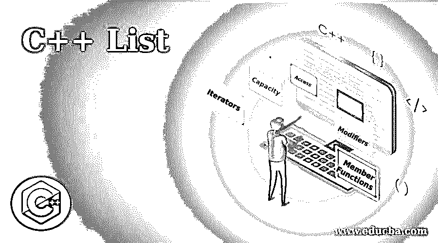
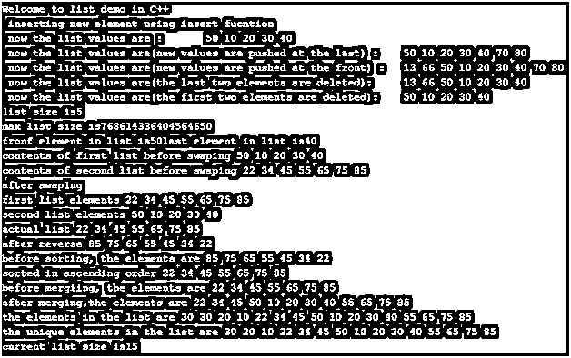
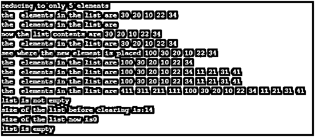

# C++列表

> 原文：<https://www.educba.com/c-plus-plus-list/>




## C++列表介绍

列表是一种序列容器数据结构。通常，该列表表示双向链表，从而允许双向访问数据。插入和删除可以发生在容器内的任何地方，这两个操作都需要恒定的时间。链接通过指向前一个元素和下一个元素在内部维护。然而，列表不是为随机访问执行的数据结构。在运行时，列表可以根据两端的元素数量改变其大小。本文将详细介绍列表及其相关功能。

**语法:**

<small>网页开发、编程语言、软件测试&其他</small>

```
template < class T, class Alloc = allocator<T>> class list;
```

*   t 表示数据类型；它甚至可以是用户定义的。
*   alloc——表示要使用的内存分配模型。

**举例:**

```
List<int>integer_list
```

### C++列表中的成员类型

以下是可以用作返回类型甚至参数的成员类型。

*   值类型
*   分配器类型
*   参考
*   常量 _ 引用
*   指针
*   常量指针
*   迭代程序
*   常量迭代器
*   反向迭代器

### C++中的链表函数

与列表相关联的功能可以分类如下:

#### 1.成员函数

*   **Constructor():** 列表的默认构造函数。
*   **析构函数():**列表的默认析构函数。

#### 2 .迭代器

*   **begin():** 这用于将迭代器带回到开始位置。
*   **end():** 这将迭代器返回到末尾。
*   **rbegin():** 这将迭代器返回到末尾。
*   **rend():** 这将迭代器返回到开头。
*   **cbegin():** 这将常量迭代器返回到开始位置。
*   **cend():** 这将常量迭代器指向末尾。
*   **crbegin():** 这是 cbegin 的反转。
*   **crend:** 这是 cend 的反转。

#### 3.容量

*   **empty():** 用于判断列表是否为空。
*   **size():** 这个函数返回列表的大小。
*   **max_size():** 这个函数决定了列表的最大大小。

#### 4.接近

*   **front():** 这个函数用来访问第一个元素。
*   **back():** 这个函数用来访问最后一个元素。

#### 5.修饰语

*   **push_front():** 这个函数用来在列表的开头插入一个元素。
*   **pop_front():** 这个函数删除第一个元素。
*   **push_back():** 这个函数在最后一个位置添加元素。
*   **pop_back():** 这个函数删除最后一个位置的元素。
*   **insert():** 用于从列表中插入元素。
*   **erase():** 用于从列表中删除元素。
*   这个函数交换两个列表的元素。
*   **resize():** 这是用来调整列表大小的。
*   **clear():** 这将清空列表内容。

#### 6.操作

*   这个函数用于将元素从一个列表转移到另一个列表。
*   **remove():** 用于删除具有特定值的元素。
*   **removeif():** 这个函数删除满足指定条件的元素。
*   **merge():** 用于合并两个列表。
*   **sort():** 用于按照指定的顺序对元素进行排序。
*   **reverse():** 这将反转列表中的元素。

### 实现 C++ List 的示例

下面是 C++列表的例子:

**代码:**

```
#include <iostream>
#include<list>
using namespace std;
intmain()
{ cout<<"\nWelcome to list demo in C++";
list<int>testli={10,20,30,40};
list<int>::iterator titr=testli.begin();
list<int> testli1={22,34,45,55,65,75,85};
list<int>::iterator titr1=testli.begin();
//insert function demo
testli.insert(titr,50);
cout<<"\n inserting new element using insert fucntion";
cout<<"\n now the list values are :\t";
for(titr=testli.begin();titr!=testli.end();++titr)
cout<<" "<<*titr;
//push back function
testli.push_back(70);
testli.push_back(80);
cout<<"\n now the list values are(new values are pushed at the last) :\t";
for(titr=testli.begin();titr!=testli.end();++titr)
cout<<" "<<*titr;
//push front function
testli.push_front(66);
testli.push_front(13);
cout<<"\n now the list values are(new values are pushed at the front) :\t";
for(titr=testli.begin();titr!=testli.end();++titr)
cout<<" "<<*titr;
//pop back function
testli.pop_back();
testli.pop_back();
cout<<"\n now the list values are(the last two elements are deleted):\t";
for(titr=testli.begin();titr!=testli.end();++titr)
cout<<" "<<*titr;
//pop front function
testli.pop_front();
testli.pop_front();
cout<<"\n now the list values are(the first two elements are deleted):\t";
for(titr=testli.begin();titr!=testli.end();++titr)
cout<<" "<<*titr;
//size function
cout<<"\nlist size is"<<testli.size();
cout<<"\nmax list size is"<<testli.max_size();
//front and back function
cout<<"\nfronf element in list is"<<testli.front();
cout<<"\last element in list is"<<testli.back();
//swap example
cout<<"\ncontents of first list before swaping";
for(titr=testli.begin();titr!=testli.end();++titr)
cout<<" "<<*titr;
cout<<"\ncontents of second list before swaping";
for(titr1=testli1.begin();titr1!=testli1.end();++titr1)
cout<<" "<<*titr1;
testli.swap(testli1);
cout<<"\nafterswaping";
cout<<"\nfirst list elements";
for(titr=testli.begin();titr!=testli.end();++titr)
cout<<" "<<*titr;
cout<<"\nsecond list elements";
for(titr1=testli1.begin();titr1!=testli1.end();++titr1)
cout<<" "<<*titr1;
//reverse function example
cout<<"\nactual list";
for(titr=testli.begin();titr!=testli.end();++titr)
cout<<" "<<*titr;
testli.reverse();
cout<<"\nafter reverse";
for(titr=testli.begin();titr!=testli.end();++titr)
cout<<" "<<*titr;
//sort function example
cout<<"\nbefore sorting, the elements are";
for(titr=testli.begin();titr!=testli.end();++titr)
cout<<" "<<*titr;
testli.sort();
cout<<"\nsorted in ascending order";
for(titr=testli.begin();titr!=testli.end();++titr)
cout<<" "<<*titr;
//merging two lists
cout<<"\nbeforemergiing, the elements are";
for(titr=testli.begin();titr!=testli.end();++titr)
cout<<" "<<*titr;
testli.merge(testli1);
cout<<"\naftermerging,the elements are";
for(titr=testli.begin();titr!=testli.end();++titr)
cout<<" "<<*titr;
//printing only unique values
testli.push_front(10);
testli.push_front(20);
testli.push_front(30);
testli.push_front(30);
cout<<"\nthe elements in the list are";
for(titr=testli.begin();titr!=testli.end();++titr)
cout<<" "<<*titr;
testli.unique();
cout<<"\nthe unique elements in the list are";
for(titr=testli.begin();titr!=testli.end();++titr)
cout<<" "<<*titr;
//resize example
cout<<"\ncurrent list size is"<<testli.size();
cout<<"\nreducing to only 5 elements";
testli.resize(5);
cout<<"\nthe elements in the list are";
for(titr=testli.begin();titr!=testli.end();++titr)
cout<<" "<<*titr;
//assign example
list<int> testli2;
list<int>::iterator titr2=testli2.begin();
cout<<"\nthe elements in the list are";
for(titr2=testli2.begin();titr2!=testli2.end();++titr2)
cout<<" "<<*titr2;
testli2.assign(testli.begin(),testli.end());
cout<<"\nnow the list contents are";
for(titr2=testli2.begin();titr2!=testli2.end();++titr2)
cout<<" "<<*titr2;
//emplace function
cout<<"\nthe elements in the list are";
for(titr=testli.begin();titr!=testli.end();++titr)
cout<<" "<<*titr;
testli.emplace(testli.begin(),100);
cout<<"\nsee where the new element is placed";
for(titr=testli.begin();titr!=testli.end();++titr)
cout<<" "<<*titr;
//empalce back and front
cout<<"\nthe elements in the list are";
for(titr=testli.begin();titr!=testli.end();++titr)
cout<<" "<<*titr;
testli.emplace_back(11);
testli.emplace_back(21);
testli.emplace_back(31);
testli.emplace_back(41);
cout<<"\nthe elements in the list are";
for(titr=testli.begin();titr!=testli.end();++titr)
cout<<" "<<*titr;
cout<<"\nthe elements in the list are";
for(titr=testli.begin();titr!=testli.end();++titr)
cout<<" "<<*titr;
testli.emplace_front(111);
testli.emplace_front(211);
testli.emplace_front(311);
testli.emplace_front(411);
cout<<"\nthe elements in the list are";
for(titr=testli.begin();titr!=testli.end();++titr)
cout<<" "<<*titr;
//check if the list is empty
if(testli.empty())
cout<<"\nlist is empty";
else
cout<<"\nlist is not empty";
//clearing the contents of the list
cout<<"\nsize of the list before clearing is:"<<testli.size();
testli.clear();
cout<<"\nsize of the list now is"<<testli.size();
if(testli.empty())
cout<<"\nlist is empty";
else
cout<<"\nlist is not empty";
return 0;
}
```

**输出:**







### 结论

因此，本文详细解释了 C++中的链表数据结构。它还详细解释了与列表相关的函数、函数的用法及其语法。本文还展示了每个函数的示例和相应的输出。要了解更多细节，建议编写示例程序并实践它们。

### 推荐文章

这是一个 C++列表指南。这里我们讨论 C++列表函数的介绍和它的例子，以及代码实现和输出。您也可以浏览我们推荐的文章，了解更多信息——

1.  [c++中的递归函数(示例)](https://www.educba.com/recursive-function-in-c-plus-plus/)
2.  [c++的 11 大特性](https://www.educba.com/features-of-c-plus-plus/)
3.  [机器学习 C++库](https://www.educba.com/machine-learning-c-plus-plus-library/)
4.  [C 语言中类型为](https://www.educba.com/hashing-function-in-c/)的哈希函数


