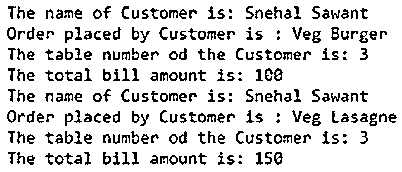
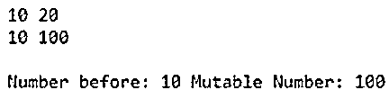
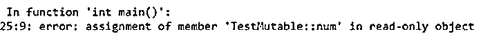

# C++可变

> 原文：<https://www.educba.com/c-plus-plus-mutable/>


## C++可变简介

下面的文章提供了 C++ Mutable 的概要。在 C++中有一个特殊的功能，即使对象是常量类型，你也可以在运行时改变数据成员的值。mutable 关键字只对类的非静态和非常数数据成员有帮助。即使成员是常量，它也有助于将值赋给此常量值。有时需要只有两个成员参与，比如一个变量和一个常数，在这种情况下可变性非常有用。

**语法:**

<small>网页开发、编程语言、软件测试&其他</small>

```
mutable member-variable-declaration;
```

我们可以通过使用 mutable 关键字在程序中声明任何对象或变量。只要对象被声明为常量，我们就可以修改类成员。

### 可变类在 C++中是如何工作的？

下面给出了可变函数的工作原理:

**代码:**

```
class exp
{
public:
bool FlagFunction() const
{
m_Count++;
return m_flag;
}
private:
bool m_flag;
mutable int m_Count;
};
int main()
{
}
```

可变函数使我们甚至可以修改一个常量变量。这里我们有一个函数，其中有一个类。可变函数作用于常量函数和变量。这里的标志函数是一个常量函数。我们通过增加 m_Count 变量的值来改变标志。可变功能可以根据需要改变。因此，变量 m_Count 被声明为可变的，它在常量函数中是递增的。

它将最初存储 m_Count 变量的值，一旦遇到可变值，它将更改该值，并在调用该变量时递增其值。每当可变变量被调用时，它就会动态改变。该值被返回并作为布尔变量发送。

### C++可变的例子

下面是提到的例子:

#### 示例#1

改变可变变量。

**代码:**

```
#include <iostream>
#include <string.h>
using std::cout;
using std::endl;
class Customer
{
char name[25];
mutable char ordertobeplaced[50];
int tableNumber;
mutable int billamt;
public:
Customer(char* s, char* m, int a, int p)
{
strcpy(name, s);
strcpy(ordertobeplaced, m);
tableNumber = a;
billamt = p;
}
void PlacedOrder(char* p) const
{
strcpy(ordertobeplaced, p);
}
void BillChanged(int s) const
{
billamt = s;
}
void display() const
{
cout << "The name of Customer is: " << name << endl;
cout << "Order placed by Customer is : " << ordertobeplaced << endl;
cout << "The table number od the Customer is: " << tableNumber << endl;
cout << "The total bill amount is: " << billamt << endl;
}
};
int main()
{
const Customer c1("Snehal Sawant", "Veg Burger", 3, 100);
c1.display();
c1.PlacedOrder("Veg Lasagne");
c1.BillChanged(150);
c1.display();
return 0;
}
```

**说明:**

*   上面的代码使用了两个可变变量。这些是可以在运行时改变的变量。这里这两个变量是 ordertobeplaced 和 billamt。我们已经在 Customer 类中将这两个函数声明为可变的。公共构造函数定义了 4 个参数。我们复制了放在两个变量中的名称和顺序。我们还采用了不可变的变量，如 tableNumber 和 billamt。
*   PlacedOrder 函数正在复制当前下的订单。BillChanged 函数正在使用可变变量中当前存在的 billamt。这两个函数对这两个可变变量进行操作。display 函数在程序运行时显示这些细节，并在其中有不同的变化。这里要注意的一点是，这里的客户对象 c1 是一个常量对象。
*   首先，它将显示价格为 100 的蔬菜汉堡订单。此后，我们调用使用可变变量的函数。这里，我们将值更改为 Veg Lasagne，并将价格更改为 150。调用 display 函数时，将显示两个订单及其各自的价格。

**输出:**

#### 


#### 实施例 2

我们试图改变一个不可变变量的例子。

**代码:**

```
#include <iostream>
using namespace std;
class TestMutable {
public:
int num;
mutable int mutnum;
TestMutable(int x=0, int y=0) {
num=x;
mutnum=y;
}
void setnum(int x=0) {
num = x;
}
void setb(int y=0) {
mutnum = y;
}
void disp() const{
cout<<endl<<"NUmber: "<<num<<" Mutable Number: "<<mutnum<<endl;
}
};
int main() {
const TestMutable t(10,20);
cout<<t.num<<" "<<t.mutnum<<"\n";
//  t.num=30; //Uncommenting this will throw an error as num is a constant and not mutable
t.mutnum=100; //mutnum can be changed any number of times as  it is mutable
cout<<t.num<<" "<<t.mutnum<<"\n";
t.disp();
return 0;
}
```

**说明:**

*   上面的例子采用了一个 TestMutable 函数，其中我们使用了一个可变函数和一个非可变函数。这个函数是常数函数。但是由于 mutnum 是可变的，我们将能够改变这个变量的值。我们将数字设置为这两个变量，然后在 display 函数中使用它来显示它的值。
*   我们将可变变量和非可变变量的数字分别设为 10 和 20。如果我们取消注释，被注释的行将抛出一个错误。这是因为该变量是常量，而且我们没有显式地定义它为可变变量。
*   我们稍后将检查输出。让我们检查注释该语句时的输出。可变数字的第一个值是 10，然后会变成 100。而 20 个将保持不变。它将如下。

**输出:**




现在，让我们尝试通过取消注释代码来显示，如下所示。我们试图显示未声明为可变的常量变量。主要做以下修改。

**代码:**

```
int main() {
const TestMutable t(10,20);
cout<<t.num<<" "<<t.mutnum<<"\n";
t.num=30; //Uncommenting this will throw an error as num is a constant and not mutable
t.mutnum=100; //mutnum can be changed any number of times as  it is mutable
cout<<t.num<<" "<<t.mutnum<<"\n";
t.disp();
return 0;
}
```

**输出:**




该错误声明 num 不是可变值，并且它是唯一的只读对象，因为它被声明为常量。

### 结论

C++中的 mutable 关键字有助于改变常量变量的值。该值可以在运行时更改。您可以显式定义一个可变变量，并在整个程序中使用它。

### 推荐文章

这是一个 C++可变的指南。这里我们讨论 C++可变的介绍，可变类如何与编程例子一起工作。您也可以看看以下文章，了解更多信息–

1.  [C++设定精度](https://www.educba.com/c-plus-plus-setprecision/)
2.  [C++位集](https://www.educba.com/c-plus-plus-bitset/)
3.  [c++中的运算符优先级](https://www.educba.com/operator-precedence-in-c-plus-plus/)
4.  [C++运算符[]](https://www.educba.com/c-plus-plus-operator/)


