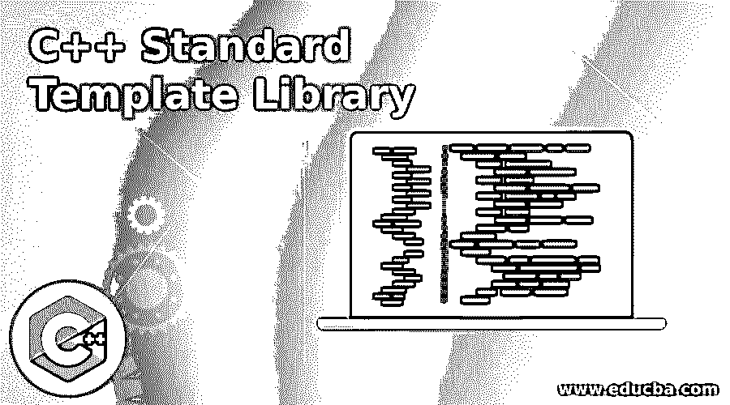
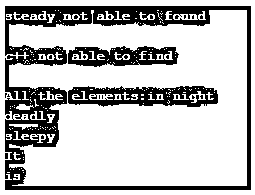
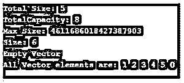

# C++标准模板库

> 原文：<https://www.educba.com/c-plus-plus-standard-template-library/>




## C++标准模板库介绍

C++中的标准模板库是一组所有标准预定义模板类的组合，包括并利用所有强制数据结构和函数，如堆栈、数组、列表、队列等。它包括编译时所需的所有必要组件。它基本上充当了一个类、容器、包、算法和迭代器的库。它是一种蓝图，是一个包含所有参数化组件的通用类。为了使用标准模板库，非常需要使用模板类的组件和特性。

### 为什么我们需要 C++标准模板库？

对于 C++标准模板库有许多需求。我们可以考虑所有因素，例如:

<small>网页开发、编程语言、软件测试&其他</small>

*   **自动管理内存:**可能使用数组，它是标准模板库的容器组件的一部分。
*   **质量使用和优化:** C++标准模板包含一些预定义的函数，如数组、堆栈、队列、列表等，只要调用一次就可以随时使用。
*   **可重用性:**使用一个已经使用过的概念或想法并不是一个坏主意，它利用了所有已经测试和定义的标准模式。
*   **更少的额外努力**:易于使用和理解只有知识和在哪里使用它们比什么都重要。

### C++标准模板库的组件

标准模板库包含模板库，模板库反过来利用一些不可忽视的重要组件。这些是预定义的功能，利用了基本组件:

*   算法
*   容器
*   迭代程序
*   功能

#### 1.算法

算法是一组指令或某种伪代码，用于获得程序执行流程的蓝图。但是在 C++的标准模板中，这些算法是在 header 算法中预定义的，header 算法定义了一组函数，这些函数被设计成利用容器中存在的元素，并且提供了对容器的内容或元素执行不同类型的操作的能力。

**排序:**排序是一种非常常见的函数，驻留在容器中的任何数据都会使用它。它利用一个内置函数，以某种方式使数据以递增或递减的方式排列。它使用了一个名为 sort()的函数。

**二分搜索法:**搜索是一项用来寻找想要的元素的任务。在应用任何搜索之前，非常需要执行排序。

**算法:**在标准模板中，这个库扮演了一个非常重要的角色，因为它对向量使用了某些非常重要的算法，比如:

*   **Sort (1 <sup>st</sup> _iterator，last_iterator):** 用于对任意给定的向量进行排序。
*   **Reverse(1<sup>ST</sup>_ iterator，last_iterator):** 用于反转一个向量。
*   **Max_element:** 用于寻找任意向量的最大元素。
*   **Min_element:** 用于寻找任意向量的最小元素。
*   **累加:**求任意向量的和。

#### 2.容器

顾名思义，容器利用容器中的类来存储各种对象和数据。STL 中的容器是以这样一种方式构造的，总共有 7 个标准的“一级”容器作为类，总共有 3 个容器适配器类，7 个头文件提供对这些容器类和容器适配器的访问。

*   为了实现可以顺序访问的数据结构，使用了一个序列容器，它包括向量、列表、数组、队列、转发列表。
*   为了给上述顺序容器的任何接口提供通用性，使用了容器适配器。它利用了队列、优先级队列和堆栈。
*   搜索可以快速搜索的数据结构，具有复杂的搜索功能，包括关联容器，并利用数据结构，如集合、映射、多重映射和多重集合。

#### 3 .迭代器

与 C++中的其他标准库不同，迭代器用于使函数或数据结构通用化并提供便利。它用于处理一系列值。

#### 4.功能

函数包括，可以用调用操作符重载任何函数。这种类型的类有特殊的实例，称为函数对象。它的另一个名字是仿函数(Functors ),通过传递**的所有参数来定制相关函数的工作。**因此，函子被用作传递给函数的参数。

### C++标准模板库示例

下面给出的是 C++标准模板库的例子:

#### 示例#1

程序利用标准库实现了无序集的功能。

**代码:**

```
#include <bits/stdc++.h>
using namespace std;
int main ()
{
unordered_set <string> stringSet;
stringSet.insert("It");
stringSet.insert("is");
stringSet.insert("deadly");
stringSet.insert("sleepy");
stringSet.insert("in night");
string key = "steady";
if (stringSet.find(key) == stringSet.end ())
cout << key << " not able to found" << endl << endl;
else
cout << "able to Find " << key << endl << endl;
key = "c++";
if (stringSet.find(key) == stringSet.end ())
cout << key << " not able to find\n";
else
cout << "able_to_find" << key << endl;
cout << "\nAll the elements:";
unordered_set<string>:: iterator itr;
for (itr = stringSet.begin(); itr != stringSet.end(); itr++)
cout << (*itr) << endl;
}
```

**输出:**




#### 示例 **#2**

用向量表示容量函数的程序。

**代码:**

```
#include <iostream>
#include <vector>
using namespace std;
int main()
{
vector<int> g1;
for (int a = 1; a <= 5; a++)
g1.push_back(a);
cout << "Total Size: " << g1.size();
cout << "\nTotalCapacity: " << g1.capacity();
cout << "\nMax_Size: " << g1.max_size ();
g1.resize(6);
cout << "\nSize: " << g1\. size();
if (g1.empty() == false)
cout << "\nEmpty Vector";
else
cout << "\nVector is not empty";
g1\. shrink_to_fit ();
cout << "\nAll Vector elements are: ";
for(auto it = g1.begin(); it != g1.end(); it++)
cout << *it << " ";
return 0;
}
```

**输出:**




### C++标准模板库的优势

*   **可重用性:**无需任何算法和实现的先验知识，即可使用带有预定义头的结构化、定义和标准代码。
*   **降低复杂性:**由于使用了一些不常见的组件，降低了不使用预定义或内置函数时有时会出现的复杂性。
*   **通用性和灵活性:**它将为处于执行模式的整个代码提供通用性和灵活性。
*   **预定义功能:**所有算法和数据结构都是预定义的，无需外部使用任何算法或数据结构。

### 结论

在 C++中使用标准模板不仅提高了整体功能并为代码提供了灵活性，而且还涉及预定义的结构和函数，这些结构和函数不需要自己编写，可以在最初声明，并与模板类或容器相链接。

### 推荐文章

这是一个 C++标准模板库的指南。这里我们讨论 C++标准模板库的简介、组件、优点和例子。您也可以看看以下文章，了解更多信息–

1.  [c++中的正则表达式](https://www.educba.com/regular-expressions-in-c-plus-plus/)
2.  [c++中的类型转换](https://www.educba.com/type-casting-in-c-plus-plus/)
3.  [c++中的抽象](https://www.educba.com/abstraction-in-c-plus-plus/)
4.  [c++中的 ifstream](https://www.educba.com/ifstream-in-c-plus-plus/)


