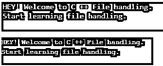
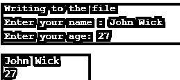

# C++中的 ifstream

> 原文：<https://www.educba.com/ifstream-in-c-plus-plus/>


## C++中的 ifstream 简介

当你编码时，有时你需要读取一些文件来处理下一阶段的代码，为此，我们需要在我们的代码中有一些东西可以帮助我们从任何位置读取所需的文件。这也被称为文件处理，为此，我们需要流类，这是通过使用 fstream、ofstream 和 ifstream 类来完成的。如果 stream 是文件的输入流，那么通过它，我们可以读取文件中的任何信息。为了使用这些流类，我们需要在代码中添加<iostream>和<fstream>头文件。</fstream></iostream>

**语法**

<small>网页开发、编程语言、软件测试&其他</small>

现在让我们看看 ifstream 类的语法:

```
ifstreamobject_name( "file_name " ) ;
```

如果 stream 对象用于读取文件，则 stream 对象用于在代码中写入文件。

### 不同类型的文件模式

我们已经了解了什么是 ifstream，以及如何在代码中使用它来执行各种代码操作，它可以读取文件、写入文件或者访问文件，此外，我们将通过一些 C ++代码示例了解 ifstream 的工作原理。但是在进入代码之前，我们将通过下表看到不同类型的文件模式可以在我们的源代码中使用:

| **输入输出流前缀** | **描述** |
| ios::in | 这个 ios 前缀用于打开文件以读取用户的输入。 |
| ios::out | 这个 ios 前缀用于打开文件以写入用户的输出。 |
| ios::ate | 这个 ios 前缀用于在不截断的情况下打开文件，并允许将数据写入上述文件中的任何位置。 |
| ios::trunc | 此 ios 前缀用于截断现有文件。 |
| ios::app | 此 ios 前缀用于打开文件并将其附加到末尾。 |
| ios::binary | 这个 ios 前缀用于将给定的文件视为二进制格式。 |

### 用 C++实现 ifstream 的例子

以下是一些例子:

#### 示例#1

下面是 C ++代码，演示了在编程中写入文件的流的工作方式。

**代码:**

```
#include <iostream>
#include <fstream>
using namespace std ;
int main () {
ofstreampersonal_file ;
personal_file.open ("file.txt") ;
personal_file<< " Writing this to a file.\n " ;
personal_file.close() ;
return 0 ;
}
```

**输出:**


**解释:**在上面的代码中，我们正在创建一个名为 file 的文件，然后我们正在创建一个 ofstream 对象，这样我们就可以在通过 file 打开它之后写入文件。开放式语法。最后，在将信息写入文件后，我们关闭了文件。

#### 实施例 2

下面是演示 ifstream 类工作的 C ++代码:

**代码:**

```
#include <iostream>
#include <string>
#include <fstream>
using namespace std ;
int main() {
// Writting to a file
ofstreampersonal_file ; // outs is an output stream  of iostream class
personal_file.open("Demo.txt") ; // connect outs to file outFile
personal_file<< "HEY! Welcome to C ++ File handling.\n";
personal_file<< "Start learning file handling.\n";
personal_file.close () ;    // closing the output file stream
// Reading from a file
string line ;
ifstreampersonal_filein ; // here the personal_filein is an input stream
personal_filein.open ("Demo.txt") ; // connecting personal_filein to file Input File
if ( personal_filein.is_open () )
{
while ( getline ( personal_filein , line ) )
{
cout<< line << '\n';
}
personal_file.close () ;   // closing the output file stream
}
return 0 ;
}
```

**输出:**




**解释:**正如你在上面的代码中看到的，我们在头文件中使用了 fstream 来包含所有的文件和流类。因为我们使用 Ustream 来处理输出流。通过一个文件。打开我们正在打开一个名为“Demo.txt”的文件。打开这个文件后，我们正在向文件中写入一些文本。最后，我们通过 file.close()方法关闭文件。因为文本是字符，所以我们必须声明字符串行字符，这样我们就可以从文件中读取所有的文本。通过使用 getline()，我们读取每个字符，然后将其写入 demo.txt 文件。

#### 实施例 3

这是另一个 C ++代码，演示了在编程中写入文件的流的工作原理。

**代码:**

```
#include <fstream>
#include <iostream>
using namespace std ;
int main () {
char data[100] ;
// opening a file in the write mode.
ofstreamoutfile ;
outfile.open ( " Demo.txt " ) ;
cout<< " Writing to the file " <<endl ;
cout<< " Enter your name : " ;
cin.getline ( data , 100 ) ;
// writing the input data into the file.
outfile<< data <<endl ;
cout<< " Enter your age: " ;
cin>>data ;
cin.ignore () ;
//  writing the input data into the file.
outfile<< data <<endl ;
// closing the opened file.
outfile.close () ;
// opening a file in read mode.
ifstreaminfile ;
infile.open ( "Demo.txt " ) ;
cout<< " Reading from the file " <<endl ;
infile>>data ;
// writing the data
cout<< data <<endl ;
// reading the data from the file
infile>>data ;
cout<< data <<endl ;
// closing the opened file.
infile.close () ;
return 0 ;
}
```

**输出:**




**解释:**正如你在上面的代码中看到的，我们在头文件中使用了 fstream 来包含所有的 file 和 iostream 类。因为我们使用 ostream 来处理输出流。通过 outfile.open 我们打开一个文件名为“Demo.txt”的文件。打开这个文件后，我们正在向文件中写入一些文本。最后，我们通过 outfile.close()方法关闭文件。

### 结论

ifstream 类在小型和大型复杂项目的文件处理中起着重要的作用，它有助于在不影响源代码效率的情况下即时修改文件。因此，借助这些流类，我们可以使用函数的数量。

### 推荐文章

这是一个用 C++编写的 ifstream 指南。在这里，我们讨论了 C++中的 ifstream 的介绍，包括语法和不同类型的文件模式，以及要实现的示例。您也可以浏览我们的其他相关文章，了解更多信息——

1.  [c++中的函数覆盖](https://www.educba.com/function-overriding-in-c-plus-plus/)
2.  [c++中的嵌套循环](https://www.educba.com/nested-loop-in-c-plus-plus/)
3.  [在 C++中反转字符串](https://www.educba.com/reverse-string-in-c-plus-plus/)
4.  [C++标准模板库](https://www.educba.com/c-plus-plus-standard-template-library/)


