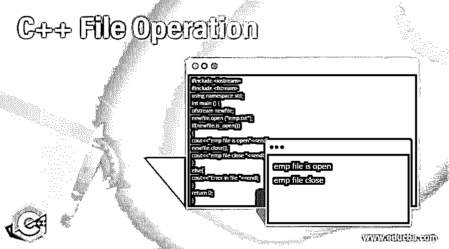
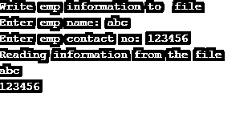

# C++文件操作

> 原文：<https://www.educba.com/c-plus-plus-file-operation/>




## C++文件操作介绍

以下文章提供了 C++文件操作的概要。C++提供了不同的文件选项，这意味着用户可以对文件执行不同的操作。文件主要用于在设备上永久存储数据。文件处理提供了在文件中存储程序输出并对其执行不同操作的工具。在文件操作中，我们用流来表示字符的来源和目的地，以及要执行的操作是读操作还是写操作。文件处理提供了不同的机制来执行操作，如 fstream、ofstream 和 ifstream。这些类是为管理文件而开发的。因此，我们必须在每个文件处理程序中包含这些类。

### 句法

以下是下面提到的语法

<small>网页开发、编程语言、软件测试&其他</small>

#### 1.文件打开

```
void open (File name, ios:: open mode of file);
```

**解释**

在上面的语法中，使用 void open 打开文件，其中文件名代表指定的文件名，文件的模式代表我们想要打开文件的模式。

#### 2.文件写入

```
void open (File name, ios:: out);
```

**解释**

在上面的语法中，void open 用于打开文件，文件名是我们要打开的指定文件名，file mode out 表示写模式。

#### 3.关闭文件

```
File name. close();
```

**解释**

在上面的语法中，文件名表示我们想要关闭的指定文件名，close()函数用于关闭文件。

### C++中的文件操作

C++主要处理如下的类

*   **of stream:**of stream 类表示输出文件流，用于创建要写入的文件和要写入文件的数据。
*   **ifstream:** 这个类表示输入文件流，它用于从文件中读取数据。
*   fstream: 这个类表示输出和输入文件流，这意味着读写文件操作。

下面我们来看看不同的文件操作。

#### 1.文件打开

在这个操作中，假设用户需要在我们使用这个操作的时候打开一个文件。C++为用户打开文件提供了不同的模式。下面我们来看看文件操作的不同模式。

| **模式** | **解释** |
| 在 | 此模式用于以读取模式打开文件，这是 ifstream 的默认模式。 |
| 在外 | 此模式用于以写模式打开文件，这是 ofstream 的默认模式 |
| 二进制的 | 此模式用于以二进制模式打开文件。 |
| 应用 | app 的意思是文件的 Append 模式，它用于将文件的所有输出添加到末尾。 |
| 吃 | 此模式用于打开文件并在文件末尾传递控件。 |
| 树干 | 此模式用于从现有文件中删除数据。 |

**示例:**使用 open()函数创建并打开文件

```
#include<iostream>
#include <fstream>
using namespace std;
int main()
{
fstream new_object;
new_object.open("sample",ios::out);
if(new_object)
{
cout<<"file not created ";
}
else
{
cout<<"New file created";
}
return 0;
}
```

**说明:**

在上面的例子中，首先，我们声明了一个头文件 iostream 和 fstream 在这段代码中，我们为 fstream 类创建了一个 new_object 对象，然后用 open()函数访问 new_object，然后我们给出了一个新的文件名示例，没有文件模式，允许我们对该文件进行写操作。这里我们使用 if 语句。如果文件已经存在，则显示未创建的文件，如果文件不存在，则显示已创建的新文件。最后，通过使用下面的快照来说明上述声明的最终结果。


#### 2.读写文件

在这个操作中，我们通过使用 ifstream 或 fstream 类从文件中读取数据，简单程序和文件处理程序的基本区别只是使用 ifstream 或 fstream 而不是 cin。类似地，我们可以说在写文件模式下我们使用 ofstream 或 fstream 类来写数据，区别只是使用 ofstream 或 fstream 而不是 cout。为了更好的理解，我们来看一个例子。

**举例:**

```
#include <fstream>
#include <iostream>
using namespace std;
int main () {
char info[50];
ofstream ofile;
ofile.open("sample1.dat"); //open file
cout << "Write emp information to  file" << endl;
cout << "Enter emp name: "; // write data into file
cin.getline(info, 50);
ofile << info << endl;
cout << "Enter emp contact no: "; // write data into file
cin >> info;
cin.ignore();
ofile << info << endl;
ofile.close(); // close the file
ifstream ifile;
ifile.open("sample1.dat"); // open file in read mode
cout << "Reading information from the file" << endl;
ifile >> info;
cout << info << endl; // read data and display
ifile >> info;
cout << info << endl; // read data and display
ifile.close(); // close the file
return 0;
}
```

**说明:**

在上面的例子中，我们执行两个文件操作，比如读和写操作。在程序的第一部分，我们打开文件并执行写操作。在该文件中，我们在此处写入诸如员工姓名和员工联系号码等信息。在程序的第二部分，我们从文件中读取信息。通过使用下面的快照来说明上述声明的最终结果。




#### 3.关闭文件

在这个操作中，我们只需使用 close()函数关闭文件。为了更好的理解，让我们看一个例子。

**举例:**

```
#include <iostream>
#include <fstream>
using namespace std;
int main () {
ofstream newfile;
newfile.open ("emp.txt");
if(newfile.is_open())
{
cout<<"emp file is open"<<endl;
newfile.close();
cout<<"emp file close "<<endl;
}
else{
cout<<"Error in file "<<endl;
}
return 0;
}
```

**说明:**

在上面的例子中，我们首先使用 open()函数打开一个 emp 文件，然后检查该文件是否打开。最后，通过使用下面的快照来说明上述声明的最终结果。


### 结论

我们希望从这篇文章中你已经理解了 C++文件操作。从上面的文章中，我们已经了解了文件操作的基本不同语法。我们还学习了如何用 C++通过每种类型的不同例子来实现它们。例如，从这篇文章中，我们学习了如何在 c++中处理 fstream、ifstream 和 ofstream。

### 推荐文章

这是一个 C++文件操作指南。这里我们讨论如何用 C++实现它们，以及每种类型的不同例子。您也可以看看以下文章，了解更多信息–

1.  [C++ endl](https://www.educba.com/c-plus-plus-endl/)
2.  [c++中的类型转换](https://www.educba.com/type-casting-in-c-plus-plus/)
3.  [C++字符串追加](https://www.educba.com/c-plus-plus-string-append/)
4.  [C++流](https://www.educba.com/c-plus-plus-stream/)


