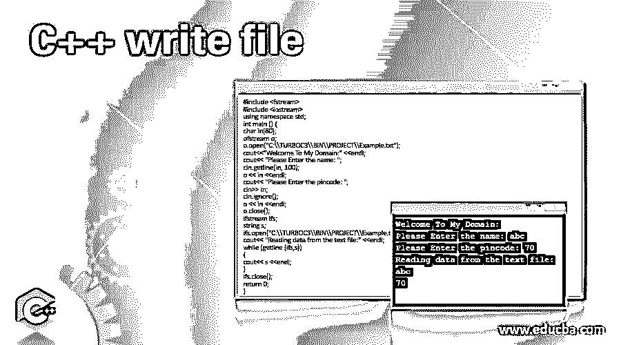

# C++写文件

> 原文：<https://www.educba.com/c-plus-plus-write-file/>




## C++写文件简介

下面的文章提供了 C++写文件的概要。在 C++语言中，write 是 outputstream(ostream)的成员函数的类型之一；它可以通过使用 ofstream 来继承。它是一种特殊类型的二进制文件，也是 read 成员函数之一，就像 istream 一样。它通过使用 ifstream 来继承。一般来说，c++的对象可以分为输入流和输出流。有时，像 fstream 这样的特定类属性的对象使用这两种流函数进行操作。在其原型中一直使用 write 类型，因为它增加了内存块和大小。

**语法**

<small>网页开发、编程语言、软件测试&其他</small>

c++ write 用于使用一些流操作符(如插入操作符(<

```
#include <iostream> //include the header files like input-output streams
#include <fstream> //include the filestreamobject as the header files
using namespace std;
main()
{
ofstream o; //ofstream is the class for fstream package
o.open("filename with extension"); //open is the method of ofstream
o << "print this file data to the user screen"; // << operator which is used to print the file informations in the screen
o.close();
---some logics depends upon the requirement---
}
```

### 如何用 C++写一个文件？

每当我们想使用文件流函数写入数据时，我们就使用基本的插入操作符，如<

### 例子

下面是一些例子:

#### 示例#1

**代码:**

```
#include <fstream>
#include <iostream>
using namespace std;
int main () {
char in[80];
ofstream o;
o.open("C:\\TURBOC3\\BIN\\PROJECT\\Example.txt");
cout<<"Welcome To My Domain:" <<endl;
cout<< "Please Enter the name: ";
cin.getline(in, 100);
o << in <<endl;
cout<< "Please Enter the pincode: ";
cin>> in;
cin.ignore();
o << in <<endl;
o.close();
ifstream ifs;
string s;
ifs.open("C:\\TURBOC3\\BIN\\PROJECT\\Example.txt");
cout<< "Reading data from the text file:" <<endl;
while (getline (ifs,s))
{
cout<< s <<endl;
}
ifs.close();
return 0;
}
```

**输出:**


#### 实施例 2

**代码:**

```
#include <iostream>
#include <fstream>
using namespace std;
int main(){
char t[300];
fstream f;
f.open ("C:\\TURBOC3\\BIN\\PROJECT\\Example.txt", ios::out | ios::in );
cout<< "Welcome To My Domain." <<endl;
cin.getline(t, sizeof(t));
f << t <<endl;
f >> t;
cout<< t <<endl;
f.close();
return 0;
}
```

**输出:**


#### 实施例 3

**代码:**

```
#include <iostream>
#include <fstream>
using namespace std;
int main()
{
fstream f;
string s;
f.open("C:\\TURBOC3\\BIN\\PROJECT\\Example.txt", ios::trunc | ios::out | ios::in);
while (f) {
getline(cin, s);
if (s == "-1")
break;
f << s <<endl;
}
f.seekg(0, ios::beg);
while (f) {
getline(f, s);
cout<< s <<endl;
cout<< "Have a Nice day user" <<endl;
}
f.close();
return 0;
}
```

**输出:**


上面的例子是 c++编写概念的基础，使用一些默认的方法，比如 open()、seekg()和 getline()，一行一行地读写文件。

### 结论

C++写入文件流，它操作与 streambuf 等类型的内部缓冲区对象相关联的文件流，因为数据传输是使用缓冲区类型进行的，每个对象都使用单独的内存块表示，它用作流和物理文件之间的中介。

### 推荐文章

这是一个 C++写文件的指南。在这里，我们讨论如何用 C++编写一个文件，以及代码和输出的例子。您也可以看看以下文章，了解更多信息–

1.  [C++ find()](https://www.educba.com/c-plus-plus-find/)
2.  [C++ end()](https://www.educba.com/c-plus-plus-end/)
3.  [C++聚合](https://www.educba.com/c-plus-plus-aggregation/)
4.  [C++多集](https://www.educba.com/c-plus-plus-multiset/)


