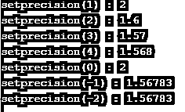
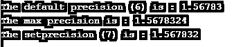
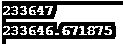

# C++ setprecision

> 原文：<https://www.educba.com/c-plus-plus-setprecision/>


## C++ setprecision()函数简介

setprecision 是 C++中的一个操作函数，用于设置输出操作中浮点值的十进制精度。这个 setprecision 是 C++中在<iomanip>头文件中定义的内置函数。十进制数可以包含无限长的数，这需要无限的存储器来存储，但是十进制数将被存储在 4 或 8 字节的存储器中。因此，一些数字丢失，并且仅存储有效数量的数字。因此，为了保持有效位数而不丢失信息，可以定义浮点数的精度。如果修改了插入或提取的操作符，则流对象和对同一流对象的并发访问可能会产生数据竞争情况。如果流处于有效状态，则 setprecision()函数会引发异常。</iomanip>

### C++ setprecision 的语法

下面是 setprecision()函数在 C++中的声明是:

<small>网页开发、编程语言、软件测试&其他</small>

```
setprecision(int n);
```

**c++设定精度函数的参数:**

n–n 是 int 参数，指定了浮点值的十进制精度。

这个函数的返回值是没有定义的，它只是作为流的一个操纵器。

### C++中 setprecision()函数的例子

下面是 C++ setprecision 的例子:

#### 示例#1

我们编写 C++代码来更清楚地理解 setprecision()函数，下面的例子中我们使用 setprecision()函数来设置不同的十进制数，如下所示:

**代码:**

```
#include <iostream>
#include <iomanip>
int main ()
{
double dp = 1.5678324;
std::cout << "setprecision(1) : " <<std::setprecision(1) << dp << std::endl;
std::cout << "setprecision(2) : " <<std::setprecision(2) << dp << std::endl;
std::cout << "setprecision(3) : " <<std::setprecision(3) << dp << std::endl;
std::cout << "setprecision(4) : " <<std::setprecision(4) << dp << std::endl;
std::cout << "setprecision(0) : " <<std::setprecision(0) << dp << std::endl;
std::cout << "setprecision(-1) : " <<std::setprecision(-1) << dp << std::endl;
std::cout << "setprecision(-2) : " <<std::setprecision(-2) << dp << std::endl;
return 0;
}
```

**输出:**




与上面的代码一样，setprecision()函数用于为浮点数设置不同的精度值，如 0、1、2、3、4、-1 和-2。正如我们在输出中看到的那样，正精度数字工作正常，但负精度数字并不像预期的那样工作，它显示在默认精度数字 6 中。

#### 实施例 2

我们编写 C++代码来理解 setprecision()函数，其中我们显示默认精度数、最大精度数，然后使用 setprecision()函数来设置特定的十进制精度数，如下所示:

**代码:**

```
#include <iostream>
#include <iomanip>
#include <limits>
using namespace std;
int main ()
{
double dp = 1.5678324;
cout<< "The default precision (6) is : " << dp << endl;
cout<< "The max precision is : " << setprecision(std::numeric_limits<double>::digits10 + 1);
cout<< dp << endl;
cout<< "The setprecision (7) is : " << setprecision(7) << dp << endl;
return 0;
}
```

**输出:**




如上面的代码所示，默认的精度数，最大精度数，然后使用 setprecision()函数设置具体的精度数。在输出中，我们可以看到默认精度数值是 6，最大精度数值是 8。

#### 实施例 3

我们编写 C++代码来理解 setprecision()函数，其中我们使用 setprecision()函数来设置特定的十进制精度数，并使用 fixed 来设置由 setprecision()函数指定的十进制精度数，如下所示:

**代码:**

```
#include <iostream>
#include <iomanip>
using namespace std;
int main ()
{
double dp = 1.567;
setprecision(7);
cout << "The decimal without fixed is : "<< dp << endl;
// Using fixed() function
cout << "The decimal with fixed is : "<< fixed << dp << endl;
return 0;
}
```

**输出:**


与上面的代码一样，使用了 setprecision()函数，并将浮点数的精度值设置为 7。在代码的后面，十进制数被打印出来，这与十进制精度为 4 的存储一样。然后在代码中，使用 fixed-function 将浮点值设置为定点表示法，因为这里 setprecision()函数将其设置为 7，所以现在当十进制数打印时，它以 7 的固定十进制精度打印。

#### 实施例 4

我们编写 C++代码来理解 setprecision()函数，其中我们使用 setprecision()函数设置最大十进制精度数，并使用 fixed 设置由 setprecision()函数指定的最大十进制精度数 fixed，如下所示:

**代码:**

```
#include <iostream>
#include <iomanip>
#include <limits>
using namespace std;
int main ()
{
float fp = 233646.6776;
cout << fp<<endl;
setprecision(std::numeric_limits<float>::digits10 + 1);
cout << fixed<<fp;
return 0;
}
```

**输出:**




与上面的代码一样，setprecision()函数用于设置浮点数的最大精度值。当在浮点数中打印时，它以默认的精度 4 进行打印，但是浮点数具有很大的精度值。因此，我们可以通过使用 setprecision()函数将固定精度数设置为最大值，这样，当十进制数正在打印时，它将以其所有的十进制精度进行打印。

### 结论

setprecision()函数是一个内置函数，在 C++中充当操作函数，用于设置输出操作中浮点值的十进制精度。要在程序中使用 setprecision()函数，我们需要包含<iomanip>头文件。</iomanip>

### 推荐文章

这是一个 C++ setprecision 指南。这里我们讨论 C++ setprecision()函数的介绍及其示例，以及代码实现和输出。您也可以浏览我们推荐的文章，了解更多信息——

1.  [c++中的递归函数](https://www.educba.com/recursive-function-in-c-plus-plus/)
2.  [c++的特性](https://www.educba.com/features-of-c-plus-plus/)
3.  [C++ find()](https://www.educba.com/c-plus-plus-find/)
4.  [C++字符串复制](https://www.educba.com/c-plus-plus-string-copy/)


