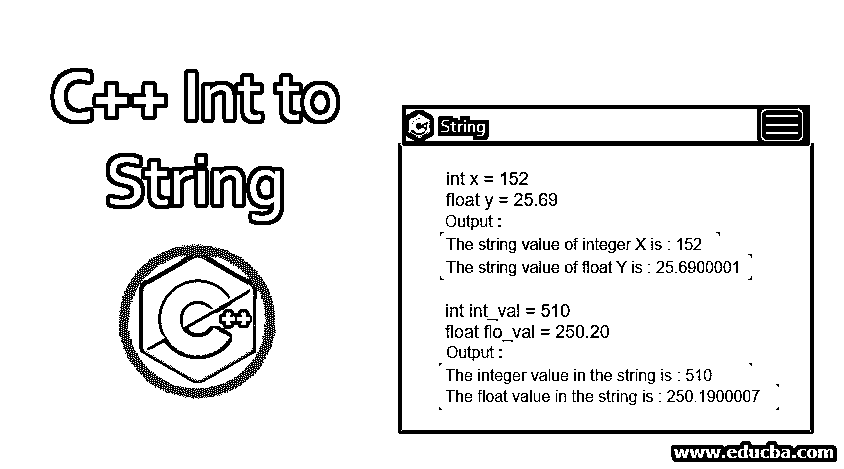
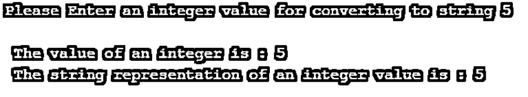

# C++ Int 到 String

> 原文：<https://www.educba.com/c-plus-plus-int-to-string/>




## C++ Int 到 String 简介

当你为你的软件编写程序时，在 C++编程中，有很多情况下你可能需要将给定的数字从整数转换成字符串，或者从字符串转换成整数数据类型。在本文中，我们将讨论使用 C++库通过不同的方法进行整数到字符串的转换。请确保始终提供有效的字符串，因为如果字符串无效，将会生成错误。然而，我们可以通过编码语言中可用的不同函数来检查字符串的有效性。基本上有两种最常见方法来转换字符串。

下面给出了将字符串从整数数据类型转换为字符串数据类型的两种方法和语法:

<small>网页开发、编程语言、软件测试&其他</small>

通过在代码中使用 to_string()方法。

```
string string_name = to_string (x);
```

在上面的语法中，string_name 可以是用户想要的任何东西，但是传递给 string 函数的参数 x 是用户定义的用于转换的字符串。

**通过使用 stringstream 类。**

```
stringstream string_name;
```

在上面的语法中，string_name 可以是用户想要的任何内容，但是需要一个插入操作来将参数插入到用户定义的字符串中进行转换。

### C++中如何把整数转换成字符串？

下面是将 C++整数转换成字符串的不同例子。在 C++中，基本上有两种方法可以将整数转换成字符串。

#### 示例# 1–使用字符串流类

stringstream 类是在代码头文件中定义的 C++流类。执行输入输出操作。这个流类用于执行基于字符串的操作。下面是使用 stringstream 类演示整数到字符串转换的 C++代码:

**代码:**

```
#include <iostream>
#include <sstream>
using namespace std ;
int main () {
int x ;
cout << " Please Enter an integer value for converting to string " ;
cin >> x ;
stringstream ss ;
ss << x ;
string s ;
ss >> s;
cout << " \n " << " The value of an integer is : " << x << " \n " ;
cout << " The string representation of an integer value is : " << s ;
}
```

**输出:**




**代码解释:**在上面的代码中，你可以看到我们有一个包含整数 x 的主类和一个 stringstream 类。我们从用户处获取一个输入整数值，并使用 C++编程语言的 stringstream 类将其转换为一个字符串。如果你能正确地看到代码，我们已经将库名作为流包含进来，以使用流类的功能。

#### 示例 2–使用 to_string()方法

**代码:**

```
#include <iostream>
#include <string>
using namespace std ;
int main ()
{
int x = 152 ;
float y = 25.69 ;
string str1 = to_string ( x ) ;
string str2 = to_string ( y ) ;
cout << " The string value of integer x is : " << str1 << " \n " ;
cout << " The string value of float y is : " << str2 ;
}
```

**输出:**


**代码解释:**在上面的代码中，你可以看到我们有一个主类，在主类里面有一个整数 x 和一个浮点数 y。然后我们定义了两个我们想要转换的字符串。一个是 str1，另一个是 str2。因此，在 to_string()函数的帮助下，我们可以使用 int 和 float 的这些字符串，然后通过使用 to_string()函数分别将其转换为 string。我们从用户处获取一个输入整数值和一个浮点值，使用 C++编程语言的 string 类的 to_string()函数将其转换为一个字符串。如果你能正确地看到代码，我们已经包含了库名作为字符串来使用字符串类的功能。

#### 示例 3–使用 to_string()方法

**代码:**

```
// How to convert a number to string.
#include <iostream>
#include <string>
using namespace std ;
int main ()
{
// Declaring an integer
int int_val = 510 ;
// Declaring a float
float flo_val = 250.20 ;
// Conversion of an int into string using a to_string () method
string str1 = to_string ( int_val ) ;
// Conversion of float into string using to_string () method
string str2 = to_string ( flo_val ) ;
// Displaying the converted strings into given formats
cout << " The integer value in the string is : " ;
cout << str1 << endl ;
cout << " The float value in the string is : " ;
cout << str2 << endl ;
return 0 ;
}
```

**输出:**


**代码解释:**在上面的代码中，你可以看到我们有一个主类，在主类内部有一个整数值 int_val 和一个浮点值 flo_val。然后，我们定义了两个要转换的字符串，并将整数和浮点值作为参数传递给 to_string()方法。一个是 str1，另一个是 str2。因此，在 to_string()函数的帮助下，我们可以使用 int_val 和 flo_val 的这些字符串，然后通过使用 to_string()函数分别将其转换为字符串。我们从用户处获取一个输入整数值和一个浮点值，使用 C++编程语言的 string 类的 to_string()函数将其转换为一个字符串。如果你能正确地看到代码，我们已经包含了库名作为字符串来使用字符串类的功能。

### 结论

当我们使用上述方法和类时，将 C++ Int 转换成 String 就变得很容易了。否则，如果我们要实现传统的转换方式，那么它将需要更多的存储空间和时间，这将影响编码效率。

### 推荐文章

这是一个 C++ Int 转 String 的指南。在这里，我们讨论了 C++中的介绍以及如何将整数转换为字符串，并给出了不同的例子及其代码实现。您也可以阅读以下文章，了解更多信息——

1.  [c++中的阿姆斯特朗数](https://www.educba.com/armstrong-number-in-c-plus-plus/)
2.  [C 中的字符串](https://www.educba.com/string-in-c/)
3.  [c++中的字符串](https://www.educba.com/string-in-c-plus-plus/)
4.  [C++字符串函数](https://www.educba.com/c-plus-plus-string-functions/)


