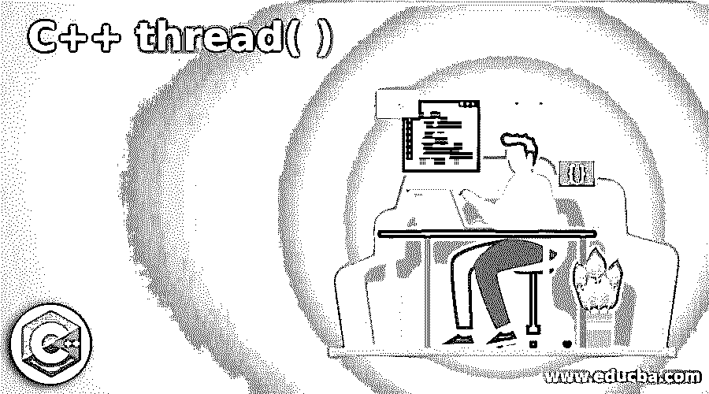

# C++线程( )

> 原文：<https://www.educba.com/c-plus-plus-thread/>




## C++线程的定义( )

在 C++中，类 thread 表示执行的单个线程。它允许同时执行几个功能。C++中表示线程类的类是 std::thread。为了启动一个线程，必须创建一个新的线程对象，并将其传递给要调用的执行代码。一旦链接的线程对象被构造，线程的执行就从作为构造器协议提供的顶层方法开始。让我们在下面的章节中看到更多关于这个主题的内容。

### C++中 thread()函数是如何工作的？

如上所述，为了创建一个新线程，需要 std:: thread，并且该线程必须是可调用的。可调用程序是线程运行时必须执行的可执行程序。也就是说，如果需要一个新线程，必须为 std:: thread 创建一个对象，并且必须将一个 callable 作为参数传递给构造函数。一旦完成，创建的新线程启动，callable 提供的代码得到执行。

<small>网页开发、编程语言、软件测试&其他</small>

### 定义可调用的

为了定义一个可调用的，可以使用不同的方法。让我们在下面看到更多。

#### 1.可使用函数对象调用

在这种技术中，函数对象可以被设置为可调用的。为此，需要一个类，在该类中，operator()必须重载。重载方法包含创建线程时必须执行的程序。

**代码:**

```
// Function object class definition
class fn_object {
// Overload ( ) operator
void operator ( ) ( params )
{
// write your code
}
}
// Thread object creation
std::thread th_obj( fn_object( ) , params )
```

这里，看看线程对象的定义是如何完成的。重载的函数作为第一个参数传递给线程对象，然后参数作为第二个参数。

#### 2.可使用函数指针调用

在这种技术中，函数指针可以被设置为可调用的。可以定义如下。

**代码:**

```
void funct( params )
{
// write your code
}
```

当这个函数被定义时，可以使用这个函数 funct 创建一个线程，如下所示。

```
std::thread th_obj ( funct , params ) ;
```

这里，传递给方法的参数或形参在线程对象中的函数名旁边提供。

#### 3.可使用 Lambda 表达式调用

除了上述方法，还可以使用 lambda 表达式创建 callable。它是通过将它传递给线程对象来执行的。下面是相同的示例代码片段。

**代码:**

```
// Lambda expression definition
auto lm = [ ] ( params )
{
// write your code
};
std::thread th_obj( lm , params ) ;
```

这里，定义了一个 lambda 表达式 lm，并将其作为第一个参数传递给 thread 对象的构造函数，随后将其参数作为第二个参数。

**Note:** Normally, we have to wait for the termination of thread before any action is done, once a thread has begun. For example, suppose we are giving a task to a thread to initialize the Graphical User Interface of an application. So, we have to wait for the thread to stop to make sure that the Graphical User Interface has loaded correctly.

为了等待线程，必须使用 std::thread::join()函数。此方法使当前线程等待，直到*this 识别的线程停止执行。例如，为了阻塞主线程直到线程 th1 终止，可以使用下面的代码。

**代码:**

```
int main( )
{
std::thread th1( callable_code ) ;
. .  . .
th1.join( );
. .  . . .
}
```

在这个例子中，main 方法必须等到线程 th1 停止。也就是说，线程的 join 方法会阻塞其他活动或功能，直到调用它的线程停止执行。

### C++线程的例子( )

让我们看一些 C++中关于线程的示例程序。

#### 示例#1

**代码:**

```
//C++ program to implement thread
#include <string>
#include <iostream>
#include <thread>
using namespace std;
// function that has to be executed on the thread
void func(string txt)
{
cout << " function func displays : " << txt;
}
int main()
{
// A new thread is created and executed
thread th(func, "Happy weekend . . . ");
// Main thread waits for the new thread th to stop execution and as a result, its own execution gets blocked
th.join();
}
```

**输出:**


在这个程序中，创建了必须在线程上执行的函数。主线程等待新线程停止执行，结果，它自己的执行被阻塞。在执行代码时，thread 被调用，消息显示如下。

#### 实施例 2

**代码:**

```
// CPP program to implement thread using object as callables.
#include <iostream>
#include <thread>
using namespace std;
// Callable object
class th_obj {
public:
void operator()(int num)
{
for (int i = 0; i < num; i++)
cout << "Thread that uses function object as callable is working :" << i << "\n";
}
};
int main()
{
// Thread starts by using function object as callable
thread t2(th_obj(), 4);
// Waiting for finishing of thread t2
t2.join();
return 0;
}
```

**输出:**

**T2】**


 **在该程序中，使用函数对象创建可调用对象，并创建线程。在执行代码时，它被调用 4 次，并且消息被显示 4 次，因为作为参数给出的数字是 4。

### 推荐文章

这是一个 C++线程指南()。在这里，我们还讨论了 c++中 thread()函数的定义和工作原理，以及不同的例子和代码实现。您也可以看看以下文章，了解更多信息–

1.  [C++ fstream](https://www.educba.com/c-plus-plus-fstream/)
2.  [C++保留()](https://www.educba.com/c-plus-plus-reserve/)
3.  [c++中的 malloc()](https://www.educba.com/malloc-in-c-plus-plus/)
4.  [c++中的 malloc()](https://www.educba.com/malloc-in-c-plus-plus/)


**