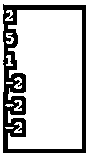
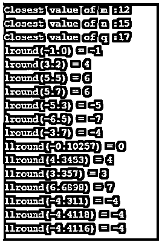

# C++回合

> 原文：<https://www.educba.com/c-plus-plus-round/>


## C++轮的定义

C++ round 函数被定义为一个返回整数值的数学函数，或者通俗地说，这个函数用于将任何给定的数据类型四舍五入到最接近的整数值，比如 double、float，string 类型除外。这个 round()是在 cmath.h 头文件下定义的。因此，在 C++中，round()和 std::round()都用于实现。Round()有助于解决分数和小数之间混淆的应用程序，还可以帮助加速这个过程。

**语法:**

<small>网页开发、编程语言、软件测试&其他</small>

一般的语法是这样的。

```
Return_datatype round(data_type variable);
```

这里的参数是在中间情况下要四舍五入的数字。

数据类型是它返回要舍入的数字的类型。

### C++中的 round 函数是如何工作的？

round()函数主要处理参数值，它是一个静态实例方法，返回的值是最接近的 int 值，该值最初被赋值为 float = 3.3 因此，返回的最接近的值应该是 3.0，而不是 3。让我们讨论一下数据类型 Float，一个包含小数点的数字。这种浮点数通常用于计算机体系结构中——进行二进制值操作和任何科学计算，这些计算通常具有大于整数的模拟值和连续值。例如，以字节存储的 4.785112。为了在这种类型上实现精度，round()被用来很好地工作。

让我们用一个实时场景来理解这个函数。假设我们想要将计数四舍五入到最接近的十进制整数或百万进制数，例如 2020 年世卫组织确定印度人口为 12，345，234。受新冠肺炎影响的人数是 9，546，321 人，因此这个数字很难记住，因此值参数可以四舍五入为 9 亿。

#### 例子

**代码:**

```
double round (double x);
float roundf (float x);
long double roundl (long double x);
round (6.8) = 7
round (-2,2) = -2
```

如果十进制值不在“0-1 -0.5”范围内，则返回小于原始值的结果值，如果十进制值在 0.6 到 0.9 之间，则返回大于该值的整数值的结果。任何十进制整数的默认值都为零。一些特殊值如 infinity 和+/- 0 返回相同的值。round()函数的另一个家族是 roundf()-舍入浮点数和 roundl ()-舍入很长的整数。

roundf()函数简化了这一计算。

```
float a= 5.9;
int b = a + 0.5; // 6
or use the round() function:
float a = 5.9;
int b = round(a);
```

### C++ round 示例

在本节中，我们将看到 C++中 round()函数的演示工作。让我们从简单的例子开始。

#### 示例 1–使用简单类型“double”

**代码:**

```
#include<bits/stdc++.h>
using namespace std;
int main ()
{
double m = 2.311, n = 4.501, l = 1.412;
cout<< round(m) <<endl;
cout<< round(n) <<endl;
cout<< round(l) <<endl;
double f1 = -2.311, f2 = -1.860, f3 = -2.001;
cout<< round(f1) <<endl;
cout<< round(f2) <<endl;
cout<< round(f3) <<endl;
return 0;
}
```

**输出:**




**解释:**这个简单的代码对 f1、f2 和 f3 的值进行舍入，它们的返回类型是 double。

#### 示例 2–使用 round()系列函数

**代码:**

```
#include <cmath>
#include <iostream>
using namespace std;
int main ()
{
double m = 11.8, n = 15.3, q = 16.5;
cout<< "Closest value of m :" << round(m) << "\n";
cout<< "Closest value of n :" << round(n) << "\n";
cout<< "Closest value of q :" << round(q) << "\n";
cout<< "lround(-1.0) = " <<lround(-1.0) << "\n";
cout<< "lround(3.2) = " <<lround(3.5) << "\n";
cout<< "lround(5.5) = " <<lround(5.5) << "\n";
cout<< "lround(5.7) = " <<lround(5.7) << "\n";
cout<< "lround(-5.3) = " <<lround(-5.3) << "\n";
cout<< "lround(-6.5) = " <<lround(-6.5) << "\n";
cout<< "lround(-3.7) = " <<lround(-3.7) << "\n";
cout<< "llround(-0.10257) = " <<llround(-0.10257) << "\n";
cout<< "llround(4.3453) = " <<llround(4.3453) << "\n";
cout<< "llround(3.357) = " <<llround(3.357) << "\n";
cout<< "llround(6.6898) = " <<llround(6.6898) << "\n";
cout<< "llround(-4.311) = " <<llround(-4.311) << "\n";
cout<< "llround(-4.4118) = " <<llround(-4.4118) << "\n";
cout<< "llround(-4.4116) = " <<llround(-4.4116) << "\n";
return 0;
}
```

**输出:**




**解释:**在上面的代码中，我们精确地操作了数据类型 double 和 float 的最近整数值。

#### 实施例 3

**代码:**

```
#include <cmath>
#include <iostream>
using namespace std;
intmain()
{
long int x1 = 16, y1 = 40;
double x2 = .16, y2 = .40;
long int res1 = (x1 * y1);
double res2 = (x2 * y2);
cout<< "For the first case: " << round(res1) << "\n";
cout<< "For the Second case: " << round(res2) << "\n";
return 0;
}
```

**解释:**当 round 函数应用于整数部分时，它返回与输入相同的数字，而当它应用于 double 或 float 时，它给出舍入值作为第二个输出，如“0”。

**输出:**


#### 示例 4–使用 roundf()函数

**代码:**

```
#include <iostream>
#include <cmath>
using namespace std;
int main()
{
cout<<roundf(-0.2) <<endl;
cout<<roundf(-0.3) <<endl;
cout<<roundf(-0.4) <<endl;
cout<<roundf(-0.11) <<endl;
cout<<roundf(-0.12) <<endl;
cout<<roundf(0.5) <<endl;
cout<<roundf(0.8) <<endl;
cout<<roundf(0.7) <<endl;
cout<<roundf(0.6) <<endl;
return 0;
}
```

**输出:**


**说明:**上面的代码使用 roundf()函数对小数点后带负参数的值进行四舍五入。因此，输出如下所示:

### 结论

因此，总而言之，本文以及 round()上的工作和示例有助于了解如何防止整数溢出。这个函数有助于 C++中的数学应用。上面提到的代码是在复杂程序中检索大值时重要使用的几个函数。使用该函数的核心优势是便于计算，并获得对预期结果的完美估计。

### 推荐文章

这是一个 C++回合的指南。这里我们还讨论了 c++中 round 函数的定义和工作原理。以及不同的示例及其代码实现。您也可以看看以下文章，了解更多信息–

1.  [C++空指针](https://www.educba.com/c-plus-plus-void-pointer/)
2.  [C++绝对值](https://www.educba.com/c-plus-plus-absolute-value/)
3.  [C++ memcpy](https://www.educba.com/c-plus-plus-memcpy/)
4.  [C++ ofstream](https://www.educba.com/c-plus-plus-ofstream/)


