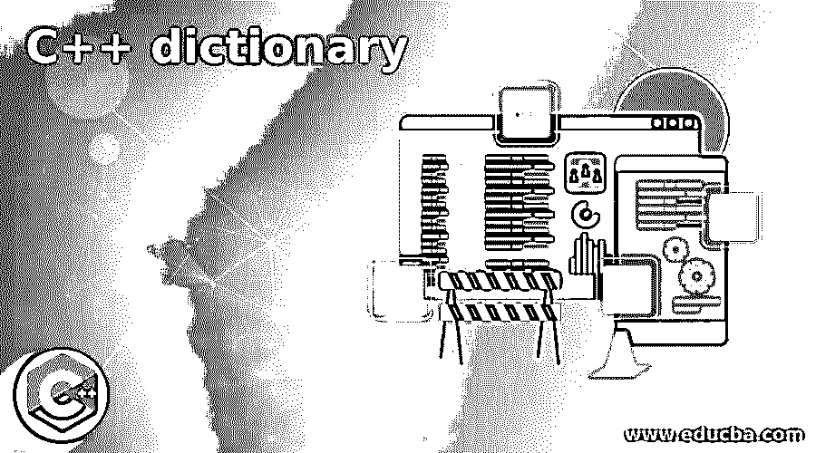
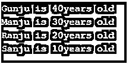

# C++词典

> 原文：<https://www.educba.com/c-plus-plus-dictionary/>




## C++字典介绍

C++中的字典类型叫做 map，它就像一个容器，用来存储由键索引的值，也就是说，容器中的每个值都与一个键相关联。并且所有值的类型在 C++映射中必须是相同的类型。C++映射中所有键的类型必须相同，但键和值不必都是相同的类型。为了能够在 C++中使用映射，映射头文件必须包含在 C++标准库中，并且映射中的值可以通过循环迭代以获得相应的键，其中每个迭代的项表示一个键-值对。

**语法:**

<small>网页开发、编程语言、软件测试&其他</small>

c++中字典的语法如下:

```
map<datatype_of_keys, datatype_of_values>name_of_the_map;
```

其中，datatype_of_keys 是存储在映射中的键的数据类型，datatype_of_values 是存储在映射中的值的数据类型，name_of_the_map 表示映射名称，它是一个变量。

### C++中词典的使用

C++中字典的工作方式如下:

*   C++中的字典类型叫做 map，它的作用就像一个容器，用来存储由键索引的值。
*   字典中的每个值也称为映射，都与一个键相关联。
*   在 C++映射中，所有值的类型必须是相同的类型，并且 C++映射中所有键的类型必须是相同的类型，但是键和值不必都是相同的类型。
*   为了能够在 C++中使用映射，映射头文件必须包含在 C++标准库中。
*   map 中的值可以通过一个循环进行迭代，以获得相应的键，其中每个迭代的项代表一个键-值对。

### C++字典示例

下面是一些例子:

#### 示例#1

C++程序，通过创建一个映射来存储映射中的键-值对，然后检索它们来演示字典类型映射:

**代码:**

```
//the headers map, string and iostream are used to be able to make use of map function, cin, cout and strings
#include <iostream>
#include <map>
#include <string>
using namespace std;
//main method is called
intmain()
{
//a map called capitalcities is created which stores keys of type strings and corresponding values of type strings
map<string, string>capitalcities;
//the elements are added to the created map
capitalcities["NewDelhi"] = "India";
capitalcities["Bangalore"] = "Karnataka";
capitalcities["Mumbai"] = "Maharashtra";
capitalcities["Chennai"] = "TamilNadu";
//iterating through the created map to print out the key and value pairs from the map
for (auto element :capitalcities)
{
//element.first represents the key in the map
cout<<element.first<<" is the capital of ";
//element.second represents the value in the map
cout<<element.second<<endl;
}
return 0;
}
```

**输出:**


在上面的程序中，可以通过包含头 iostream、string 和 map 来使用 map 函数、cin、cout 函数和字符串。然后调用 main 方法，在该方法中定义了一个映射，该映射存储 string 类型的键及其对应的 string 类型的值。然后，创建的映射通过一个循环进行迭代，以检索商店的键和值对。第一个表示键和元素。秒表示作为屏幕输出打印的值。

#### 实施例 2

C++程序，通过创建一个映射来存储映射中的键-值对，然后检索它们来演示字典类型映射:

**代码:**

```
//the headers map, string and iostream are used to be able to make use of map function, cin, cout and strings
#include <iostream>
#include <map>
#include <string>
using namespace std;
//main method is called
intmain()
{
//a map called age is created which stores keys of type strings and corresponding values of type int
map<string, int> age;
//the elements are added to the created map
age["Sanju"] = 10;
age["Ranju"] = 20;
age["Manju"] = 30;
age["Gunju"] = 40;
//iterating through the created map to print out the key and value pairs from the map
for (auto element : age)
{
//element.first represents the key in the map
cout<<element.first<<" is ";
//element.second represents the value in the map
cout<<element.second<<  "years old" <<endl;
}
return 0;
}
```

**输出:**




在上面的程序中，可以通过包含头 iostream、string 和 map 来使用 map 函数、cin、cout 函数和字符串。然后调用 main 方法，在该方法中定义了一个映射，该映射存储 strings 类型的键及其对应的 int 类型的值。然后，创建的映射通过一个循环进行迭代，以检索商店的键和值对，其中 element.first 表示键和 element.second 表示在屏幕上输出的值。

#### 实施例 3

C++程序，通过创建一个映射来存储映射中的键-值对，然后检索它们来演示字典类型映射:

**代码:**

```
//the headers map, string and iostream are used to be able to make use of map function, cin, cout and strings
#include <iostream>
#include <map>
#include <string>
using namespace std;
//main method is called
intmain()
{
//a map called patriotism is created which stores keys of type strings and corresponding values of type int
map<string, string> patriotism;
//the elements are added to the created map
patriotism["India is my motherland"] = "I love my India";
//iterating through the created map to print out the key and value pairs from the map
for (auto element : patriotism)
{
//element.first represents the key in the map
cout<<element.first<<" and ";
//element.second represents the value in the map
cout<<element.second<<endl;
}
return 0;
}
```

**输出:**


在上面的程序中，可以通过包含头 iostream、string 和 map 来使用 map 函数、cin、cout 函数和字符串。然后调用 main 方法，在该方法中定义了一个映射，该映射存储 string 类型的键及其对应的 string 类型的值。然后，创建的映射通过一个循环进行迭代，以检索商店的键和值对，其中 element.first 表示键和元素，second 表示在屏幕上输出的值。

### 推荐文章

这是一本 C++词典指南。这里我们也讨论了 c++中的字典的介绍和工作，以及不同的例子和它的代码实现。您也可以看看以下文章，了解更多信息–

1.  [C++ Max](https://www.educba.com/c-plus-plus-max/)
2.  [C++线程 _ 本地](https://www.educba.com/c-plus-plus-thread_local/)
3.  [C++格式化程序](https://www.educba.com/c-plus-plus-formatter/)
4.  [C++保留()](https://www.educba.com/c-plus-plus-reserve/)


