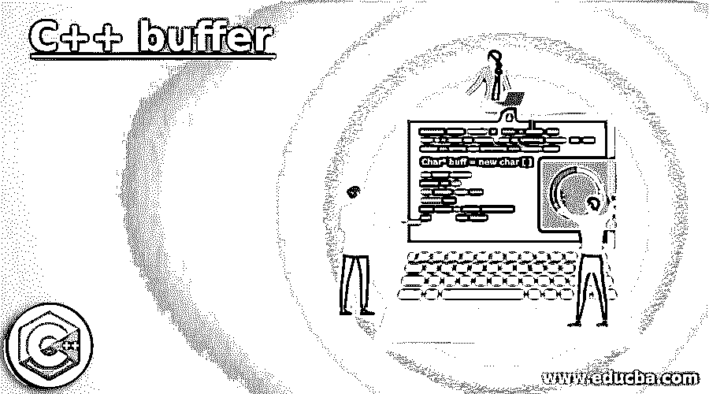
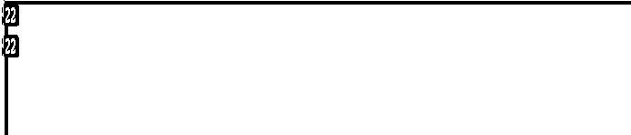
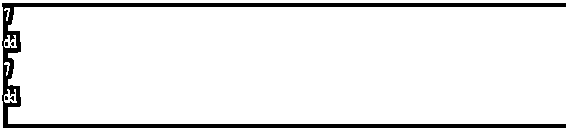

# C++缓冲区

> 原文：<https://www.educba.com/c-plus-plus-buffer/>




## C++缓冲区的定义

缓冲区是一个基本术语，表示充当临时占位符的计算机内存块。缓冲区一词几乎用于所有领域，如视频流、RAM 等。在编程部分，软件缓冲区是数据开始处理之前可以保存数据的地方。这样做是为了使过程更快。也就是说，通常如果使用直接操作写入数据，这需要时间。在缓冲区的情况下，它以快速的方式执行。在本文中，我们将详细讨论 C++缓冲区。

**语法:**

<small>网页开发、编程语言、软件测试&其他</small>

在正常情况下，打开文件时会创建一个缓冲区，关闭文件时会刷新缓冲区。在 C++中缓冲区可以通过如下所示的内存分配来创建。

```
Char* buff = new char [ ]
```

类似地，当必须释放分配的内存时，可以使用下面的格式。

```
delete[ ]
```

### C++中 buffer 是如何工作的？

正如我已经提到的，将数据写入缓冲区比在直接操作中写入数据更容易。这就是在计算机编程中使用缓冲区的主要原因。通常，C++和其他编程语言涉及大量的计算操作。在这种情况下，缓冲会有所帮助。

在某些情况下，为了在首选容器中获得下一个输入，您可能必须刷新不需要的缓冲区。也就是说，不在先前的变量缓冲区中。让我们考虑这样一种情况，在遇到语句“cin”之后，用户必须输入一个字符串或字符数组。此时，他或她必须清除输入缓冲区。否则，给定的输入将被放入不是首选容器的前一个变量的缓冲区中。在第一次输入之后，当按下输出屏幕上的“Enter”时，程序跳过容器的下一次输入，因为前一个变量的缓冲区没有被清除。

**注意:**假设我们使用的系统内存较低。这时候缓冲的好处就变少了。也就是说，我们必须在缓冲区大小和计算机现有内存之间找到一个平衡点。

### C++缓冲区示例

为了更好的理解，让我们看一些关于 C++缓冲区的示例程序。

#### 示例#1

**代码:**

```
// C++ Code that demonstrates the importance of clearing input buffer that can result in unwanted outputs
//import the necessary libraries
#include<iostream>
#include<vector>
using namespace std;
//main method
int main()
{
//declare an integer variable
int num;
//declare a character variable
char c[20];
// Take input from the user
cin >> num;
// Take another input from the user that is of character type
cin.getline(c,20);
// Print the number that is given as input
cout << num << endl;
// Print the character that is given as input
cout << c << endl;
return 0;
}
```

**输出:**




这是一个 C++程序，向我们展示了清除输入缓冲区的重要性，输入缓冲区会导致不必要的输出。为此，首先，导入库，然后声明整数和字符变量。之后，编写代码来获取输入并打印作为输入给出的值。在执行代码时，我们会被要求提供输入。单击 enter 按钮，该值将被打印出来。也就是说，程序没有给出下一个字符输入的机会。这表明必须清除输入缓冲器。

#### 实施例 2

**代码:**

```
// C++ Code that demonstrates the clearing input buffer that can result in the outputs desired
//import the necessary libraries
#include<iostream>
#include<vector>
//This library is used for <streamsize> used in the program
#include<ios>
//This library is used for numeric_limits used in the program
#include<limits>
using namespace std;
//main method
int main()
{
//declare an integer variable
int num;
//declare a character variable
char c[20];
// Take input from the user
cin >> num;
cin.ignore( numeric_limits<streamsize>::max() , '\n' ) ;
// Take another input from the user that is of character type
cin.getline(c,20);
// Print the number that is given as input
cout << num << endl;
// Print the character that is given as input
cout << c << endl;
return 0;
}
```

**输出:**


在上面的程序中，我们已经看到了清除输入缓冲区的重要性以及执行代码所获得的结果。在这个程序中，讨论了上述问题的解决方案。也就是说，在这个程序中输入缓冲区被清除。为此，导入两个额外的库#include <ios>和#include <limits>，以便在程序中使用<streamsize>和 numeric_limits。从用户那里获得输入后，添加一行额外的代码用于清除输入缓冲区。为此，该行</streamsize></limits></ios>

```
cin.ignore(numeric_limits<streamsize>::max(),'\n');
```

已使用。在执行代码时，用户必须输入一个整数变量和字符变量。与上面的程序不同，在给出第一个输入后按下回车键，将给出一个给出下一个输入的额外机会。这表明输入缓冲器已被清空。在给出两个输入之后，用户给出的两个值都将被打印出来，如示例输出所示。

#### 实施例 3

**代码:**

```
// C++ Code that demonstrates the clearing input buffer using another method
//import the necessary libraries
#include<iostream>
#include<vector>
using namespace std;
//main method
int main()
{
//declare an integer variable
int num;
//declare a character variable
char c[20];
// Take input from the user
cin >> num;
//clears the input buffer
cin >> ws;
cin.getline(c,20);
cout << num << endl;
// Print the character that is given as input
cout << c << endl;
return 0;
}
```

**输出:**




在这个程序中，输入缓冲区也被清空，但与第二个程序不同。这里，行 CIN > > ws；用于清除输入缓冲区。因此，程序通过要求用户输入两个值来正常工作。

### 推荐文章

这是一个 C++缓冲区的指南。这里我们也讨论一下 c++中 buffer 的定义和工作原理？以及不同的示例及其代码实现。您也可以看看以下文章，了解更多信息–

1.  [C++ Max](https://www.educba.com/c-plus-plus-max/)
2.  [C++静态转换](https://www.educba.com/c-plus-plus-static_cast/)
3.  [C++ sort()](https://www.educba.com/c-plus-plus-sort/)
4.  [C++绝对值](https://www.educba.com/c-plus-plus-absolute-value/)


