# c++中的星形模式

> 原文：<https://www.educba.com/star-patterns-in-c-plus-plus/>

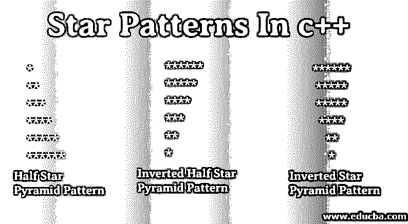


## C++中的星形模式介绍

在本文中，首先，我们将借助例子来看看如何使用 C++编程来处理各种星形模式程序。在任何编程语言中，星型模式都是被广泛使用的常见模式之一，因为它有助于提高逻辑思维和流程控制知识。要在 C++语言中创建模式，你只需要使用两个或三个循环。循环的数量取决于您需要创建的模式。对于图案，最少使用两个，即一个用于行，一个用于列。第一个循环称为显示行的外部循环，第二个循环称为显示列的内部循环。

### C++语言中的模式示例

让我们讨论一些例子来理解 C++中模式的概念。

<small>网页开发、编程语言、软件测试&其他</small>

#### 示例 1–用 C++编程打印半星形金字塔图案

在下面的 C++程序中，用户可以根据自己的意愿输入打印半星形金字塔图案的行数，然后结果会显示在屏幕上:

**代码:**

```
#include <iostream>
using namespace std;
int main()
{
int  i, j, n;
cout << "Enter number of rows:  ";
cin >> n;
for(i = 1; i <= n; i++)
{
for(j = 1; j <= i; j++)
{
cout << "* ";
}
//Ending line after each row
cout << "\n";
}
return 0;
}
```

**输出:**

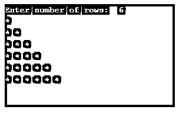


#### 示例 2——用 C++编程来打印倒半星形金字塔图案

在下面的 C++程序中，用户可以根据自己的意愿输入打印倒半星金字塔图案的行数，然后结果会显示在屏幕上:

**代码:**

```
#include <iostream>
using namespace std;
int main()
{
int  i, j, n;
cout << "Enter number of rows:  ";
cin >> n;
for(i = n; i >= 1; i--)
{
for(j = 1; j <= i; j++)
{
cout << "* ";
}
// ending line after each row
cout << "\n";
}
return 0;
}
```

**输出:**

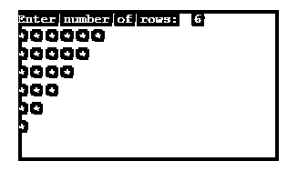


#### 示例 3-用 C++编程打印星形金字塔图案

在下面的程序中，用户可以根据自己的意愿输入打印星形金字塔图案的行数，然后结果会显示在屏幕上:

**代码:**

```
#include<iostream>
using namespace std;
int main()
{
int n, s, i, j;
cout << "Enter number of rows: ";
cin >> n;
for(i = 1; i <= n; i++)
{
//for loop for displaying space
or(s = i; s < n; s++)
{
cout << " ";
}
//for loop to display star equal to row number
for(j = 1; j <= (2 * i - 1); j++)
{
cout << "*";
}
// ending line after each row
cout << "\n";
}
}
```

**输出:**


#### 例 4-**P**c++程序输入若干行打印星形金字塔图案

在下面的程序中，用户可以根据自己的意愿输入打印星形金字塔图案的行数，然后结果会显示在屏幕上:

**代码:**

```
#include<iostream>
using namespace std;
int main()
{
int n, s, i, j;
cout << "Enter number of rows: ";
cin >> n;
for(i = n; i >= 1; i--)
{
//for loop to put space
for(s = i; s < n; s++)
cout << " ";
//for loop for displaying star
for(j = 1; j <= (2 * i - 1); j++)
cout << "* ";
// ending line after each row
cout << "\n";
}
return 0;
}
```

**输出:**

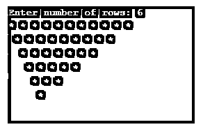


#### 例 5**–**用 C++编程打印倒星形金字塔图案

在下面的程序中，用户可以根据自己的意愿输入打印倒星形金字塔图案的行数，然后结果会显示在屏幕上:

**代码:**

```
#include<iostream>
using namespace std;
int main()
{
int n, s, i, j;
cout << "Enter number of rows: ";
cin >> n;
for(i = n; i >= 1; i--)
{
//for loop to put space
for(s = i; s < n; s++)
cout << " ";
//for loop for displaying star
for(j = 1; j <= i; j++)
cout << "* ";
// ending line after each row
cout << "\n";
}
return 0;
}
```

**输出:**

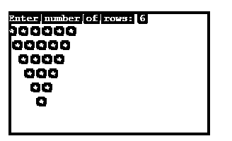


#### 示例 6–用 C++编写程序，输入打印星形金字塔图案的行数

在下面的程序中，用户可以根据自己的意愿输入打印星形金字塔图案的行数，然后结果会显示在屏幕上:

**代码:**

```
#include<iostream>
using namespace std;
int main()
{
int n, s, i, j;
cout << "Enter number of rows: ";
cin >> n;
for(i = 1; i <= n; i++)
{
//for loop to put space
for(s = i; s < n; s++)
cout << " ";
//for loop for displaying star
for(j = 1; j <= i; j++)
cout << "* ";
// ending line after each row
cout << "\n";
}
return 0;
}
```

**输出:**

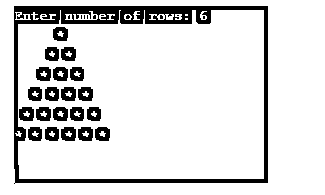


#### 示例 7–用 C++打印全星形钻石图案的程序

在下面的程序中，用户可以输入菱形尺寸的行数，按照自己的意愿打印菱形图案，然后结果会显示在屏幕上:

**代码:**

```
#include<iostream>
using namespace std;
int main()
{
int n, s, i, j;
cout << "Enter number of rows: ";
cin >> n;
for(i = 0; i <= n; i++)
{
for(s = n; s > i; s--)
cout << " ";
for(j=0; j<i; j++)
cout << "* ";
cout << "\n";
}
for(i = 1; i < n; i++)
{
for(s = 0; s < i; s++)
cout << " ";
for(j = n; j > i; j--)
cout << "* ";
// ending line after each row
cout << "\n";
}
return 0;
}
```

**输出:**

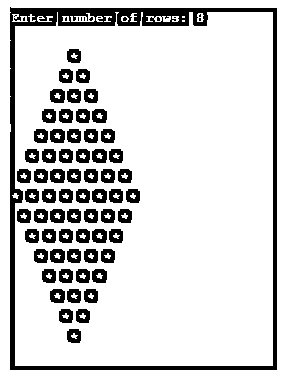


#### 实施例 8

**代码:**

```
#include<iostream>
using namespace std;
int main()
{
int n, i , j;
cout << "Enter number of rows: ";
cin >> n;
for(i = 1; i <= n; i++)
{
for(j = 1; j <= i; j++)
{
cout << "*";
}
cout<<"\n";
}
for(i = n; i >= 1; i--)
{
for(j = 1; j <= i; j++)
{
cout << "*" ;
}
// ending line after each row
cout<<"\n";
}
return 0;
}
```

**输出:**

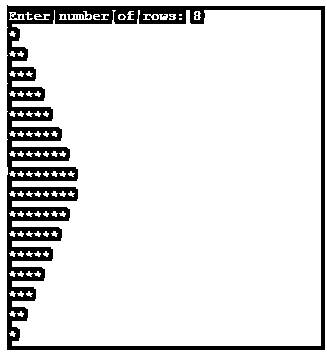


#### 示例 9

**代码:**

```
#include<iostream>
using namespace std;
int main()
{
int n, i, j;
cout << "Enter number of rows: ";
cin >> n;
for(i = 1; i <= n; i++)
{
for(j = i; j < n; j++)
{
cout << " ";
}
for(j = 1; j <= i; j++)
{
cout << "*";
}
cout << "\n";
}
for(i = n; i >= 1; i--)
{
for(j = i; j <= n; j++)
{
cout << " ";
}
for(j = 1; j < i; j++)
{
cout<<"*";
}
// ending line after each row
cout<<"\n";
}
return 0;
}
```

**输出:**

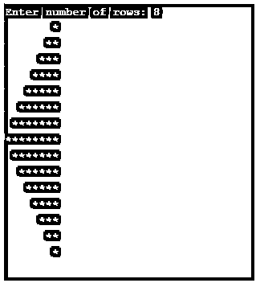


#### 示例 10-打印空心星形金字塔的程序

在下面的程序中，用户可以根据自己的意愿输入打印空心星形金字塔图案的行数，然后结果会显示在屏幕上:

**代码:**

```
#include<iostream>
using namespace std;
int main()
{
int r, i, j, s;
cout << "Enter number of rows: ";
cin >> r;
for(i = 1; i <= r; i++)
{
//for loop to put space in pyramid
for (s = i; s < r; s++)
cout << " ";
//for loop to print star
for(j = 1; j <= (2 * r - 1); j++)
{
if(i == r || j == 1 || j == 2*i - 1)
cout << "*";
else
cout << " ";
}
//ending line after each row
cout << "\n";
}
return 0;
}
```

**输出**


#### 示例 11-印刷倒置空心星形金字塔图案的程序

在下面的程序中，用户可以根据自己的意愿输入打印倒空星形金字塔图案的行数，然后结果会显示在屏幕上:

**代码:**

```
#include<iostream>
using namespace std;
int main()
{
int r, i, j, s;
cout << "Enter number of rows: ";
cin >> r;
for(i = r; i >= 1; i--)
{
//for loop to put space in pyramid
for (s = i; s < r; s++)
cout << " ";
//for loop to print star in pyramid
for(j = 1; j <= 2 * i - 1; j++)
{
if(i == r || j == 1 || j == 2*i - 1)
cout << "*";
else
cout << " ";
}
cout << "\n";
return 0;
}
```

**输出**

**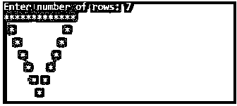

** 

#### 示例 12-以菱形图案打印中空星形金字塔的程序

在下面的程序中，用户可以根据自己的意愿输入打印菱形空心星形金字塔的行数，然后结果会显示在屏幕上:

**代码:**

```
#include<iostream>
using namespace std;
int main()
{
cout << "Enter size of  Daimond:  ";
int n, i, j, m = 1, k;
cin >> n;
for(i = 0; i <= n; i++)
{
for(j = n; j > i; j--)
{
cout << " ";
}
cout << "*";
if (i > 0)
{
for(k = 1; k <= m; k++)
{
cout << " ";
}
m += 2;
cout << "*";
}
cout << endl;
}
m -= 4;
for(i = 0; i <= n-1; i++)
{
for(j = 0; j <= i; j++)
{
cout << " ";
}
cout << "*";
for(k = 1; k <= m; k++)
{
cout << " ";
}
m -= 2;
if(i != n-1)
{
cout << "*";
}
//ending line after each row
cout << endl;
}
return 0;
}
```

**输出:**

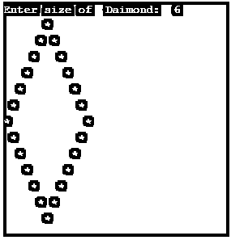


### 推荐文章

这是 c++中星型模式的指南。这里我们讨论了 c++中的介绍和不同模式的例子以及输出。您也可以浏览我们推荐的其他文章，了解更多信息——

1.  [C 中的星形图案](https://www.educba.com/star-patterns-in-c/)
2.  [Java 中的星型模式](https://www.educba.com/star-patterns-in-java/)
3.  [c++中的模式](https://www.educba.com/patterns-in-c-plus-plus/)
4.  [PHP 中的星形模式](https://www.educba.com/star-patterns-in-php/)


