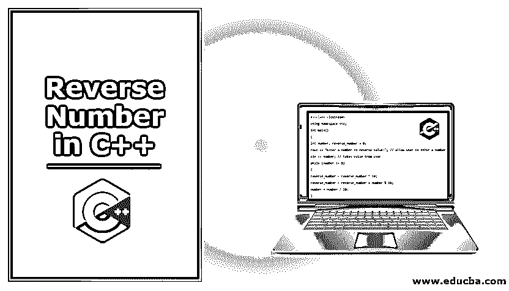
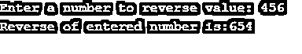
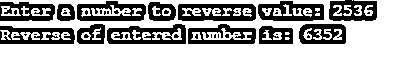
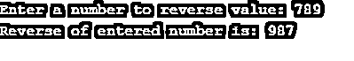
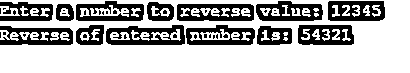

# 在 C++中反转数字

> 原文：<https://www.educba.com/reverse-number-in-c-plus-plus/>




## C++中的反数概述

在这篇文章中，我们将看到如何在 C++语言中反转一个数字。意思是把给定的数字印回正面。例如，给定的数字是 864，那么这个数字的倒数将是 468。让我们通过一些例子来看看如何在 C++中构建这个逻辑。我们可以使用各种循环或循环组合以及算术运算符来反转数字或字符。

### C++中的逆数逻辑

模数(%)符号用于求给定数字的倒数。反向编号的逻辑如下:

<small>网页开发、编程语言、软件测试&其他</small>

1.  将一个反向数字初始化为 0。
2.  将倒数乘以 10。
3.  将给定的数除以 10，求模数。
4.  添加模数和倒数。
5.  打印第四步的结果。
6.  将给定的数除以 10
7.  重复步骤 2 到 6，直到输出。

### C++语言中如何求一个数的倒数？

在这一节中，我们将借助例子来了解如何使用 while 循环、递归、for 循环和 do while 循环等各种方法来反转一个数字。

#### 示例 1:使用 While 循环在 C++中查找倒数

在进入程序之前，我们先来了解一下 while loop 是如何工作的。同时循环执行几次，直到条件匹配。条件将根据程序的要求而有所不同。While 循环首先检查条件，然后开始循环。如果给定的条件为真，那么它将把流控制转移到 while 循环中定义的语句。如果给定的条件为假，那么它将把流控制转移到在 while 循环之外定义的语句。即在本程序中，while 循环将一直持续到该数字！= 0 为假。它将跳过 while 循环中定义的语句。让我们看看如何使用 While 循环在 C++中找到一个反数。

**代码:**

```
#include <iostream>
using namespace std;
int main()
{
int number, reverse_number = 0;
cout << "Enter a number to reverse value:"; // allow user to enter a number
cin >> number; // takes value from user
while (number != 0)
{
reverse_number = reverse_number * 10;
reverse_number = reverse_number + number % 10;
number = number / 10;
}
cout << "Reverse of entered number is:";
cout << reverse_number; //print reverse value
return 0;
}
```

**输出:**




#### 示例 2:使用递归在 C++中查找逆数

**代码:**

```
#include <iostream>
using namespace std;
int reverse(int);
int main()
{
int number, reverse_number = 0;
cout << "Enter a number to reverse value:"; // allow user to enter a number
cin >> number; // takes value from user
reverse_number = reverse(number);
cout << "Reverse of entered number is: ";
cout <<  reverse_number; // print reverse value
return 0;
}
int reverse(int number)
{
static int reverse_number = 0;
if (number == 0)
return 0;
reverse_number = reverse_number * 10;
reverse_number = reverse_number + number % 10;
reverse(number/10);
return reverse_number;
}
```

**输出:**




#### 示例 3:使用 for 循环在 C++中查找倒数

在进入程序之前，让我们先了解一下循环是如何工作的。在循环中，首先我们为代码初始化一个变量。变量初始化后，我们提到了一些评估程序的条件。这个初始化步骤在代码中只执行一次。之后，需要声明增量或减量。这也取决于程序的要求。

For 循环执行，直到满足给定的条件。如果条件为真，那么它将把流控制转移到 for 循环块内的语句。如果条件为假，则它会将流控制转移到 for 循环块之外的语句，并跳过 for 循环。

**代码:**

```
#include <iostream>
using namespace std;
int main()
{
int number, remainder_number, reverse_number= 0, i;
cout << "Enter a number to reverse value:"; // allow user to enter a number
cin >> number; // takes value from user
for(i = number; i >0; )
{
remainder_number= i % 10;
reverse_number = remainder_number + reverse_number * 10;
i = i/ 10;
}
cout << "Reverse of entered number is: ";
cout <<  reverse_number; //print reverse value
return 0;
}
```

**输出:**




#### 示例 4:使用 Do While 循环查找倒数

do-while 循环类似于 while 循环，唯一的区别是 while 循环首先检查条件，然后执行代码，而 do-while 循环首先执行代码，然后检查条件。

如同 do while 循环结束时的检查条件一样，它将至少执行一次循环。在 do-while 循环中，条件在循环结束时声明。

如果给定的条件为真，循环将把流控制转移回 do，并且循环中的所有语句将再次执行。重复这个过程，直到给定的条件匹配。让我们看看如何在 C++中使用 do-while 循环找到一个反数。

**代码:**

```
#include <iostream>
using namespace std;
int main()
{
int number, reverse_number = 0;
cout << "Enter a number to reverse value:"; // allow user to enter a number
cin >> number; // takes value from user
do
{
reverse_number = reverse_number * 10;
reverse_number = reverse_number + number % 10;
number = number / 10;
}while(number != 0);
cout << "Reverse of entered number is: ";
cout <<  reverse_number; //print reverse value
return 0;
}
```

**输出:**




### 推荐文章

这是一个在 C++中反转数字的指南。在这里，我们讨论了概述以及如何在 C++语言中用不同的例子来反转一个数字。您也可以阅读以下文章，了解更多信息——

1.  [c++中的平方根](https://www.educba.com/square-root-in-c-plus-plus/)
2.  [什么是 C++中的模板类？](https://www.educba.com/what-is-template-class-in-c-plus-plus/)
3.  [反转 C 中的数字](https://www.educba.com/reverse-number-in-c/)
4.  [Python 中的反数](https://www.educba.com/reverse-number-in-python/)


