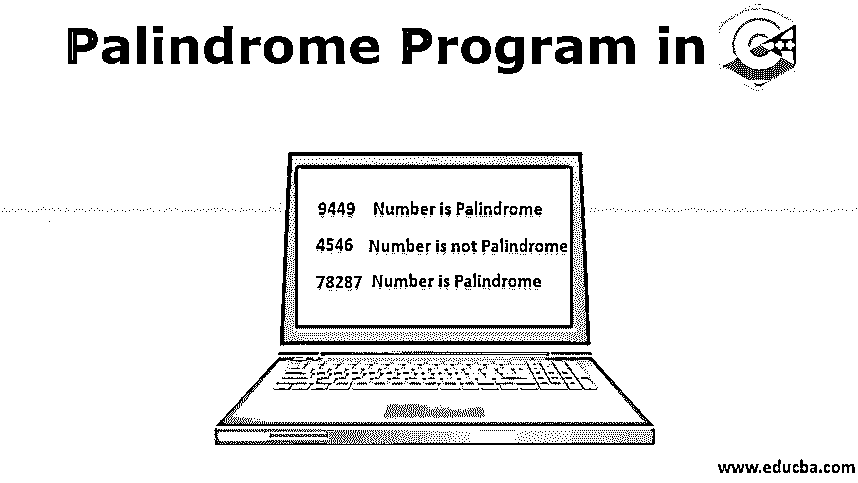
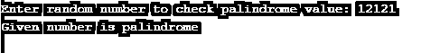
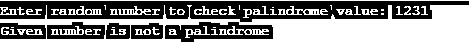
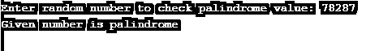
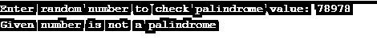
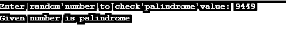
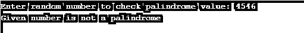
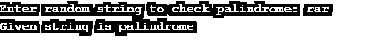

# C++中的回文程序

> 原文：<https://www.educba.com/palindrome-program-in-c-plus-plus/>




## C++中回文程序介绍

像任何其他的编程语言一样，我们也可以在 C++中执行各种操作。在本文中，我们将借助一些例子来看看如何在 C++中测试回文程序。在此之前，首先我们来看看回文是什么意思。回文是在反转原始值后给出相同值的结果。回文背后的逻辑听起来很简单。例如，如果你找到了妈妈的反义词，结果是一样的。所以我们可以说妈妈是一个回文。

**一些识别它们是否是回文的例子**

<small>网页开发、编程语言、软件测试&其他</small>

*   78987:反过来是 78987，所以是回文。
*   LOL:反过来就是 LOL，所以是回文。
*   56425:反向是 52465，所以不是回文。
*   票价:反转是 era，所以不是回文。

从上面提到的例子，我们现在可以确定它是否是一个回文。但是我们已经口头解决了以上这些例子。让我们看看这种口头逻辑在 C++这样的编程语言中是如何执行的。在此之前，首先，我们将看到在 C++程序中检查回文值的算法。

C++程序中测试回文的算法如下:
1。从用户那里获取输入。
2。将输入值存储在临时变量中。
3。求输入值的倒数。
4。比较两个值的反向变量和临时变量。
5。如果两个值都匹配 print，则是一个回文
6。如果两个值不匹配，打印它不是一个回文。

### C++程序中如何检查回文？

在这一节中，我们将借助例子来看看如何使用 while 循环、for 循环[和 do while 循环](https://www.educba.com/do-while-loop-in-javascript/)等各种方法来检查 C++语言中的回文。

#### 示例 1:使用 while 循环在 C++中检查回文的程序

**代码:**

```
#include<iostream>
using namespace std;
int main()
{
int num, reverse_num = 0, temp_num;
cout << "Enter random number to check palindrome value:"; // allow user to enter a number
cin >> num; // takes value from user
temp_num = num; //store number to temp_number
while (num != 0)
{
reverse_num = reverse_num * 10;
reverse_num= reverse_num + num% 10;
num = num / 10;
}
if(temp_num == reverse_num) // check reverse number with original number
{
cout << "Given number is palindrome"; //if match, print palindrome
}
else
{
cout << "Given number is not a palindrome"; // If it doesn’t match with original print, not a palindrome
}
return 0;
}
```

**上述程序的说明**

在上面的程序中，为了检查值是否是回文，我们使用了 while 循环。这里我们初始化 3 个变量 num 来存储用户输入的值，reverse_num 来存储反向值，temp_num 来临时存储值。While 循环在执行循环之前首先检查条件。如果符合条件，它将执行循环中声明的语句。这里我们使用 while 循环来求值的倒数。一旦计算出相反的值，它就将流控制转移给 if 语句。如果条件匹配，即如果反向值等于临时变量，它将显示给定值是回文，否则它将显示给定值不是回文。

**输出:**







#### 示例 2:使用 For 循环在 C++中检查回文的程序

**代码:**

```
#include<iostream>
using namespace std;
int main()
{
int num, remainder_num, reverse_num = 0, i, temp_num;
cout << "Enter random number to check palindrome value:"; // allow user to enter a number
cin >> num; // takes value from user
temp_num = num; //store number to temp_number
for(i = num; i >0;)
{
remainder_num= i % 10;
reverse_num = remainder_num+ reverse_num * 10;
i = i/ 10;
}
if(temp_num == reverse_num) // check reverse number with original number
{
cout << "Given number is palindrome"; //if match, print palindrome
}
else
{
cout << "Given number is not a palindrome"; // If it doesn’t match with the original print, not a palindrome
}
return 0;
}
```

**上述程序的说明**

在上述程序中，为了检验数字是否为 Palo，我们使用了 for 循环方法。这里我们初始化了四个变量 num 来存储数值，remainder_num 来存储数值的余数，reverse_num 来存储反向值，temp_num 来存储临时值。为了找到我们用于循环方法的反向值。在 for 循环中，首先，我们初始化值，然后应用条件，最后提到增量。For 循环检查条件和借口循环，直到条件变为假。一旦计算出[倒数](https://www.educba.com/reverse-number-in-c-plus-plus/)，我们测试[回文值](https://www.educba.com/palindrome-in-javascript/)与我们在第一种方法中讨论的相同，即 while 循环。

**输出:**







#### 例 3:使用 do-while 循环在 C++中检查回文的程序

**代码:**

```
#include<iostream>
using namespace std;
int main()
{
int num, reverse_num = 0, temp_num;
cout << "Enter random number to check palindrome value:"; // allow user to enter a number
cin >> num; // takes value from user
temp_num = num; //store number to temp_number
do
{
reverse_num = reverse_num * 10;
reverse_num = reverse_num+ num % 10;
num = num / 10;
}while(num != 0);
if(temp_num == reverse_num) // check reverse number with original number
{
cout << "Given number is palindrome"; //if match, print palindrome
}
else
{
cout << "Given number is not a palindrome"; // If it doesn’t match with the original print, not a palindrome
}
return 0;
}
```

**上述程序的说明**

在上面提到的程序中，为了检验数字是否是回文，我们使用了 while 循环方法。它与 while 循环相同，唯一的区别是 while 循环先检查条件，然后执行循环 do-while 循环是否先执行循环，然后检查条件。如果条件为真，它将执行循环，直到条件变为假。这里，为了找到数字的反向值，我们使用了 do-while 循环。一旦计算出反向值，它将反向值与临时值进行比较，并使用我们在第一个示例中讨论的 if-else 语句打印结果[。](https://www.educba.com/if-else-statement-in-matlab/)

**输出:**







#### 例 4:在 C++中检查字符串是否是回文的程序

**代码:**

```
#include<iostream>
#include<string.h>
using namespace std;
int main()
{
char string[25];
int i, length, flag = 0;
cout << "Enter random string to check palindrome:"; // allow user to enter string
cin >> string; // takes string as a input
length = strlen(string); //counts string length
for(i = 0; i < length; i++)
{
if(string[i] != string[length-i-1])
{
flag = 1;
break;
}
}
if(flag)
{
cout << "Given string is not palindrome";
}
else {
cout << "Given string is palindrome";
}
return 0;
}
```

**上述程序的说明**

在前面的例子中，我们检查了值的回文。在上面的程序中，我们测试了字符串的回文。首先，我们初始化 string 来存储字符串值。这里我们使用 strlen()关键字来查找字符串的长度。字符串的逻辑与数字的逻辑相同。在这里找到我们用于循环的字符串的反序。一旦计算出给定字符串的倒数，它就会将控制权转移给 if-else 语句来打印结果。

**输出:**




### 结论

在这篇文章中，一些例子和详细的解释，我们已经看到了如何使用 C++语言来测试一个数字或字符串是否是回文。我希望这篇文章能帮助你理解回文数字是如何工作的，并且你会发现这篇文章是有帮助的。

### 推荐文章

这是一个 C++回文程序指南。在这里，我们讨论基本概念，如何检查 C++程序中的回文，以及例子和代码实现。您也可以浏览我们的其他相关文章，了解更多信息-

1.  [C 程序中的回文](https://www.educba.com/palindrome-in-c-program/)
2.  [Python 中的回文](https://www.educba.com/palindrome-in-python/)
3.  [PHP 中的回文](https://www.educba.com/palindrome-in-php/)
4.  [Java 中的回文](https://www.educba.com/palindrome-in-java/)


