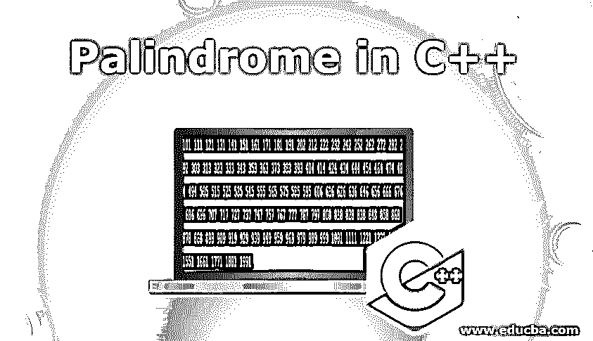
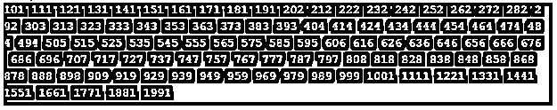
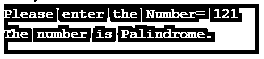
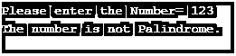
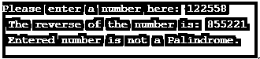
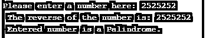

# C++中的回文

> 原文：<https://www.educba.com/palindrome-in-c-plus-plus/>




## C++中的回文介绍

回文是一个数字，一个序列或者一个单词，向后读和向前读是一样的。《伊甸园中的夫人，我是亚当》是回文单词颠倒后听起来一样的最好例子之一。这就是回文让事情变得有趣的地方，它们就像镜子一样。根据希腊语词源，名称“回文”实际上意味着再次往回跑。在 C++中，回文数是一个反转后保持不变的数。但是这怎么可能呢？我们如何检查一个数字是否太大太复杂？永远记住这个小算法，检查一个数字是否是回文。

1.  从用户处获取输入号码。
2.  将它保存在一个临时变量中。
3.  反转数字。
4.  反转后，将其与临时变量进行比较。
5.  如果相同，那么这个数字是一个回文。

不要担心，这里有一个例子，假设我们要打印给定数字范围之间的回文。例如，范围为{10，122}，则输出应为{11，22，33，44，55，66，77，88，99，101，111，121}

<small>网页开发、编程语言、软件测试&其他</small>

### 如何在 C++中实现回文？

下面是在 c++中实现回文的不同例子。

#### 示例#1

**代码:**

```
#include<iostream>
using namespace std;
// Function to check if a number is a palindrome or not.
int Palindrome(int n)
{
// Find reverse of n
int reverse = 0;
for (int i = n; i > 0; i /= 10)
reverse = reverse*10 + i%10;
// To check if they are same
return (n==reverse);
}
//function to prints palindrome between a minimum and maximum number
void countPalindrome(int minimum, int maximum)
{
for (int i = minimum ; i <= maximum; i++)
if (Palindrome(i))
cout << i << " ";
}
// program to test above functionality
int main()
{
countPalindrome(100,2000);
return 0;
}
```

**输出:**




让我们再举一个具体使用 while 循环的例子，它也将解释我们在引言中讨论的算法。我们将接受一个数字作为用户的输入，并检查它是否是一个回文。

#### 实施例 2

让我们用 C++程序来检查一个数是否是回文。

**代码:**

```
#include <iostream>
using namespace std;
int main()
{
int n,sum=0,temp,reverse;
cout<<"Please enter the Number=";
cin>>n;
temp=n;
while(n>0)
{
reverse=n%10;
sum=(sum*10)+reverse;
n=n/10;
}
if(temp==sum)
cout<<"The number is Palindrome.";
else
cout<<"The number is not Palindrome.";
return 0;
}
```

**输出:**







上面的代码将一个数字作为用户的输入，并将其放入一个临时变量中，正如您可以看到的那样，sum 已经是 0 了。它将使用 while 循环，直到数字变为 0，并且随着代码的编写，它将执行 while 循环后编写的操作。如果数字变为 0，那么它将检查临时变量是否等于总和。如果条件满足，它将打印出该数字是回文，否则，如果条件不满足，它将转到 else 部分，并打印出该数字不是回文。

另一个使用 do-while 循环的例子也将解释我们在引言中讨论的算法。我们将接受一个数字作为用户的输入，并检查它是否是一个回文。

#### 实施例 3

让我们用 C++程序来检查一个数是否是回文。

**代码:**

```
#include <iostream>
using namespace std;
int main()
{
int x, number, reverse = 0, temp ;
cout << "Please enter a number here: ";
cin >> number;
x = number;
do
{
temp = number % 10;
reverse = (reverse * 10) + temp;
number = number / 10;
} while (number != 0);
cout << " The reverse of the number is: " << reverse << endl;
if (x == reverse)
cout << " Entered number is a Palindrome.";
else
cout << " Entered number is not a Palindrome.";
return 0;
}
```

**输出:**







### 优势

下面是提到的优点。

*   假设在你的项目中，你想将第一个字符串/元素与最后一个匹配，然后将第二个元素/字符串与倒数第二个匹配，依此类推，如果你到达中间，这个字符串将会是回文。通过使用 for 循环，你可以执行所有的操作，并且在编程时节省了大量的时间和空间，因为在这种情况下，你既不用修改现有的字符串，也不用向内存中写入另一个变量。同样，所需的匹配完全等于[字符串长度](https://www.educba.com/javascript-string-length/)的一半。
*   如果你正在使用一种编程语言，其中字符串反转很容易，但是它需要额外的空间来以另一种方式存储反转的字符串，比如递归，需要更多的堆栈帧。除了递归还有一种方法，就是在字符串中间写一个循环，检查两端对应的字母是否相同。如果不相等，那么尽早断开配对，并声明该字符串不是回文。
*   上述方法的优点是不浪费任何计算资源，如递归，不需要额外的堆栈帧，但它也不简单，因为只是反转字符串并检查它们之间的相等性。这确实需要努力，但总是比其他算法少，因为这是找到回文的最简单的方法。
*   每种技术在编程中都有它的好处，而且有成千上万种其他的方法来完成同样的任务，但都是高效的。这完全取决于你正在做的项目。你只需要根据你的情况决定哪种技术能帮助你获得最好的收益，而不考虑它的缺点。
*   在一个真实的项目中，你需要在短时间内频繁地执行 n 次回文检查，那么你应该首先实现上面的算法，直到并且除非你需要一个针对当前技术约束的更乐观的解决方案。

### 结论

通过使用回文算法，无论数据类型是字符串还是整数，你都可以在查找回文时更加高效和快速。对于在不同系统中有多个数据的项目，这些算法可以用来提高整体性能。

### 推荐文章

这是一个 C++中的回文指南。在这里我们讨论的基本概念，C++程序来检查和实施回文详细的优势。您也可以阅读以下文章，了解更多信息——

1.  [c++中的回文程序](https://www.educba.com/palindrome-program-in-c-plus-plus/)
2.  [最佳 C++编译器](https://www.educba.com/best-c-plus-plus-compiler/)
3.  [c++中的斐波那契数列](https://www.educba.com/fibonacci-series-in-c-plus-plus/)
4.  [c++中的重载](https://www.educba.com/overloading-in-c-plus-plus/)


