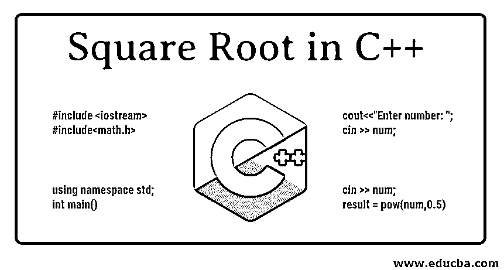
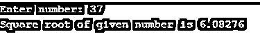
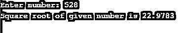
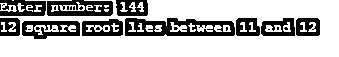
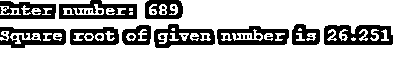
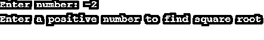

# C++中的平方根

> 原文：<https://www.educba.com/square-root-in-c-plus-plus/>




## C++中的平方根介绍

今天在这里，我们来学习一下众所周知的数学计算之一，平方根。我们将使用 C++编程来寻找一个给定数字的平方根。众所周知，C++是 C 编程语言的扩展，引入了 OOPS(T3)的 T2 概念；让我们从用 C++制作自己的平方根函数开始。

### C ++中的平方根逻辑

为了得到平方根函数，我们需要理解平方根是如何计算的。

<small>网页开发、编程语言、软件测试&其他</small>

实际上也有许多理解逻辑的方法，但是我们将首先从基础水平开始。

*   我们知道一个数的平方是 2 的幂。同样的，平方根，一个数是的幂。为此，我们可以使用 h 包库下的一个 pow 函数。

让我们看看如何用 C++来表示它。

```
#include <iostream>
#include<math.h>
using namespace std;
int main()
{
int num;
float result;
cout<<"Enter number: ";
cin >> num;
result = pow(num,0.5);
cout << "Square root of given number is " << result;
return 0;
}
```

**输出:**







*   在另一种方法中，我们可以以相反的方式拥有逻辑。就像，得到的最终结果的平方应该是我们选择的数字。

让我们看看如何用 C++来表示它。

```
#include <iostream>
#include<math.h>
using namespace std;
int main()
{
int num;
float result =0 ;
double sq;
cout<<"Enter number: ";
cin >> num;
sq = result*result;
while (sq < num)
{
result = result + 1;
sq = result*result;
if(num == sq)
{
cout<< result;
break;
}
}
cout<< " square root lies between "<< result-1 << " and " << result;
return 0;
}
```

我不会认为上面的一个是完美的，因为只有当它是一个完美的正方形时，输出才会正确。这是因为；我们将结果值直接增加整数 1。因此，如果它不是一个完美的正方形，我们可以显示如下输出。




我们甚至可以用这样一种方式写同样的逻辑，它也计算带小数的精确平方根。下面找一下。

### 寻找根

所以，显然有很多方法可以找到一个数的平方根。上述两种方法也可用于求根。现在，让我们看看如何更精确、更有逻辑性地编写平方根逻辑代码。

```
#include <iostream>
#include <iomanip>
using namespace std;
int main()
{
float num,i;
cout<<"Enter number: ";
cin >> num;
for(i=0.01;i*i<=num;i=i+0.01);
if(num==0)
{
cout<<"Square root of given number is 0";
}
else if(num==1)
{
cout<<"Square root of given number is 1";
}
else if( num < 0 )
{
cout<<"Enter a positive number to find square root";
}
else
{
std::cout << std::fixed;
std::cout << std::setprecision(3);
cout<<"Square root of given number is " <<i;
}
}
```

是的，代码看起来简短而简单。逻辑是这样的:

*   我们声明了两个值，一个作为输入，一个作为结果。
*   要求用户输入一个数字，我们需要写[平方根](https://www.educba.com/square-root-in-php/)。
*   在 for 循环中，我们将 I 值初始化为 0.01，因为我们需要用小数点表示结果。
*   然后，我们将执行一个循环，直到 I 值的平方小于用户输入的值。
*   我们将 I 值只增加 0.01，因为我们需要小数点，我们必须根据声明按比例增加 I 值。
*   如果观察的话，我们在 for 循环的末尾保留了一个分号，这使得循环在不执行任何内部语句的情况下运行，直到满足条件。
*   现在，我们可以判断输入值的条件是否为 0，然后立即返回 0。
*   同样，如果输入值为 1，则输出为 1。
*   在接下来的 else if 条件中，我们给出了一个任意负值的条件，即作为用户输入给出的[。](https://www.educba.com/java-user-input/)
*   在 else 条件下，我们将输出 I 值。
*   这里，我们使用了设定精度的方法，将小数位数固定为 3 位，这样我们得到的输出将是一致的。

注意: **iomanip** 包和 including 在程序中的声明是使用这个 set precision 方法所必须的。

输出附在下面:







这样我们可以很容易地完美计算出一个数的平方根。作为一个练习，你能试着用其他方法找到一个数的平方根吗？

### 结论

所以，这样一来，我们就可以在 C++中拥有自己的平方根函数了。我们甚至可以使用欧几里德，贝叶斯甚至通过排序技术找到平方根。反正大家都知道，我们甚至可以使用 sqrt 函数直接计算平方根。

### 推荐文章

这是一个关于 C ++中平方根的指南。这里我们讨论 C ++中平方根的介绍和逻辑以及求根。您也可以阅读以下文章，了解更多信息——

1.  [c++中的数组](https://www.educba.com/arrays-in-c-plus-plus/)
2.  [c++中的构造函数](https://www.educba.com/constructor-in-c-plus-plus/)
3.  [Java 中的平方根](https://www.educba.com/square-root-in-java/)
4.  [Python 中的平方根](https://www.educba.com/square-root-in-python/)


