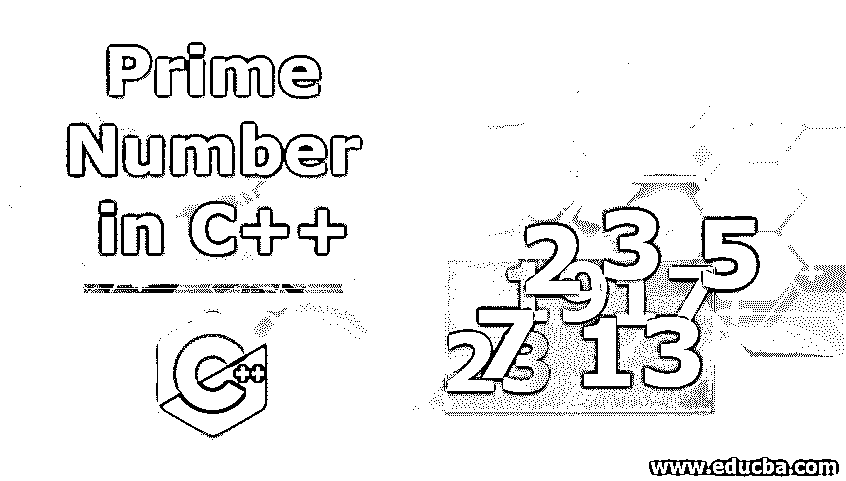
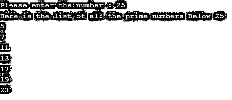
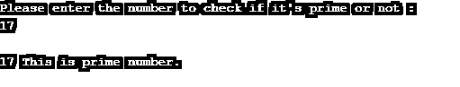
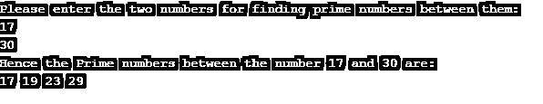

# C++中的质数

> 原文：<https://www.educba.com/prime-number-in-c-plus-plus/>




## C++中素数的介绍

质数是多少？任何大于 1 的数，它要么被 1 整除，要么这个数本身叫做质数。因为质数不能被任何其他数整除，所以它只能是同一个数或 1。例如，这是 C++中的素数列表，可以被 1 或数字本身整除。

### 一些素数的列表

2 3 5 7 11 13 17 19 23 29 31 37 41…

<small>网页开发、编程语言、软件测试&其他</small>

你可能会想，为什么 2 被认为是质数？这是个例外，所以 2 是列表中唯一的偶数。只有两个数是连续的自然数，而且是质数！还有，2 是最小的质数。

质数背后的逻辑是，如果你想从一系列数字中找出质数，那么你必须应用下面提到的逻辑:

如果给定的数能被它自己或 1 整除，那么 2 是唯一的偶数，这是个例外，所以要记住。用给定的数除以 2，如果你得到一个整数，那么这个数不可能是质数！

除了 2 和 3，所有的质数都可以用 6n+1 或 6n-1 的形式表示，n 是自然数。

没有一个以 5 结尾的素数大于 5。因为从逻辑上讲，任何大于 5 的数都可以被 5 整除。

为了更清楚地解释以上给出的所有逻辑，这里是所有素数[到 401 的表格:](https://www.educba.com/prime-numbers-in-c-sharp/)

|  | Two | Three | Five | Seven | Eleven | Thirteen | Seventeen | Nineteen | Twenty-three |
| Twenty-nine | Thirty-one | Thirty-seven | Forty-one | Forty-three | Forty-seven | Fifty-three | Fifty-nine | Sixty-one | Sixty-seven |
| Seventy-one | Seventy-three | Seventy-nine | Eighty-three | Eighty-nine | Ninety-seven | One hundred and one | One hundred and three | One hundred and seven | One hundred and nine |
| One hundred and thirteen | One hundred and twenty-seven | One hundred and thirty-one | One hundred and thirty-seven | One hundred and thirty-nine | One hundred and forty-nine | One hundred and fifty-one | One hundred and fifty-seven | One hundred and sixty-three | One hundred and sixty-seven |
| One hundred and seventy-three | One hundred and seventy-nine | One hundred and eighty-one | One hundred and ninety-one | One hundred and ninety-three | One hundred and ninety-seven | One hundred and ninety-nine | Two hundred and eleven | Two hundred and twenty-three | Two hundred and twenty-seven |
| Two hundred and twenty-nine | Two hundred and thirty-three | Two hundred and thirty-nine | Two hundred and forty-one | Two hundred and fifty-one | Two hundred and fifty-seven | Two hundred and sixty-three | Two hundred and sixty-nine | Two hundred and seventy-one | Two hundred and seventy-seven |
| Two hundred and eighty-one | Two hundred and eighty-three | Two hundred and ninety-three | Three hundred and seven | Three hundred and eleven | Three hundred and thirteen | Three hundred and seventeen | Three hundred and thirty-one | Three hundred and thirty-seven | Three hundred and forty-seven |
| Three hundred and forty-nine | Three hundred and fifty-three | Three hundred and fifty-nine | Three hundred and sixty-seven | Three hundred and seventy-three | Three hundred and seventy-nine | Three hundred and eighty-three | Three hundred and eighty-nine | Three hundred and ninety-seven | Four hundred and one |

### 在 C++中使用各种方法生成质数

现在让我们来看看如何使用各种方法，如 for 循环、while 循环、do-while 循环来找到[素数。在所有三种循环情况下，输出将是相同的，因为逻辑是相同的，只是实现方式不同。](https://www.educba.com/prime-numbers-in-python/)

我们将通过一个 C ++代码分别看到每个循环。

#### 示例#1

使用 for 循环寻找素数

**代码:**

```
#include <iostream>
#include <math.h>
using namespace std;
int main() {
int x; //  Declaring a variable x
cout << "Please enter the number : "; //  cout to get the input value from user
cin >> x;
cout << "Here is the list of all the prime numbers Below "<< x << endl;
for ( int m=2; m<x; m++)      //implementing for loop to find out prime numbers
for ( int n=2; n*n<=m; n++)
{
if ( m % n == 0)
break;
else if ( n+1 > sqrt (m)) {
cout << m << endl;
}
}
return 0;
}
```

**输出:**




正如你在上面的代码中看到的，我们用了两个 for 循环，因为我们需要一个素数列表，它将低于我们程序中给定的数。我们将 for 循环包含在另一个 for 循环中，以使我们的计算更容易。通过 if 语句添加了一个条件，以便在代码中达到给定的数字时中断循环。

#### 实施例 2

使用带有 if-else 的 for 循环查找素数

**代码:**

```
#include <iostream>
using namespace std;
int main ()
{
int number, x, count = 0;
cout << "Please enter the number to check if it's prime or not : " << endl;
cin >> number;
if ( number == 0)
{
cout << "\n" << number << " This number is not prime";
exit(1);
}
else   {
for ( x=2; x < number; x++)
if ( number % x == 0)
count++;
}
if ( count > 1)
cout << "\n" << number << " This number is not prime.";
else
cout << "\n" << number << " This is prime number.";
return 0;
}
```

**输出:**




#### 实施例 3

使用带有 if-else 的 WHILE 循环查找素数

**代码:**

```
#include <iostream>
using namespace std;
int main()
{
int lower, higher, flag, temporary;
cout << "Please enter the two numbers for finding prime numbers between them: "<< endl;
cin >> lower >> higher;
if ( lower > higher) {    //It will swap the numbers if lower number is greater than higher number.
temporary = lower;
lower = higher;
higher = temporary;
}
cout << "Hence the Prime numbers between the number " << lower << " and " << higher << " are: "<< endl;
while ( lower < higher)
{
flag = 0;
for ( int x = 2; x <= lower/2; ++x)
{
if ( lower % x == 0)
{
flag = 1;
break;
}
}
if ( flag == 0)
cout << lower << " ";
++lower;
}
return 0;
}
```

**输出:**




在上面的代码中，我们将整数作为一个较小的数字、一个较大的数字、一个临时变量和一个标志。最初，我们将两个数字作为输入，一个较低，另一个较高。如果较小的数字大于较大的数字，那么这些数字将首先通过一个临时变量进行交换，以便在代码中进一步移动。现在，当 loop 将继续下去，直到 lower 小于 higher，而对于 loop，条件将继续计算它们之间的质数。

### 结论

在中，[质数逻辑不仅可以在 C++中使用](https://www.educba.com/prime-number-in-javascript/)，而且可以在[任何编程语言中使用](https://www.educba.com/best-programming-languages/)。从一小组数字到一大堆数字，这种逻辑可以用来根据需要在几秒钟内找到一组素数，而不会浪费计算机编程的任何时间。

### 推荐文章

这是一个 C++的质数指南。这里我们讨论一些素数的列表，以及用于素数的各种方法。您也可以浏览我们推荐的其他文章，了解更多信息——

1.  [c++中的 ifstream](https://www.educba.com/ifstream-in-c-plus-plus/)
2.  [在 C++中交换](https://www.educba.com/swapping-in-c-plus-plus/)
3.  [c++中的抽象](https://www.educba.com/abstraction-in-c-plus-plus/)
4.  [c++中的正则表达式](https://www.educba.com/regular-expressions-in-c-plus-plus/)


