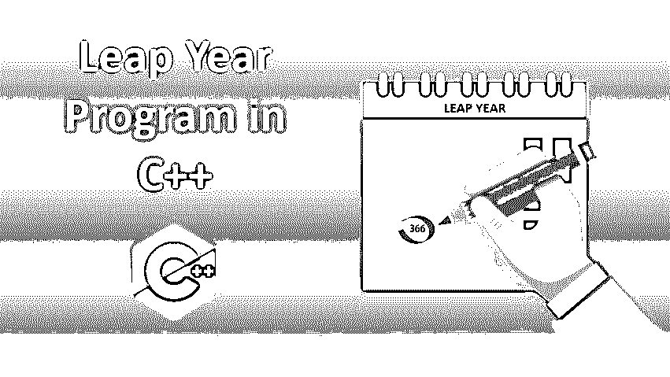
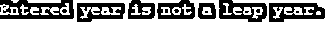
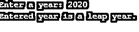
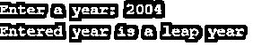

# C++中的闰年程序

> 原文：<https://www.educba.com/leap-year-program-in-c-plus-plus/>




## C++闰年程序介绍

如果一年是 366 天而不是 365 天，那么这一年就叫做闰年。闰年在日历上增加了一天。我们也可以说能被 4 整除的一年叫做闰年。但是，能被 400 整除的年份也被称为闰年，但能被 100 整除的年份不算闰年。从理论上和数学上计算闰年是相当繁琐的，但编程语言使它变得容易。我们不必担心数学计算。写一个简单的程序可以减少我们的工作量，我们可以随时检查。所以在这篇文章中，我们将会看到如何用 C++语言编写一个闰年程序

### 用 C++实现闰年的例子

下面举例说明闰年的实现。

<small>网页开发、编程语言、软件测试&其他</small>

#### 示例#1

使用嵌套 if 语句的 C++闰年程序。

**代码:**

```
#include <iostream>
using namespace std;
int main()
{
int y = 2400;
if (y % 4 == 0)
{
if (y % 100 == 0)
{
if (y % 400 == 0)
cout << "Entered year is a leap year.";
else
cout << "Entered year is not a leap year.";
}
else
cout << "Entered year is a leap year.";
}
else
cout << "Entered year is not a leap year.";
return 0;
}
```

**代码解释:**

这里我们写了一个程序，使用嵌套的 if 语句来检查闰年。这里我们使用了一个固定值。这里我们将变量 y 初始化为 2400。我们的年份是 2400 年。首先，它检查年份是否能被 4 整除。然后它检查这一年是否能被 100 整除。如果它能被 100 整除，它会检查它是否能被 400 整除。如果它也能被 400 整除，那么它将打印输入的数字是闰年，否则它将打印输入的数字不是闰年。如果年份不能被 100 整除，那么它将打印输入的数字是闰年。这是 2400 年的产量。

**输出:**


如果我们想检查 1700 年，我们只需要更改 y 的值。这里我们已经将 y 的值更改为 1700。

int y = 1700

1700 年的产量是:




#### 实施例 2

使用嵌套 if 语句和一个随机值在 C++中检查闰年的程序。

**代码:**

```
#include<iostream>
using namespace std;
int main()
{
int y;
cout << "Enter a year: ";
cin >> y;
if (y % 4 == 0)
{
if (y % 100 == 0)
{
if (y % 400 == 0)
cout << "Entered year is a leap year.";
else
cout << "Entered year is not a leap year.";
}
else
cout << "Entered year is a leap year.";
}
else
cout << "Entered year is not a leap year.";
return 0;
}
```

**代码解释:**

这里我们写了一个程序，允许用户输入年份，并检查这一年是否是闰年。

**输出:**




#### 实施例 3

使用 if else 语句检查 C++中闰年的程序。

```
#include <iostream>
using namespace std;
int main()
{
int y = 1600;
if (((y % 4 == 0) && (y % 100 != 0)) || (y % 400 == 0))
cout << "Entered year is a leap year";
else
cout<<"Entered year is not a leap year";
return 0;
}
```

**代码解释:**

在这里，我们编写了一个程序，使用 [if else 语句](https://www.educba.com/if-else-statement-in-c-plus-plus/)来检查闰年。这里我们使用了固定值，这里我们将变量 y 初始化为 1600，我们的年份是 1600。首先，它检查年份是否能被 4 整除。然后它检查这一年是否能被 100 整除。如果它能被 100 整除，它会检查它是否能被 400 整除。如果它也能被 400 整除，那么它将打印输入的数字是闰年，否则它将打印输入的数字不是闰年。这里我们利用& &运算符和||运算符来应用条件并减少编码语句的数量。

**输出:**


如果我们想检查 1800 年，我们只需要更改 y 的值。这里我们已经将 y 的值更改为 1800。

int y = 1800

1800 年的产量是:


#### 实施例 4

使用 if else 语句和一个随机值来检查闰年的程序。

```
#include <iostream>
using namespace std;
int main()
{
int y;
cout << "Enter a year: ";
cin >> y;
if (((y % 4 == 0) && (y % 100 != 0)) || (y % 400 == 0))
cout << "Entered year is a leap year";
else
cout<<"Entered year is not a leap year";
return 0;
}
```

**代码解释:**

这里我们写了一个程序，允许用户输入年份，并检查这一年是否是闰年。

**输出:**




### 推荐文章

这是一个用 C++编写的闰年程序指南。这里我们讨论用 C++实现闰年的介绍和例子以及代码解释。您也可以看看以下文章，了解更多信息–

1.  [Else-If 在 C++中](https://www.educba.com/else-if-in-c-plus-plus/)
2.  [C 语言中的闰年程序](https://www.educba.com/leap-year-program-in-c/)
3.  [Java 中的闰年程序](https://www.educba.com/leap-year-program-in-java/)
4.  [Python 中的闰年程序](https://www.educba.com/leap-year-program-in-python/)


