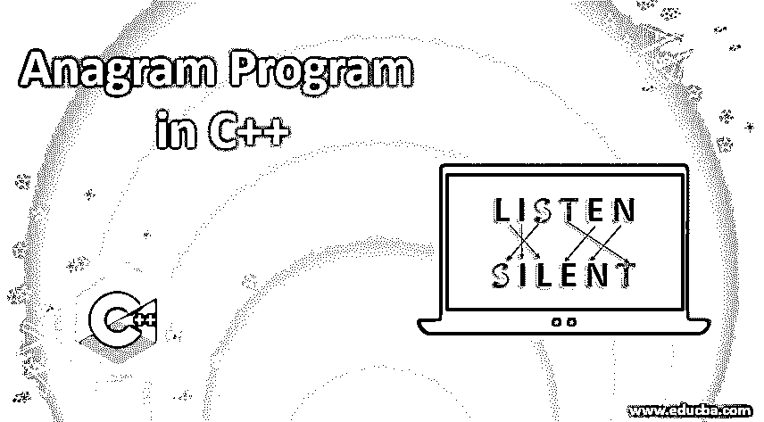
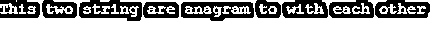
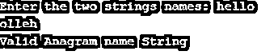

# C++中的字谜

> 原文：<https://www.educba.com/anagram-in-c-plus-plus/>




## C++中的字谜简介

我们在这里开发的算法称为变位词，用于查找给定的两个字符串中的字符数，并比较相同字符串中的每个字符。写一个函数来判断两个字符串是否是变位词。字符串变位词是具有相同字符的字符串，顺序只能不同。为了理解变位词是如何工作的，你可以看看变位词的例子，即“三角形”和“整数”，“沉默”和“听”是彼此的变位词。

### C++中的变位词示例

以下是要实施的示例:

<small>网页开发、编程语言、软件测试&其他</small>

#### 示例#1

通过排序

**代码:**

```
// C++ program to see if two strings are mutually anagrams
#include <bits/stdc++.h>
using namespace std;
/* function to check whether two strings are each anagrams */
bool areAnagram(string abc1, string abc2)
{
// Get both strings lengths
int n1 = abc1.length();
int n2 = abc2.length();
// If both strings are not equal in length, they are not anagram
if (n1 != n2)
return false;
// Filter the strings of both
sort(abc1.begin(), abc1.end());
sort(abc2.begin(), abc2.end());
for (int i = 0; i < n1; i++)
if (abc1[i] != abc2[i])
return false;
return true;
}
// Driver code
int main()
{
string abc1 = "hello";
string abc2 = "olleh";
if (areAnagram(abc1, abc2))
cout << "This two string are anagram to with each other";
else
cout << "This two strings are not anagram to with each other";
return 0;
}
```

**输出:**




#### 实施例 2

用 C++编写程序来搜索这两个字符串是否是彼此的变位组合。

**代码:**

```
#include <bits/stdc++.h>
using namespace std;
#define NO_OF_CHARS 256
/* function to test whether two strings are each anagram */
bool areAnagram(char* abc1, char* abc2)
{
// Build 2 count arrays and start all values with 0.
int count1[NO_OF_CHARS] = { 0 };
int count2[NO_OF_CHARS] = { 0 };
int i;
// Raise number in the respective count array for each character in the input strings
for (i = 0; abc1[i] && abc2[i]; i++) {
count1[abc1[i]]++;
count2[abc2[i]]++;
}
// If there is a different length of both strings. Removal would cause the software to fail for strings like
// "aaca" and "aca"
if (abc1[i] || abc2[i])
return false;
for (i = 0; i < NO_OF_CHARS; i++)
if (count1[i] != count2[i])
return false;
return true;
}
/* Driver code*/
int main()
{
char abc1[] = "educba";
char abc2[] = "abcuda";
if (areAnagram(abc1, abc2))
cout << "The two strings are one anagram";
else
cout << "The two strings are not one anagram";
return 0;
}
```

**输出:**


#### 实施例 3

通过使用哈希映射方法。程序来检查字符串是否是变位词，通过使用哈希映射方法。

**代码:**

```
#include <iostream>
#include <string>
#include <unordered_map>
using namespace std;
bool isValidAnagramString(string abc, string cbe) {
if(abc.length() != cbe.length()) return false;
if(abc.empty() && cbe.empty()) return true;
unordered_map<char, int> myMap;
for(char c : abc) {
myMap[c] += 1;
} // End the for loop
// Read the string cbe and check it in myMap
for(char c : cbe) {
myMap[c] -= 1;
} // End the for loop
for(auto it = myMap.begin(); it != myMap.end(); ++it ) {
if (it->second != 0) {
return false;
}
}
return true;
}
int main() {
string a1, a2;
cout << "Enter the two strings names: ";
cin>>a1>>a2;
if(isValidAnagramString(a1, a2)) {
cout << "Valid Anagram name String" << endl;
} else {
cout << "Not Anagram name String" << endl;
}
return 0;
}
```

**输出:**




**对上述程序的解释:**在这种情况下，首先必须测试每个字符串的长度，如果字符串长度相等，则消息应该以不等长的长度打印。这两个字符串的长度必须相同，因为变位词是经过验证的。我们首先逐个比较第一个字符串字符和所有第二个字符串字符，然后逐个比较第二个字符串字符和其他字符串字符，然后逐个比较第一个字符串字符和所有其他字符串字符，以此类推。

### 结论

在本文中，我们已经看到了如何通过使用各种方法和示例来检查两个字符串是否是彼此的变位词。我希望这篇文章对你有所帮助。

### 推荐文章

这是一本 C++中的字谜指南。在这里，我们讨论了基本概念和不同的例子，在 c++中的一个字谜与适当的代码和输出。您也可以浏览我们的其他相关文章，了解更多信息——

1.  [Else If in C++](https://www.educba.com/else-if-in-c-plus-plus/)
2.  [c++中的枚举](https://www.educba.com/enum-in-c-plus-plus/)
3.  [C 语言中的字谜程序](https://www.educba.com/anagram-program-in-c/)
4.  [Java 中的字谜程序](https://www.educba.com/anagram-program-in-java/)


