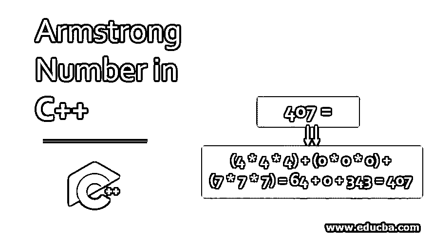
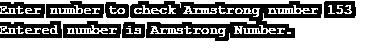
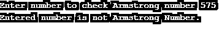
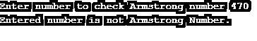
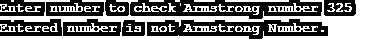
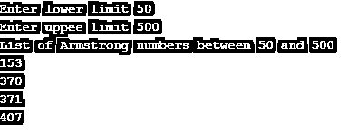

# C++中的阿姆斯特朗数

> 原文：<https://www.educba.com/armstrong-number-in-c-plus-plus/>




## C++中阿姆斯特朗数的介绍

等于其位数的立方之和的数是阿姆斯壮数。如果一个数的所有位数的立方之和等于该数，则称该数为阿姆斯特朗数。在本文中，我们将讨论如何使用 C++编程语言来检查阿姆斯特朗数。阿姆斯特朗的一些数字是-0，1，153，407。让我们用数学计算来检查一下。

0 = 0 * 0 * 0 = 0
1 = 1 * 1 * 1 = 1
153 =(1 * 1 * 1)+(5 * 5 * 5)+(3 * 3 * 3)= 1+125+27 = 153
407 =(4 * 4 * 4)+(0 * 0 * 0)+(7 * 7 * 7)= 64+0+343 = 407

<small>网页开发、编程语言、软件测试&其他</small>

### **检查阿姆斯特朗数的算法**

下面给出了在 C++中检查 armstrong 数算法:

**第一步:**输入号码

**第二步:**求输入数字的每一位的立方

第三步:将所有数字的立方相加

**第四步:**如果第三步的输出等于输入的数字，即第一步。那么打印输入的号码就是阿姆斯特朗号码。

**第五步:**如果第三步的输出等于输入的数字，即第一步。那么打印输入的号码不是阿姆斯特朗号码。

### 阿姆斯特朗数的例子

在这一节中，我们将讨论如何用各种方法检查阿姆斯特朗的数字。

#### 示例# 1–使用 while 循环

**代码:**

```
#include <iostream>
using namespace std;
int main()
{
int num, r, sum=0, temp_num;
cout << "Enter number to check Armstrong number ";
cin >> num;
temp_num = num;
while(num > 0)
{
r = num % 10;
sum = sum + (r * r * r);
num = num / 10;
}
if(temp_num == sum)
cout << "Entered number is Armstrong Number." << endl;
else
cout << "Entered number is not Armstrong Number." << endl;
return 0;
}
```

**输出:**







这里我们编写了一个程序，使用 while 循环来检查 Armstrong 数字，首先它要求用户输入一个值。然后将输入的数字复制到 temp_num 中。这里，temp_num 用于将结果与原始结果进行比较。while 条件检查该数字是否大于 0。如果该数字大于 0，它将在一段时间后执行语句。最后一位数字通过执行 num%10 与 num 分开。然后对该数字进行立方运算，并存储总和。然后使用 num/10 丢弃最后一个数字。对数字中的所有数字执行该过程。然后比较 temp_num 和 num，如果两者相等，将打印输入的数字是 Armstrong 数字。如果两者不相等，它将打印输入的号码不是阿姆斯特朗号码。

#### 示例 2–使用 do-while 循环

**代码:**

```
#include <iostream>
using namespace std;
int main()
{
int num, r, sum=0, temp_num;
cout << "Enter number to check Armstrong number ";
cin >> num;
temp_num = num;
do
{
r = num % 10;
sum = sum + (r * r * r);
num = num / 10;
} while(num > 0);
if(temp_num == sum)
cout << "Entered number is Armstrong Number." << endl;
else
cout << "Entered number is not Armstrong Number." << endl;
return 0;
}
```

**输出:**







这里我们写了一个程序，使用 do-while 循环来检查 Armstrong 的号码。操作与我们在实施例 1 中讨论的相同。唯一的区别是在第一个示例中，如果首先检查条件，即 num > 0。在这个例子中，在循环结束时测试了相同的条件。

#### 示例 3–使用 for 循环

**代码:**

```
#include <iostream>
using namespace std;
int main()
{
int lower_limit, upper_limit, i, r, sum, temp_num;
cout << "Enter lower limit ";
cin >> lower_limit;
cout << "Enter uppee limit ";
cin >> upper_limit;
cout << "List of Armstrong numbers between " << lower_limit << " and " << upper_limit << endl;
for(i = lower_limit; i <= upper_limit; i++)
{
sum = 0;
temp_num = i;
for(; temp_num >0; temp_num /= 10)
{
r = temp_num % 10;
sum = sum + (r * r * r);
}
if(sum == i)
cout << i << endl;
}
return 0;
}
```

**输出:**




在这里，我们编写了一个程序来打印用户输入的两个数字之间的阿姆斯特朗数。下限取最小数，上限取最大数。如果上限小于下限，那么它会抛出一个错误。上限数字应该大于下限。间隔之间的每个数字都存储在 temp_num 中。然后在变量 r 中检索数字的每个数字，然后找到立方体。然后将立方的结果加到最后一位数字的结果上。同样，遍历每个数字，当遍历完成时，将总和与原始数字进行比较，即如果它们相等，则打印该数字。

### 推荐文章

这是一个用 C++编写的阿姆斯特朗数指南。在这里，我们讨论了阿姆斯特朗数在 C++中的介绍和算法，以及示例和代码实现。您也可以浏览我们的其他相关文章，了解更多信息——

1.  [C++垃圾收集](https://www.educba.com/c-plus-plus-garbage-collection/)
2.  [c++中的存储类](https://www.educba.com/storage-class-in-c-plus-plus/)
3.  [c++中的访问说明符](https://www.educba.com/access-specifiers-in-c-plus-plus/)
4.  [c#中的阿姆斯特朗数](https://www.educba.com/armstrong-number-in-c-sharp/)


