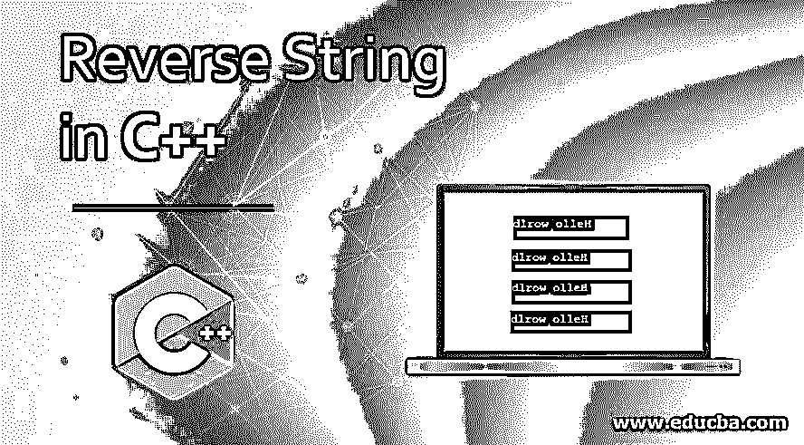

# 在 C++中反转字符串

> 原文：<https://www.educba.com/reverse-string-in-c-plus-plus/>




## C++中的反向字符串介绍

在 C++中反转一个字符串意味着以相反的顺序或向后的方向读取或改变读取字符的顺序。字符串的定义是，字符串是一个有序的字符集合或字符序列。string 是 C++中 std: string 类的对象。在字符串上，我们可以执行任何操作，如复制、连接、转换、比较、反转等。比如字符串“hello”如果我们按逆序或反方向读就是“olleh”，那么字符串“hello”反过来就是“olleh”。要反转一个字符串，我们可以编写 C ++程序，并用它来执行字符串的反转操作。 [String 在 C++中我们可以用两种方式将](https://www.educba.com/string-in-c-plus-plus/)存储在变量中，一种方式是作为 std: string 类的对象使用，第二种方式是存储在字符数组中。

### 反向字符串的逻辑

首先存储在字符数组中的给定字符串。字符数组的长度存储在变量 j 中，并且变量 I 被初始化为 0，并且通过 for 循环，可以使用临时变量 temp 在其中迭代地反转字符串。字符数组的第 I 个字符与第 j 个字符交换。一旦 I 小于 j，循环就终止了。因此我们得到的是逆序的字符数组。

<small>网页开发、编程语言、软件测试&其他</small>

### 反向字符串的示例

以下是一些例子:

#### 示例#1

通过使用 for 循环

**代码:**

```
#include <bits/stdc++.h>
using namespace std;
// Function to reverse a string
void revStr(string& strg)
{
for (int i=strg.length()-1; i>=0; i--)
cout << strg[i];
}
// main program
int main()
{        string strg = "Hello world";
revStr(strg);
return 0;
}
```

**输出:**


在上面的输出中，我们看到给定的字符串是以相反的顺序打印的，但实际上，它并没有被更新或编辑成字符串，只是打印出来。

#### 实施例 2

通过使用 while 循环

**代码:**

```
#include <bits/stdc++.h>
using namespace std;
// Function to reverse a string
void revStr(string& strg)
{
int i=strg.length();
while(i>=0)
{
cout <<strg[i];
i--;
}
}
// main program
int main()
{
string strg = "Hello world";
revStr(strg);
return 0;
}
```

**输出:**


同样，我们可以看到输出是以相反的顺序打印的，同样，实际上它没有被更新或编辑为字符串。

#### 实施例 3

通过使用 do-while 循环

**代码:**

```
#include <bits/stdc++.h>
using namespace std;
// Function to reverse a string
void revStr(string& strg)
{
int i=strg.length();
do
{
cout <<strg[i];
i--;
}while(i>=0);
}
// main program
int main()
{
string strg = "Hello world";
revStr(strg);
return 0;
}
```

**输出:**


同样，我们可以看到输出是以相反的顺序打印的，同样，实际上它没有被更新或编辑为字符串。

#### 实施例 4

接下来，我们编写 C++代码，通过下面的例子更清楚地理解反转字符串，在这个例子中，我们将 keydown()方法应用于第一个输入文本框元素

通过交换字符:

**代码:**

```
#include <bits/stdc++.h>
using namespace std;
// Function to reverse a string
void revStr(string& strg)
{
int last = strg.length();
//  characters are swaping from two both side
for (int i = 0; i < last / 2; i++)
// to swap characters using swap( ) built in function
swap(strg[i], strg[last - i - 1]);
}
// main code
int main()
{
string strg = "Hello world";
revStr(strg);
cout << strg;
return 0;
}
```

**输出:**


在上面的输出中，我们看到给定的字符串是逆序的。

#### 实施例 5

通过使用 reverse()内置方法

**代码:**

```
#include <bits/stdc++.h>
using namespace std;
int main()
{
string strg = "Hello world";
// using built in reverse method to reverse a string
// its syntax is void reverse(first, last)
reverse(strg.begin(), strg.end());
cout << strg;
return 0;
}
```

**输出:**


#### 实施例 6

通过使用常量字符串

**代码:**

```
#include <bits/stdc++.h>
using namespace std;
// Function to reverse a string
char* revConstStr(char const* strg)
{
int len = strlen(strg);
// dynamic pointer create of type char array
char *ptr = new char[len+1];
// copy the string to ptr pointer
strcpy(ptr, strg);
//  characters are swaping from two both side
for (int i=0, j=len-1; i<j; i++,j--)
swap(ptr[i], ptr[j]);
// return pointer of reversed string
return ptr;
}
// main code
int main(void)
{
const char *strg = "Hello world";
const char *str=revConstStr(strg);
for (int i=0; i<strlen(str); i++)
cout<<str[i];
return (0);
}
```

**输出:**


### 结论

字符串是字符的有序集合。在 C++中反转一个字符串可以通过按逆序逐字符或反向逐字符读取字符串来实现。string 是 C++中 std: string 类的对象。我们可以像上面的例子一样用多种方法来反转一个字符串。

### 推荐文章

这是一个在 C++中反转字符串的指南。在这里我们讨论介绍，在 C++中反向字符串的逻辑和例子。您也可以浏览我们的其他相关文章，了解更多信息——

1.  [c++中的 Deque](https://www.educba.com/deque-in-c-plus-plus/)
2.  [在 C#中反转字符串](https://www.educba.com/reverse-string-in-c-sharp/)
3.  [c++中的类型转换](https://www.educba.com/type-casting-in-c-plus-plus/)
4.  [C# StringReader](https://www.educba.com/c-sharp-stringreader/)


