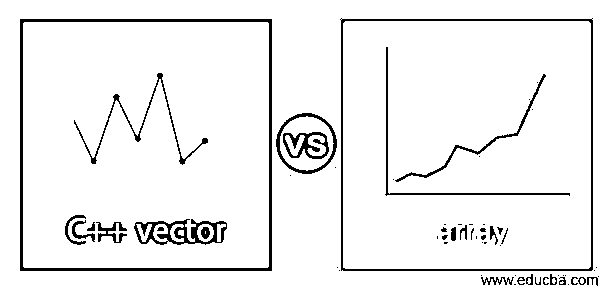
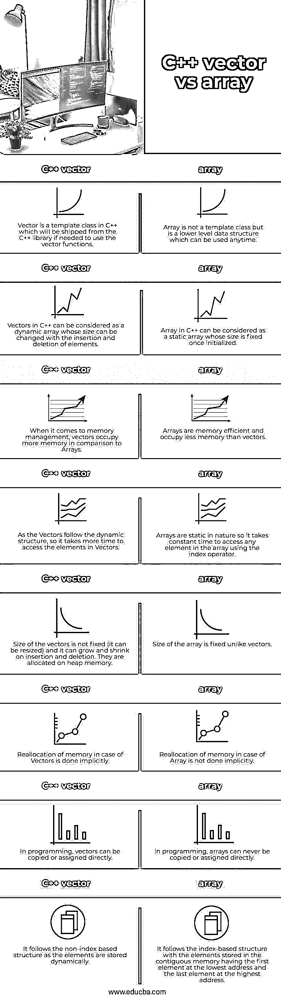
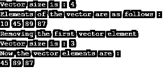

# C++向量与 C++数组

> 原文：<https://www.educba.com/c-plus-plus-vector-vs-c-plus-plus-array/>




## C++向量和数组的定义

C++中的向量是允许连续存储元素的顺序容器。向量本质上是动态的，可以在插入和删除元素时调整大小。因为它不是基于索引的，所以访问元素是通过使用迭代器来完成的，并且更加耗时。Vector 是一个模板类，并且只是一个 C++构造，这意味着如果需要在程序中使用它，它需要从 C++库中运出。

C++中的数组是固定大小的低级数据结构，允许基于索引存储元素。它可以被认为是存储在连续存储单元中的相同类型的元素的集合。它们本质上是静态的，在插入和删除元素时不能调整大小。由于它是基于索引的结构，访问数组中的元素只需要提供索引就需要花费恒定的时间。访问元素时，数组速度更快，性能更高。

<small>网页开发、编程语言、软件测试&其他</small>

### C++向量与数组的直接比较(信息图)

下面是 C++ vector 与 array 的 8 大区别。




### C++向量与数组的主要区别

下面给出了 C++ vector 和 array 之间的一些关键区别:

*   向量最适合程序员频繁插入和删除，而数组最适合频繁访问元素的情况。
*   向量是动态存储元素的顺序容器，而数组是允许基于索引存储元素的元素的顺序集合。
*   向量允许使用下标操作符访问元素，而数组允许使用直接索引访问元素。
*   Vector 是一个模板类，其父类是 C++库提供的集合类，而 Vector 是一个较低级的数据结构，通常使用，有自己的函数和方法。
*   数组在性能、速度和支持多维方面非常有效，而 Vectors 是一个类型安全的版本。
*   自动释放内存是在向量的情况下完成的，而数组如果是由程序员动态分配的，则需要显式地释放。
*   当使用函数时，在向量的情况下，大小值不需要作为参数传递，因为它维护变量以保持容器的大小，而在数组的情况下，大小需要作为参数传递。
*   程序员可以从函数中返回向量，而数组不能在代码中作为函数返回。
*   在 C++中初始化数组的基本语法:

```
int marks = [100, 50, 46, 67, 87];
```

**在 C++中初始化 vector 的语法:**

```
vector <int> marks;
//elements in the vector can be added using the push_back() function
```

*   数组中的所有元素都必须是同一类型的，并且按顺序存储在连续的内存中，而向量的情况则不是这样。
*   向量利用指针来访问容器元素，而数组元素通常通过提供索引来访问。

### C++向量与 C++数组对照表

下面给出的是 C++ vector 和 array 之间的比较表:

| **序列号** | **C++矢量** | **C++数组** |
| 1. | Vector 是 C++中的一个模板类，如果需要使用 vector 函数，它将从 C++库中提供。 | Array 不是一个模板类，而是一个可以随时使用的低级数据结构。 |
| 2. | C++中的向量可以看作是一个动态数组，它的大小可以随着元素的插入和删除而改变。 | C++中的数组可以被认为是一个静态数组，它的大小在初始化后是固定的。 |
| 3. | 说到内存管理，向量比数组占用更多的内存。 | 数组的内存效率高，占用的内存比向量少。 |
| 4. | 由于向量遵循动态结构，所以访问向量中的元素需要更多的时间。 | 数组本质上是静态的，所以使用索引操作符访问数组中的任何元素都要花费恒定的时间。 |
| 5. | 向量的大小不是固定的(可以调整大小),它可以在插入和删除时增长和收缩。它们被分配在堆内存中。 | 与向量不同，数组的大小是固定的。 |
| 6. | 在向量的情况下，内存的重新分配是隐式完成的。 | 数组情况下的内存重新分配不是隐式完成的。 |
| 7. | 在编程中，向量可以直接复制或赋值。 | 在编程中，数组永远不能被直接复制或赋值。 |
| 8. | 它遵循基于非索引的结构，因为元素是动态存储的 | 它遵循基于索引的结构，其中元素存储在连续存储器中，第一个元素在最低地址，最后一个元素在最高地址。 |

### 例子

让我们讨论 C++向量与数组的例子。

#### 示例 1–c++中的向量

**代码:**

```
#include <vector>
using namespace std;
int main() {
// Initializing the vector of integer values
vector<int> marks;
// Inserting the elements in the vector
marks.push_back(10);
marks.push_back(45);
marks.push_back(89);
marks.push_back(87);
// Getting the size of vector using the size() function
cout<< "Vector size is : "<< marks.size() << endl;
cout<<"Elements of the vector are as follows :"<<endl;
// Iterator to retrieve the elements of vector
for (auto it : marks)
cout << it << " ";
cout << endl;
//Removing the first vector element using erase() function
cout << "Removing the first vector element "<< endl;
marks.erase(marks.begin());
cout<< "Vector size is : "<< marks.size() << endl;
cout<< "Now the vector elements are : "<< endl;
for (auto it : marks)
cout << it << " ";
return 0;
}
```

**输出:**




#### 示例 2–c++中的数组

**代码:**

```
#include<iostream>
#include<array>
using namespace std;
int main()
{
//Initialising the array
int marks[10] = {90, 87, 76, 56, 67};
// getting the size of array
cout << "Size of array is : ";
cout << sizeof(marks) / sizeof(marks[0]) <<endl;
// Printing elements of the array marks
cout << "The array elements are given below : ";
for ( int x=0; x<5; x++)
cout << marks [x] << endl;
return 0;
}
```

**输出:**

**T2】**


 **### 结论

上面的描述清楚地解释了什么是 C++中的向量和数组，以及两者之间的主要区别。数组和向量都是按顺序存储元素的常用数据结构。由于两者都有不同的特性，并且在不同的场景中使用，所以程序员需要首先理解需求，然后根据需求实现它们。

### 推荐文章

这是 C++ vector 和 array 之间主要区别的指南。在这里，我们还将讨论信息图和比较表的主要区别。您也可以看看以下文章——

1.  [C++使用 vs typedef](https://www.educba.com/c-plus-plus-using-vs-typedef/)
2.  [C++ vs Java](https://www.educba.com/c-plus-plus-vs-java/)
3.  [C++ vs C#](https://www.educba.com/c-plus-plus-vs-c-sharp/)
4.  [C++与 Visual C++](https://www.educba.com/c-plus-plus-vs-visual-c-plus-plus/)


**