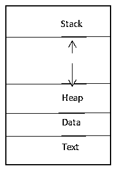

# 多线程面试问题 C++

> 原文：<https://www.educba.com/multithreading-interview-questions-c-plus-plus/>


## 介绍多线程面试问答 C++

在我们深入讨论线程和与访谈相关的概念之前，我想先简单介绍一下文章标题之前的工作原理，即多线程开始发挥作用。让我们快速看一下细节

有三种类型的计算机语言

<small>网页开发、编程语言、软件测试&其他</small>

*   低级别(机器级别)
*   中间层(装配层)和
*   高级(如 C++，JAVA，COBOL 等)

这些高级语言(在我们的例子中，我们将考虑 C++)通过使用程序(内置代码)与机器进行交互。翻译员帮助将细节翻译成机器语言(0 和 1 ),就像导游将一种语言翻译成另一种语言一样。

现在，一旦这种信息交换在人和机器之间(通过代码)发生，线程和进程这样的概念就出现了。这些细节我们将通过“C++线程面试问题”的问答来讨论。

现在，如果你正在寻找一份与多线程 C++相关的工作，那么你需要准备 2022 年多线程 C++面试问题。的确，每个面试都因不同的职位而不同。在这里，我们准备了重要的多线程面试问答 C++，它将帮助你在面试中取得成功。

在这篇 2022 多线程面试问题 C++文章中，我们将呈现 10 个最重要和最常被问到的多线程面试问题 C++。这些面试问题分为以下两部分:

### 第 1 部分–多线程面试问题 C++ (Basic)

这第一部分涵盖了基本的多线程面试问题 C++。

#### Q1。什么是多线程？

**答案:**
线程是执行的序列；也可以称为 OS(操作系统)的一个特性。
让我们用更简单的方式来理解上面这句话。
对于用户在系统上采取的任何行动，必须有一个过程来完成该行动(如用户所要求的)。每个进程必须至少有一个与之关联的线程。每个系统中内置的操作系统负责为每个线程分配处理时间。所以多线程是一种更加专门化的多任务处理方式。这种行为允许用户同时执行多项任务。

#### Q2。想出你知道的关于这个过程的每一个细节？

**回答:**
我们来看看流程到底是什么，A 先生登录系统，想看他业务的仪表盘。为了在系统上查看他的业务仪表板，他将导航到仪表板部分。在此过程中，他生成了一个由相应的系统操作系统处理的进程。操作系统将为该进程分配内存，并且操作系统还将确保一个进程的内存不能被其他进程访问。

因此，我们可以说，进程只不过是一个正在执行的程序。

流程布局(组件)—




一个流程有不同的阶段，也可以称为流程生命周期

*   开始
*   现成的
*   运转
*   等待
*   终止或退出

让我们转到下一个多线程面试问题 C++。

#### Q3。用它的类型突出 thread 的一些优点？

**答案:**
一般来说，螺纹有 2 种类型

*   **UI 线程—**这些用于创建 UI 组件。消息框弹出向用户显示任何信息。
*   **工作线程—**其中不包含消息泵

**优势—**

*   最小化上下文切换时间
*   促进交流
*   易于创建和连接线程
*   线程的使用使进程更加并发

#### Q4。为什么我们需要不止一个线程？

**答案:**
这是 C++面试中常见的多线程面试问题。我们知道，每个进程至少有一个相关的线程。在一个进程中使用更多的线程有很多好处。

*   **UI 界面—**首要的原因是拥有一个拥有出色用户体验的出色 UI。多线程概念有助于做到这一点。
*   **多任务处理–**有了更多的线程，人们可以同时做更多的事情。
*   **可用性—**系统的不同组件可能在给定的时间点使用不同的组件。在这里，多线程可以节省时间。

#### Q5。C++中创建线程的方法有哪些？

**回答:**
有四种方法可以做到这一点

*   使用函数指针创建线程
*   使用函数对象创建线程
*   使用 lambda 创建线程
*   使用成员函数创建线程

#### Q6。如何使用函数对象和函数指针启动线程？

**答案:**
**使用功能对象——**

```
class fn_object_class {
void operator () (params)
{
}
Std:: thread thread_object(fn_class_object(), params)
```

**使用函数指针-**

```
void foo(param)
{
}
std::thread thread_obj (foo, params);
```

#### Q7。您在这段代码中发现了什么问题？

**答案:**
代码给考生——

```
#include <iostream>
int main(int argc, char **argv)
{
const int & r1 = 100;
int v = 200;
int &r2 = v;
int & r3 = 200;
return 0;
}
```

右值必须是变量。问题出在 r3 的初始化上。

### 第 2 部分–多线程面试问题 C++(高级)

现在让我们来看看高级多线程面试问答 C++。

#### Q8。简单介绍一下多线程中可用的模型？

**答案:**
多对多关系

多对一关系

一对一的关系

#### Q9。命名线程的设计模式？

**答案:**
当前 IT 行业的一些热门测试案例
线程池(Boos 和 Worker)

同行(工作人员)

管道

让我们转到下一个多线程面试问题 C++。

**Q10。定义忙等待以及如何避免忙等待？**

**答:**
当一个线程正在等待另一个线程时，使用一个活动的循环结构，这种不做任何事情的状态称为忙等待状态。这个甘蔗避免使用互斥。

#### Q11。你所理解的优先级反转术语是什么？

**答:**
在低优先级线程持有锁，而高优先级线程正在等待的情况下，高优先级线程必须在低优先级线程之后等待。这是一个优先级反转的例子。

#### Q12。用户级线程和内核级线程有什么区别吗？

**答案:**
这是 C++面试中最常见的多线程面试问题。是的，这两者之间有一些重要的区别。下面列出了它们。

| **用户级别** | **内核级** |
| 这些在行动和创造上都很快 | 这些是缓慢的行动和创造 |
| 这些不绑定到任何操作系统 | 这些是特定于操作系统的 |
| 实现在用户级别 | 实现在内核级别。 |

#### Q13。说出用来创建线程的函数？

**答:**
afxbeginthread 函数用于创建线程(两种都有)。线程的创建有两种模式——一种是开始执行，另一种是在挂起模式下创建，稍后可以恢复。

#### Q14。多线程中可用的 6 个同步原语是什么？

**答案:**
它们如下——

*   互斥（体）…
*   加入
*   条件变量
*   障碍
*   旋转锁
*   旗语

### 推荐文章

这是一个多线程面试问题和答案 C++列表的指南，以便考生可以轻松破解这些多线程面试问题 C++。在这篇文章中，我们研究了面试中经常被问到的多线程面试问题。您也可以阅读以下文章，了解更多信息——

1.  [Java 多线程面试问题](https://www.educba.com/multithreading-interview-questions-in-java/)
2.  [线程面试问题](https://www.educba.com/threading-interview-questions/)
3.  [Java Servlet 面试问题](https://www.educba.com/java-servlet-interview-questions/)
4.  [QlikView 面试问题](https://www.educba.com/qlikview-interview-questions/)


