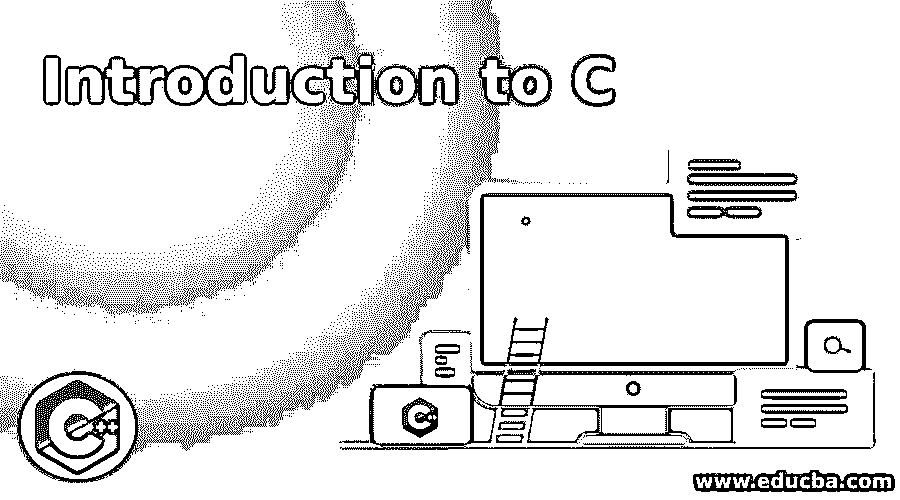
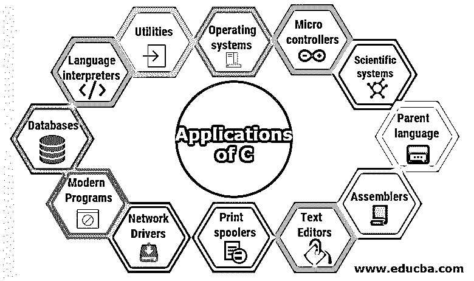

# C 语言简介

> 原文：<https://www.educba.com/introduction-to-c/>

## C 语言简介

下面的文章提供了 C 语言的简介。C 语言是最流行的高级编程语言之一，它最初是由开发人员 Dennis Ritchie 为 Unix 操作系统开发的。1972 年，它第一次被用在一台叫做 PDP-11 的数字设备公司的计算机上。它是一种过程编程语言，其主要目的是作为系统编程语言来编写操作系统。

许多流行的操作系统，如 Unix 操作系统和所有与 Unix 相关的应用程序，都是用 C 语言编写的。它是开发人员之间最流行的语言之一，因为它易于学习和编码，可以生成高效的程序，是一种结构化语言，能够处理低级活动，可以在各种计算机上编译。

<small>网页开发、编程语言、软件测试&其他</small>

### C 的主要组成部分

下面给出了 C 的主要组成部分:

*   这种编程语言是为了能够使用它编写 Unix 而创建的。
*   这种语言有 B 语言作为它的直接父语言，它是在 20 世纪 70 年代开发的。
*   ANSI(美国国家标准协会)在 1988 年将这种语言正式确定为官方编程语言。
*   说到系统友好的编程语言，没有比 c 更好的选择了。
*   最先进的软件是用 C 语言编写的。
*   使用 C 语言作为系统专用编程语言的主要原因是它的高速度和高效率，与汇编语言接近。
*   c 程序的扩展名是. c。

### C 语言的特点

下面给出了 C 的特征:

*   低级内存访问:轻量级编程语言需要低级内存访问，因此非常适合系统编程。
*   **简化关键词集:**丰富且易于理解和使用一组符合这种语言最重要特征之一的简化关键词。
*   干净的风格:这种语言专注于保持代码整洁，因此代码流是干净的。
*   **指针机制:**C 语言中指针和寻址机制的高效使用，使其与众不同，区别于其他所有编程语言。
*   一种高效的编译器设计语言:轻量级、丰富多样的命令集和特性、能够很好地与硬件配合工作的能力、低内存利用率等原因使它成为编译器设计开发的理想语言。
*   它是一种非常健壮的语言，具有丰富的内置运算符和函数。
*   用 C 语言编写的程序速度更快，效率更高。
*   它是一种高度可移植的语言。这意味着一旦用 C 写的程序几乎不需要修改就可以很容易地在其他各种机器上运行。
*   它拥有大量的库或内置函数。它还为我们提供了定制或创建自己的函数并将其包含在 C 库集合中的能力。
*   它是一种高度可扩展的语言。

### C 的应用

下面给出了 C 语言的应用:

*   **操作系统:**这种语言因其高度的灵活性和通用性而被用于开发操作系统。
*   微控制器:这种语言因其效率和速度而用于系统编程，因此有时会取代汇编语言。C 的编译器直接转换成机器语言。这也是一个很好的选择，因为它允许用最少的命令集实现最大的控制。
*   科学系统:这种语言被用于建立和创造许多科学系统。
*   **高级语言的母语言:**所有的高级编程语言都是 C 语言的结果；因此，了解这种语言为各种其他编程语言打开了许多大门。
*   **汇编器:**所有用于执行机器级硬件专用系统的汇编器都是用 C 语言创建的。
*   **文本编辑器:**文本编辑器的一个重要特性或者说一个特点就是它的轻量级，没有比 C 语言更好的语言可以创建文本编辑器。
*   **打印假脱机程序:**在 C 编程语言的帮助下，创建了一个软件程序，该程序负责在命令发出后将作业发送到打印机。
*   **网络驱动:**负责上网和运行 WIFI 的网络驱动和其他种类的驱动都是用 C 语言编写的。
*   现代程序:各种现代程序都是用 C 编程语言编写的，它们的主要要求是消耗更少的内存和更接近硬件通信。
*   **数据库:**有许多数据库需要存储大量的数据，因此是用 C 语言编写的。
*   语言解释器:各种语言解释器负责将语言类型从高级语言转换为机器语言。
*   **实用程序:**各种命令和程序系统特定的实用程序也是用 C 语言编写的。

### C 语言的优缺点

下面给出了提到的优点和缺点:

#### 优势

*   c 语言是许多主要编程语言的构建模块，拥有巨大而强大的运算符和数据类型，因此使其成为一种快速而高效的编程语言。
*   它是一种高度可移植的语言，这意味着它是可互操作的。
*   作为内置函数的一部分，ANSI-C 中有 32 个关键字。此外，用户内置函数也得到广泛使用。
*   这种语言可以通过使用许多其他库函数来扩展。
*   编程语言的模块化结构使得这种语言的调试、测试和编程更加容易。

#### 不足之处

*   c 语言没有术语和 OOPS 的概念，OOPS 是目前所有高级编程语言中非常流行和重要的概念。
*   不可能进行严格的类型检查。
*   不检查运行时间。
*   它没有为我们提供命名空间。
*   它也没有构造函数和析构函数的概念。

### 推荐文章

这是 C 语言入门指南。在这里，我们讨论了 C 语言入门、C 语言的特点、组件、应用、优点和缺点。您也可以看看下面的文章来了解更多信息

1.  [C++命令](https://www.educba.com/c-plus-plus-commands/)
2.  [c++和 Visual C++的比较](https://www.educba.com/c-plus-plus-vs-visual-c-plus-plus/)
3.  [C 与 C++性能对比](https://www.educba.com/c-vs-c-plus-plus-performance/)
4.  [C 与 c++ | 18 大差异](https://www.educba.com/c-vs-c-plus-plus/)

