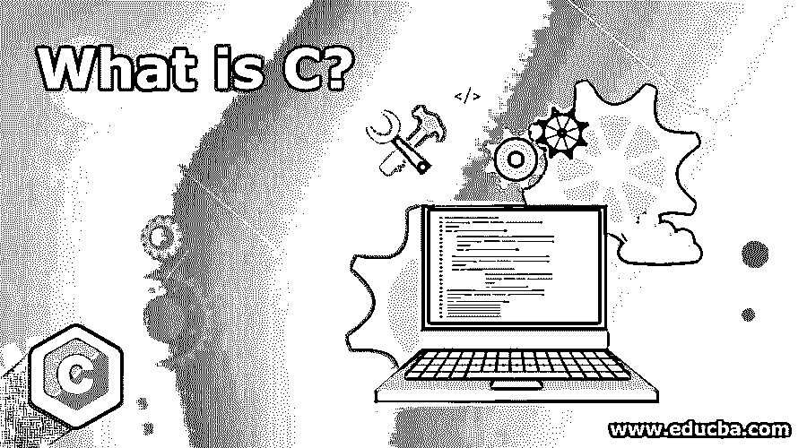
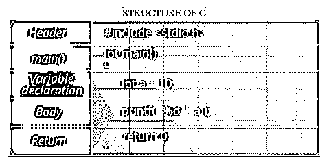

# 什么是 C？

> 原文：<https://www.educba.com/what-is-c/>

## C 语言简介

c 是常用的系统编程语言，可应用于任何类型的系统开发，例如系统应用程序开发过程、软件应用程序开发过程或甚至基于 web 的应用程序开发。它与内置的编译器一起工作，因为它将 C 从一种编程语言转换成一种机器可读的编码语言。由于其高性能、卓越的效率和可移植性，它是几十年来最受欢迎的语言。

### 学习 C 语言的先决条件

开始学习 c 之前你需要知道的东西不多，关于逻辑构建技巧的基础知识，数学就足够开始学习了。

<small>网页开发、编程语言、软件测试&其他</small>

### 谅解

任何语言写程序都有固定的结构和语法，用其他任何形式写都会出编译错误。这意味着我们也有一个固定的结构来编写 C 程序。

### C 的结构

### 使用

*   **操作系统**:用于编程 Windows、Linux、Mac 等操作系统。内核，也被认为是操作系统的核心部分，主要是用 C 语言开发的。
*   **手机**:手机内核也是用这种语言写的。所以，我们手里一直拿着的智能手机运行的是 C 内核。
*   **手机应用**:类似 C++、C#、Objective-C 这样的语言就是从它衍生出来的，用来制作手机和网络应用。
*   **数据库**:很多流行的数据库像 MySQL、 [Oracle 数据库](https://www.educba.com/what-is-oracle-database/)，MS SQL Server 都是用这种语言编写的。
*   **3D 电影、动画、计算机图形**:制作 3D 电影、动画、计算机图形的应用程序需要快速高效。因此，我们用 C 语言编写这些应用程序，因为它非常高效和快速。
*   **嵌入式系统**:嵌入式系统，如 Mp3 播放器、闹钟、收音机、微波炉、咖啡机、汽车传感器等。，都是用 c 语言编码编程的。

### 优势

以下是优点:

*   **可移植**:其可移植性允许代码在不同的计算机和不同的操作系统上运行，而无需做任何改动。
*   **高效**:是通用编程语言。因此它有效地工作。
*   区分大小写:你需要非常小心地编写代码，因为它对小写和大写字母的处理是不同的。
*   **内存操作和分配**:有操作任意内存地址的能力。它还允许动态分配内存。
*   **中级语言**:它本身融合了低级和高级语言的特点。

因此，它可用于以下两种情况:

1.  **低级编程:**像在开发内核
2.  **高级编程:**喜欢在开发应用。

*   **结构化编程语言:**它是一种结构化编程语言。因此，一个复杂的程序可以分解成不同的功能。
*   **自我扩展能力**:既然库支持，就允许我们在它的库中添加自己的函数。

### 为什么要用 C 语言？

我们应该使用这种语言，原因如下:

*   首先，它使代码变小。
*   它是高效的、可移植的、结构化的和易于理解的。
*   它只有 32 个容易记忆的关键词。
*   它接近于汇编语言，因为用 C 语言写的代码和用汇编语言写的代码运行得一样快。
*   它有[指针](https://www.educba.com/pointers-in-c/)将内核、驱动程序等硬件连接到系统；因为这个原因，C 会一直用下去。

### 范围

虽然许多人不使用它，但它仍然是最有价值和最受欢迎的技能之一。而且很值得学，因为 C 程序员很缺，工作也不算少。

操作系统、[嵌入式系统](https://www.educba.com/what-is-embedded-systems/)只能用 C 语言编写，因为它们需要快速有效的执行。

它有指针，这是任何其他编程语言都没有的。这个专业永远不会让语言消亡。

### 谁应该学 C？

无论您是编程新手，都应该学习它，原因如下:

*   它有 50 年的历史了，现在仍然很受欢迎。
*   它为编程打下了坚实的基础。因为它有自己的编译器，所以用它写的程序[只能在 C 编译器](https://www.educba.com/best-c-compilers/)上运行。所以，它不仅会教你编程或编码，还会让你了解一个程序如何在计算机上运行。
*   它将使你成为一个铁杆程序员，因为它有较少的库。因此，您将最终编写自己的代码。

### 职业成长

有从事嵌入式编程、系统编程和编译器设计等的公司。，寻找好的 C 专业人士，给一个好的职业成长。这项技术不会消亡，并将永远提供一个良好的职业机会。

### 结论

c 被认为是其他编程语言的基础。这项技术似乎没有有效期。它提供与硬件交互的特性使其独一无二。它的可移植性和高效性使它成为复杂数据操作以及嵌入式系统和操作系统内核开发的良好选择。许多其他编程语言也有需求，但它们无法击败它，当性能成为优先事项时，它仍然是首选。

### 推荐文章

这是一个什么是 C 语言的指南。在这里，我们讨论 C 语言的工作，结构，用途和优势，它可以帮助职业发展。您也可以浏览我们推荐的其他文章，了解更多信息——

1.  [什么是 MySQL？](https://www.educba.com/what-is-mysql/)
2.  [JavaScript 是什么？](https://www.educba.com/what-is-javascript/)
3.  [Python 是什么](https://www.educba.com/what-is-python/)
4.  [什么是 HTML？](https://www.educba.com/what-is-html/)

