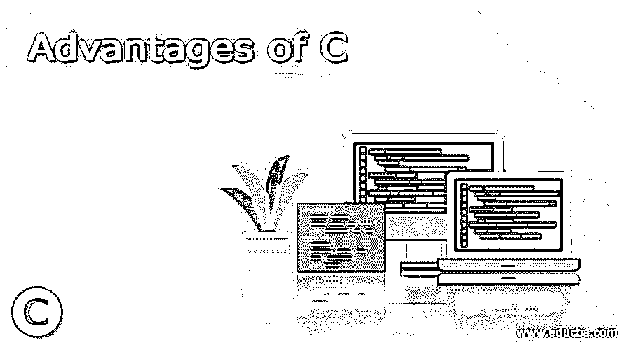

# C 语言的优势

> 原文：<https://www.educba.com/advantages-of-c/>

## C 语言优势介绍

c 语言是由 Dennis Ritchie 于 20 世纪 70 年代在贝尔实验室开发的，这样就可以在 Unix 上创建实用程序。它后来被应用于 Unix 操作系统内核的重新实现。它是使用最广泛、最流行的轻量级计算机编程语言之一。c 编程语言有很多优点，我们将在这篇文章中讨论。这种过程语言在本质上也是命令式的，它被设计成通过使用通用编译器来编译，该通用编译器可用于提供对存储器的低级访问，以便提供最小的运行时支持，并且还能有效地映射到指令的机器级别。这种语言用于执行许多主要与交叉浏览相关的功能。这种语言可以在各种各样的计算机平台上以互操作模式使用，只需对该语言的源代码进行小的修改，因此该语言可以在从许多微控制器到超级计算机的许多平台上使用。

### 什么是 C？

c 语言是一种通用语言，本质上也是命令式的，支持一种结构化的编程以及词法范围和其他技术，如递归，而静态系统类型用于防止意外操作。作为设计的一部分，C 语言提供了用于有效地映射典型机器指令的结构，并且在汇编语言中也具有初级的用途。这种语言的应用包括软件的创建和开发，如操作系统，以及各种应用级别的软件，这些软件是计算机专用的，范围从嵌入式系统到超级计算机。

<small>网页开发、编程语言、软件测试&其他</small>

### C 编程的优势

下面是 C 编程的优点。

1.  在完整的控制流原语集中存在固定且少量的关键字，因此用户名无法与关键字区分开来。
2.  有大量的算术、逻辑和按位运算符
3.  一条语句可以用来执行多种类型的赋值。
4.  返回值在不使用时可以忽略。
5.  弱强制静态类型使隐式转换成为可能。
6.  C 语言没有定义的关键字，因此被称为声明性语言
7.  用户定义的 type-def 关键字和其他级别的复合语句也是可能的。
8.  类型化的[指针](https://www.educba.com/pointers-in-c/)可用于转换低级机器语言。
9.  过程提供了一个非类型化的返回类型 void。
10.  这些函数可以在函数的词典范围之外定义。
11.  运行时多态性的概念也可以用在 C 语言中。
12.  预处理器用于执行宏级别的定义，包括源代码文件包含，还可以利用条件编译
13.  C 语言中存在的模块化的基本形式可用于单独传输文件，并且可用于通过提供对其他文件也可见的数据对象和函数的控制来链接在一起。
14.  复杂的功能，如输入输出字符串操作和其他数学功能，这些功能经常委托给其他库例程。
15.  c 语言是一种中级语言，用于结合高级语言和低级语言的特点。它广泛应用于所有低级编程中，例如编程[微控制器](https://www.educba.com/what-is-microcontroller/)和驱动器。它还主要用于为基于计算机的软件和实用程序编写脚本。这也用于为高级编程语言和应用程序等提供脚本支持。
16.  C 语言的这一优点是结构强大，可以用来将复杂的代码分解成更小更简单的块，这些块被称为函数。数据移动也可以在这些功能之间自由移动。
17.  C 的不同特性包括直接访问机器级别的硬件应用编程接口，这发生在有 [C 编译器](https://www.educba.com/best-c-compilers/)的情况下。
18.  c 语言是区分大小写的语言，这意味着在这种语言中，小写字母和大写字母的含义是不同的。
19.  c 是一种高度可移植的语言，用于编写基于系统的应用程序，构成了 Windows、Linux 和 Unix 操作系统的主要部分。
20.  它可以在企业级的应用程序和产品上高效地工作。由于其轻量级的属性和性质，它被用于许多操作系统和低级编码实用程序，如驱动程序和基本软件文件。
21.  c 编程语言是一个丰富的库，用于提供许多内置函数。这也用于提供动态级别的内存分配。
22.  c 语言用于快速实现数据结构和算法，从而加快程序的计算速度。这使得 C 语言在许多高级语言如 Mathematica 和 Matlab 中的使用更加普遍。

由于这些介绍和 C 语言的基本优势，这种 C 编程语言已经成为最主要的语言之一，并且传播得越来越快，不仅仅限于贝尔实验室，因此已经取代了许多语言，如 PASCAL、COBOL、FORTRAN、B、PL/I 等。这种 C 编程语言用于在从超级计算机到微控制器的许多平台上提供广泛的功能。这种高度可移植的语言通常是设备、小工具和所有需要多应用程序支持和开发的环境中最主要的选择。这种语言中广泛丰富的库用于提供许多轻量级的特性，并且在游戏中也得到最广泛的应用。它还展示了面向对象的性质，因此在某些方面也与许多高级编程语言如 C++和 Java 竞争。这种语言有很多优点，这完全取决于公司和项目的使用和要求。

### 结论

c 语言可以在多种计算机平台上以互操作模式使用。这种语言的应用包括软件的创建和开发，例如操作系统以及各种应用级别的软件。c 语言提供了用于有效地映射典型的机器指令的结构，并且在汇编语言中也有初级的用法。

### 推荐文章

这是关于 C 编程优势的指南。这里我们分别讨论基本概念与 C 编程语言的好处。您也可以阅读以下文章，了解更多信息——

1.  数据库管理系统的优势
2.  [Linux 的优势](https://www.educba.com/advantage-of-linux/)
3.  [OOP 的优势](https://www.educba.com/advantages-of-oop/)
4.  [CSS 的优势](https://www.educba.com/advantages-of-css/)

