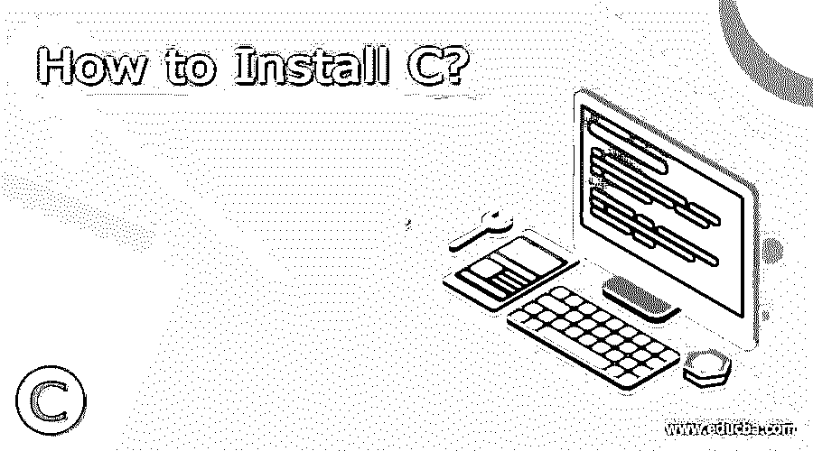
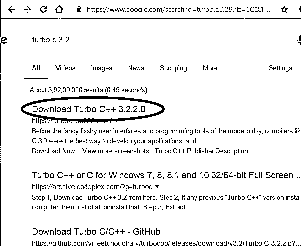
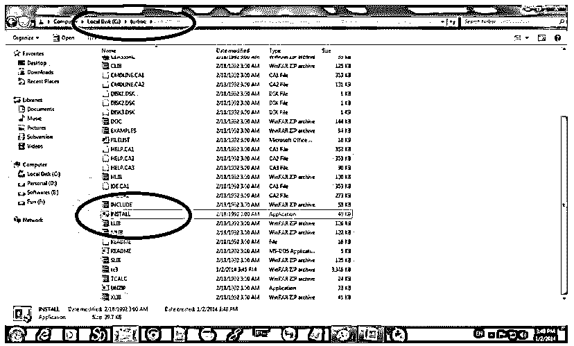
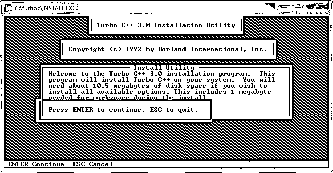
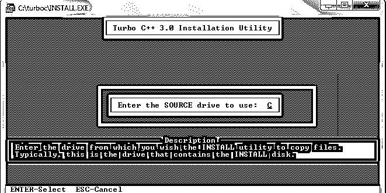
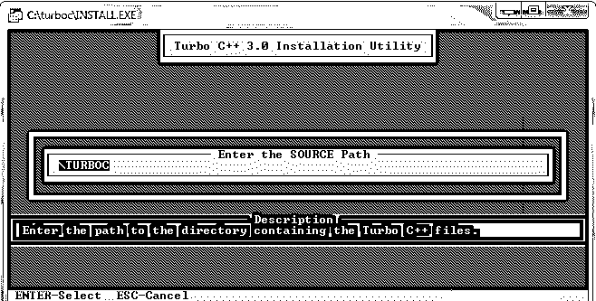
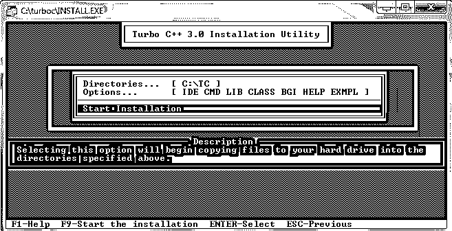
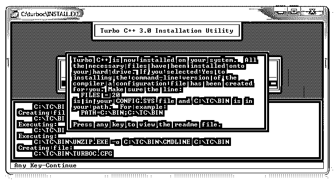
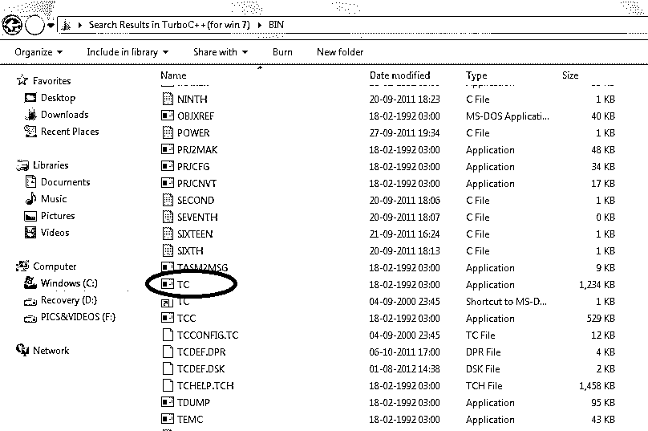
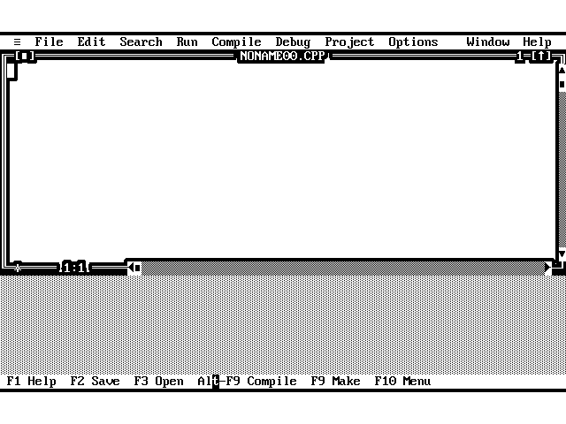

# 如何安装

> 原文：<https://www.educba.com/install-c/>




## 如何安装

c 语言是一种高级通用语言，由美国计算机科学家 Dennis M. Ritchie 于 1969 年至 1973 年间在位于美国的美国电话电报公司贝尔实验室(美国电话电报公司)开发的。它是用[汇编语言](https://www.educba.com/what-is-assembly-language/)编写的。Dennis Ritchie 和 Brian Kernighan 在 1978 年出版了第一版 K & R C 或“C 编程语言”。Linux 操作系统、Perl、Matz 的 Ruby、NumPy、Java 的第一个编译器、web 服务器如 Apache、Nginx 和 RDBMS MySQL 都是用 C 语言编写的。它是三种结构化语言的继承者，即 BCPL(基本组合编程语言)、ALGOL(算法语言)和 b。C 语言的许多特性继承了这些语言，同时也引入了许多新特性，如指针、结构、数据类型等。

1983 年，美国国家标准协会(ANSI)成立了一个委员会，对商业和政府项目中使用的语言进行标准化。

<small>网页开发、编程语言、软件测试&其他</small>

它是一种面向结构的编程语言。它允许直接访问内存和直接控制计算机的底层。它主要用于系统开发工作，如设计数据库、操作系统、语言解释器、语言编译器、汇编器、文本编辑器等等。许多遗留程序也是用 c 语言编写的。

它简单、高效、易学。它是学习许多其他编程语言的基础，因此有时也被称为所有编程语言之母。

一个主要的优点是它可以在各种平台上编译并产生高效的程序。它是可移植的或独立于机器的，也就是说，用 C 语言编写的程序也可以在其他机器上执行。它本质上是健壮的，并且有许多内置函数，这有助于程序员轻松高效地开发程序。我们也可以创建自己的函数，并把它们添加到 C 库中。它有一个模块化的结构，作为代码调试、代码测试和代码维护的催化剂。它还具有自我扩展的能力，因为它可以轻松有效地采用新功能。它的多功能性使其成为高级数据操作软件的有效选择，如 [3D 动画](https://www.educba.com/careers-in-3d-animation/)。

这是一种区分大小写的语言，即 continue 和 CONTINUE 被区别对待。c 语言严格遵循规则和条例，因此是一种非常严格的基于语法的编程语言。它还提供了[指针](https://www.educba.com/pointers-in-c/)的功能，用户可以通过它直接引用存储器或与存储器交互。我们可以使用递归，也就是在函数定义中调用函数，这样就可以使用回溯。

它是一种程序语言，即指令是一步一步执行的。它也是一种静态类型语言(静态类型语言是在编译时而不是运行时检查变量类型的语言。与动态类型语言相比，它们更快)，因此在软件开发周期中检测错误。

它总共有 32 个关键字和 45 个运算符，因此易于记忆和学习。它遵循自顶向下的编程方法。有 5 种内置数据类型，即整数(int)、浮点、字符(char)、双精度和 void。

c 程序很难调试和理解(除非注释写得很好)。C 不提供数据保护，C 编译器只能检测错误，不能处理异常。

C 有很多版本，最新的是 2011 年推出的 C11，所有标准 C 语言编译器都支持。

你可以安装 C 编译器，它把 C 语言程序转换成机器语言，在你的系统上运行任何 C 程序，因为没有编译，用 C 写的程序就不能执行。有许多 C 编译器，如 Turbo C、GCC、Microsoft Visual Studio Express、Xcode、Pelles C 等等。

许多 ide 也可以使用 C 语言，比如 NetBeans、DevC++、Eclipse、Code:: Blocks、MinGW 等等。

现在让我们看看 Turbo C++在 Windows 上的安装过程。

### 安装 C 的步骤

让我们讨论一下安装 c 所需的步骤。

#### 步骤 1:下载 Turbo C++软件

首先，你必须从链接下载 Turbo c++:[Turbo。C.3.2](https://www.google.com/search?q=Turbo.C.3.2&rlz=1C1CHBF_enIN834IN834&oq=Turbo.C.3.2&aqs=chrome..69i57j0l5.175j0j7&sourceid=chrome&ie=UTF-8)

当您打开此链接时，将出现以下页面。打开第一个链接下载。




#### 第二步:下载 Turbo C++

当您打开 open 链接时，将出现下载 turbo C++的选项。点击下载。


#### 第三步:在 c 盘创建 turbo c 目录，解压 tc3.zip

现在，您必须在 c: drive 中创建 turbo c 目录，并提取该目录中的 zip 文件。




#### 步骤 4:安装 C 的权限

现在会出现一个窗口询问是否允许安装，按回车键安装 c。




#### 步骤 5:将驱动器改为 C

按回车键后，将出现一个窗口。将驱动器更改为 C




#### 第六步:按回车键

它将在目录中查找所需的文件。




#### 步骤 7:开始安装

通过向下箭头键选择开始安装选项，然后按 enter 键。




#### 步骤 8:安装 C

c 已正确安装在您的系统中。所以按回车键阅读文件或关闭窗口。




#### 第九步:点击 BIN 文件夹中的 TC 应用程序

现在选择或双击 TC 应用程序开始编程。




#### 第十步:一个蓝色的窗口将会出现

开始用 C 语言编码并执行你的程序。




为了方便初学者，一个简单的打印 hello world 的程序被提及。

```
#include<stdio.h>
int main() {
printf("Hello World\n");
return 0;
}
```

**输出:**


### 推荐文章

这是一个关于如何安装 C 的指南。这里我们讨论了在我们的 windows 中安装 C 的不同步骤。您也可以阅读以下文章，了解更多信息——

1.  [C++命令](https://www.educba.com/c-plus-plus-commands/)
2.  [C++面试问题](https://www.educba.com/c-plus-plus-interview-questions/)
3.  [多线程面试问题 C++](https://www.educba.com/multithreading-interview-questions-c-plus-plus/)
4.  [安装 WordPress](https://www.educba.com/install-wordpress/)


