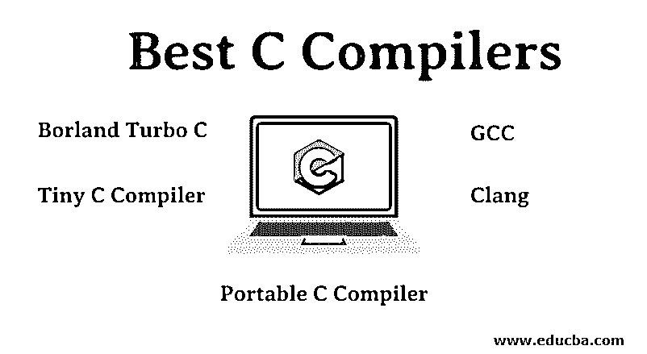
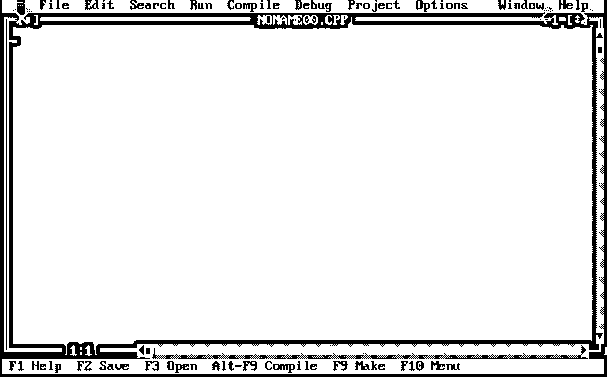

# 最佳 C 编译器

> 原文：<https://www.educba.com/best-c-compilers/>

## C 编译器概述

让我们通过一个例子来学习编译器的这个概念。假设你去过一个语言完全不同的地方，现在你遇到了一些旅行问题，想和他们交流。怎么会？你需要翻译吗？你选择找一个懂你语言的人来翻译，让对面的人明白你想说什么。同样的，我们将会用一种人类可以理解的高级语言来编写我们的 C 代码。程序如何理解我们要求它做的事情？这就是编译器发挥作用的地方。编译器将高端语言转换和翻译成机器(低级)可理解的语言。编译过程执行基本的翻译机制和错误检测。前端编译包括词法、语法和语义分析。在后端，编译完成代码生成和优化。所以 C 里面有很多编译器像 BDS，Clang，GCC，Interactive C，Lattice，Portable C 编译器，Visual Express 等等。下面就让我们深入了解其中的几个吧。

### C 编译器说明

以下是 C 语言的顶级编译器:

<small>网页开发、编程语言、软件测试&其他</small>

#### 1) Borland Turbo C

Turbo C 是 C 编程语言的基本和流行的编译器之一。这是 1987 年首次推出的；它因体积小、编译速度快、价格低而广受欢迎。一旦 Turbo C++在 1990 年发布，两个编译器都被合并，Turbo C 这个名字就不再使用了。2006 年，Embarcadero Technologies 重新发布了 Turbo C 免费版。你还记得这个蓝屏吗？

#### 2)微型 C 编译器

微型 C 编译器是为在磁盘空间很小的慢速计算机上工作而设计的。这是一个 ARM 处理器的 C 编译器。该编译器从 2005 年开始支持 Windows。下面提到了它的一些特性。

1.  它的文件很小，根据这个编译器的所有者(法布里斯·贝拉)。这个编译器的速度比 GCC 快 9 倍左右。代码的编译、汇编和链接是衡量该编译器速度的主要属性。
2.  这个编译器包含了许多编译器特有的特性，以增强可选内存、绑定检查器，并具有更高的代码稳定性。
3.  这个编译器只允许在编译时使用命令行参数自动执行程序。这样，程序使用 shell 脚本在 UNIX 下执行。最新版本发布于 2017 年 12 月。

#### 3)可移植 C 编译器

大约在 1970 年中期，可移植 C 编译器(PCC)是一个非常早期使用和建立的 C 编程语言编译器。这个编译器有很长的寿命。这在一段时间内很流行，许多 C 编译器都是基于它的。PCC 的优势取决于它的能力和概率预测。PCC 编译器使得源文件依赖于机器，而不是全部，只是其中的一部分。它可以检测语法错误，并可以执行完美的有效性检查。PCC 的新版本已于 2014 年 12 月 10 日发布。

#### 4)海湾合作委员会

GNU 编译器集合是 GNU 项目产生的编译器。它支持许多编程语言，是通用公共许可证下的自由软件基础。这个编译器首次发布于 1987 年，开始时只支持 C 语言。慢慢地它扩展到了 C++、Java、Android 和 IOS。这里，每种不同语言的编译器都有自己的程序，它读取编写的代码，并将机器码作为输出发送出去。所有这些都有一个共同的内部结构。当编写高级语言时，根据编写的语言，编译器解析该语言中的代码并生成抽象语法树。GCC 使用 LALR 解析器，但在 2006 年慢慢转向 C 语言的递归下降解析器。说到优化部分，众所周知，这可能发生在编译的任何阶段。然而，这里的批量优化是在代码生成之前和语法、语义分析之后执行的。下面是 GCC 执行的一些优化。

1.  它可以消除死代码段。
2.  它可以消除代码级的冗余。
3.  相对于标量水平的聚集体替换。
4.  可以对数组执行优化。

在 GCC 中，后端是由特定于特定架构的预处理器宏和函数指定的。该代码通常是通过首先调用与每个模式相关联的一小段代码并从指令集生成指令来构建的。这是通过在重新加载阶段选择的寄存器、偏移量和地址来完成的。GCC 当前版本为 9.2，发布于 2019 年 8 月 12 日。

#### 铿锵

1.  金属撞击声；包括 C ),也是 C++、Objective-C 和 objective-C++编程语言的编译器。这个编译器使用 LLVM 进行后端代码相关的编译。这个编译器被设计成通过支持 GCC 的许多编译标志和语言扩展来代替 GCC。
2.  Clang 有许多贡献者，包括苹果、微软、谷歌、索尼和英特尔。它是开源软件。LLVM 最初由 GCC 用于前端编译，但 GCC 给苹果的开发人员带来了一些问题，因为源代码很大，很难使用。所以，他们想出了铿锵。
3.  Clang 的主要目标之一是提供基于库的架构。它被设计成在编译过程中比 GCC 保存更多的信息。这也有助于保持原始代码的整体形状。
4.  Clang 在编译期间生成的错误报告总是以机器可读的格式详细而具体。与 GCC 相比，Clang 一直致力于减少内存空间的过度使用并提高编译速度，由于这些特性，它已经成为一段时间内增长最快的编译器之一。但是过了一段时间，Clang 的性能开始下降。这些报告指出，与海湾合作委员会相比，该组织的表现已经落后，差距几乎很大，而且表现开始放缓。最近的比较表明，[编译器](https://www.educba.com/javascript-compilers/)的性能都有所提高，并再次在它们之间产生了激烈的竞争。然而，海湾合作委员会仍然高居榜首。

### 结论

虽然有很多 C 编译器，但 GCC 是目前最好的编译器之一。这里的赢家声明基于耐用性、优化、速度和代码/错误/语法检查。通过这一点，我们可以清楚地了解到编译器是编程语言的重要支柱。没有他们的工作，我们写的任何程序对系统来说都是垃圾。

### 推荐文章

这是最好的 C 编译器指南。这里我们讨论基本概念，用五个要点解释 C 编译器。您也可以浏览我们推荐的其他文章，了解更多信息——

1.  [Python 编译器](https://www.educba.com/python-compilers/)
2.  [Java 编译器](https://www.educba.com/java-compilers/)
3.  [C 的优势](https://www.educba.com/advantages-of-c/)
4.  [JavaScript 编译器](https://www.educba.com/javascript-compilers/)

