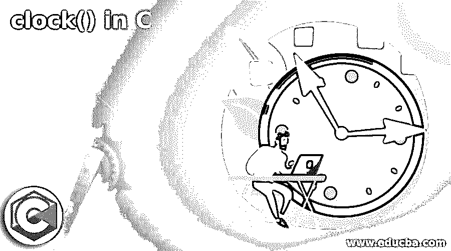
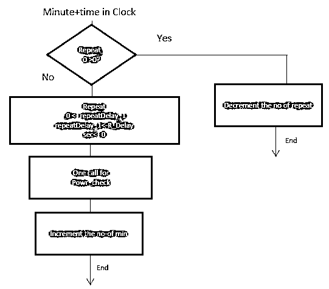
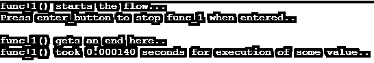
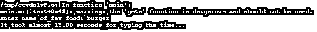

# C 语言中的时钟()

> 原文：<https://www.educba.com/clock-in-c/>




## C 语言中的 clock()介绍

Clock()在整个 C 编程中起着重要的作用，因为它有助于维护具有适当层次结构的计时记录。基于计时的经过时间或记录将有助于在每秒的基础上生成 32 位系统时钟。返回值返回函数，其中包含每个程序启动时经过的时钟周期数，但如果失败，返回值-1。Clock 函数是库 C 函数的一部分，它主要通过包含 ctime 头文件来启动流。

**语法:**

<small>网页开发、编程语言、软件测试&其他</small>

有一个合适的语法来表示 clock()函数，它返回一些近似的处理器时间，这些时间会被程序进一步消耗。根据时钟时间，分配每个操作系统的资源。语法表示如下:

```
clock_k clock(void)
```

其中 clock_k 表示带有关键字 clock 和参数的函数，用于返回 void 类型。

### C 中 clock()是如何工作的？

*   时钟功能主要用于确定操作系统中的处理器时间。
*   它通过计算任何操作每秒的滴答数来帮助将时间资源分配给处理器。
*   时钟功能基本上使用以下版本，其中它使用 C 语言作为 ANSI/ISO 9899-1990
*   还有其他类似于时钟函数的 C 函数，它们在标准库中有所表示:

```
Time_0 func (time.h)
```

*   Clock()函数遵循一些由分钟和时间表示的算法代码，例如:




*   算法流程以这样的方式进行，其中它首先检查重复循环是否存在，并且如果它大于 0 或不大于 0，如果条件检查得到满足，那么它将减少流逝的次数或每第二基础的滴答数，否则。
*   如果它不满足该条件，那么它将转而进入另一个场景，在该场景中，延迟或重复将以小于 0 的值发生。
*   然后，它将进一步要求电源检查它是否持续，然后，它将进入分钟数的增量，之后，它将按照流程图的描述，在完成状态中对完成的操作进行计数。

**伪代码**

```
# include <time.h>
clock_h  strt, end;
double cpu_time_usd;
start=clock();
// Perform Work
end = clock();
cpu_time_usd = ( (double) (end-start)) // This gives clock value on per second basis…
```

*   按照最初的伪代码，clock()函数有一个开始和结束时间，然后取一个 cpu_time_usd 变量，然后将 clock 函数赋给 start 函数。
*   然后，它将执行所有操作工作。
*   一旦工作结束，clock()函数的结果将被分配给 end()函数，从而在资源分配时，以每秒为单位对 CPU 计时进行操作。
*   时钟函数 return 是自程序在任何程序开始时启动以来经过的处理时间。
*   如果出错，该函数将返回-1。

### 例子

以下是下面提到的例子。

#### 示例#1

这个程序演示了函数在处理过程中是如何消耗时间的，如下图所示。

**代码:**

```
#include <stdio.h>
#include <time.h>
void func_1()
{
printf("func_1() starts the flow... \n");
printf("Press enter_button to stop func_1 when entered.. \n");
while(1)
{
if (getchar())
break;
}
printf("func_1() gets an end here.. \n");
}
int main()
{
clock_t t_0;
t_0 = clock();
func_1();
t_0 = clock() - t_0;
double time_consumed = ((double)t_0)/CLOCKS_PER_SEC;
printf("func_1() took %f seconds for execution of some value.. \n", time_consumed);
return 0;
}
```

**输出:**




**说明:**

这里用 C 语言中的 Clock()函数来演示 func_1 在执行某个值及其时间时消耗时间的流程。它需要一些时间来执行，并根据操作系统分配资源。如果按下 enter 键，那么它将按照输出中所示的所需值停止。

#### 实施例 2

该函数展示了 fib_time(20)在处理器内进行任何操作所消耗的时间，如输出中所示。

```
>#include<stdio.h>
int fib_time(int a_0)
{
if (a_0 <= 1)
return a_0;
return fib_time(a_0-1) + fib_time(a_0-2);
}
int main ()
{
printf("The number coming out of fib_time is: %d", fib_time(20));
return 0;
}
```

**输出:**


**说明**:在这个程序中，fib_time 出来的数字是作为用于概览的 fib_time()函数的最终编译时间，它是最终编译时间。

#### 实施例 3

这个程序演示了当前时间作为 ctime 标准库的一部分，以确定当前时间作为 clock()函数的一部分进行比较。

```
#include <stdio.h>
#include <time.h>
int main () {
time_t currnt_time;
time(&currnt_time);
printf("Current_time comes_out to be: = %s", ctime(&currnt_time));
return(0);
}
```

**输出:**


#### 实施例 4

Difftime 是另一个 c 引用函数，它也类似于 clock()函数，但是有一些主要的区别，如下面的输出所示。

```
#include <stdio.h>
#include <time.h>
int main ()
{
time_t tm_1,tm_2;
char get_inpt [258];
double diff_sc;
time (&tm_1);
printf ("Enter name of_fav food: ");
gets (get_inpt);
time (&tm_2);
diff_sc = difftime (tm_2,tm_1);
printf ("It took almost %.2lf seconds_for typing the time...\n", diff_sc );
return 0;
}
```

**输出:**




**解释**:这个程序演示了函数 diff_sc 与一些时间差的比较，它有助于理解切换或任何其他功能工作的瞬时时间。这里给出了一个选项，输入 fav food 的名称，比较并获取与操作系统不同的时间实例，如输出所示。

C 中的 clock()函数起着重要的作用，因为它有助于开发人员了解当前系统或正在使用的处理器的时序约束。它使开发人员能够区分和排除故障，即使某些补丁和版本是在检查和运行 clock()和 ctime 函数作为同一标准库的一部分进行验证的帮助下制作的。

### 推荐文章

这是一个 C 语言中 clock()的指南。这里我们讨论了 clock()在 C 语言中是如何工作的，并给出了代码和输出的例子。你也可以看看下面的文章来了解更多

1.  [Java 时钟](https://www.educba.com/java-clock/)
2.  [Trie 数据结构 C++](https://www.educba.com/trie-data-structure-c-plus-plus/)
3.  [C 语言中的指针算法](https://www.educba.com/pointer-arithmetic-in-c/)
4.  [C++快速排序](https://www.educba.com/c-plus-plus-quicksort/)


