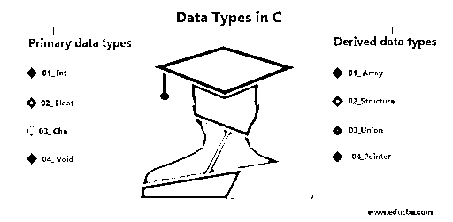
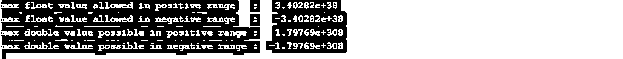
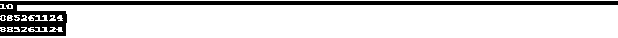

# C #中的数据类型

> 原文：<https://www.educba.com/data-types-in-c/>




## C 语言中的数据类型介绍

下面的文章提供了 C 中数据类型的概要。C 是一种紧凑的通用计算机编程语言，由 Dennis Ritchie 在 bell laboratories 为 Unix 操作系统开发。c 是一种独立于机器的结构化编程语言。许多组织已经使用 C 开发操作系统、解释器、设备驱动程序；此外，数据库 oracle 是用 C 编写的，在现代，嵌入式系统设计和物联网开发也使用 C 语言。c 是一种编译语言，编译器负责将源代码转换成机器可读的目标代码。有各种各样的编译器可用，如 TurboC、Clang 等。

### C #中数据类型的类型

每当在 C 中定义一个变量时，它都必须与某种数据类型相关联。

<small>网页开发、编程语言、软件测试&其他</small>

这给出了要分配给该变量的内存量的指示，并且每个变量将拥有自己唯一的内存位置，除了某些情况下变量只指向同一个内存位置。

c 将数据类型分为:

*   主要数据类型
*   派生数据类型

形容词（adjective 的缩写）主要数据类型也称为原始数据类型，包括以下几种:

*   （同 Internationalorganizations）国际组织
*   浮动
*   茶
*   空的

b.派生的数据类型可以是以下几种:

*   排列
*   结构
*   联盟
*   指针

现在让我们用例子来描述它们:

#### 1.整数数据类型(int)

如果你必须存储整数，那么 int 可以作为一种数据类型，它可以有一个基于你在内存中选择的大小的数字范围，它可以有所有的正数或者从负到正的数字范围，基于用户对代码设计的选择。

| **Int 类型** | **大小(以字节为单位)** | **允许范围** |
| int 或有符号 int | Two | -32768 至 32767 |
| 无符号整数 | Two | 0 到 65535 |
| 短整型或有符号短整型 | One | -128 到 127 |
| 无符号短整型 | One | 0 到 255 |
| 长整型或有符号长整型 | Four | -2147483648 至 2147483647 |
| 无符号长整型 | Four | 0 到 4，294，967，295 |

**举例:**

**代码:**

```
#include <stdio.h>
void main()
{
int a = 1;
printf(" %d is the integer value ",a);
unsigned short int x = -3278989;
printf(" %hu is the integer value ",x);
}
```

**输出:**


#### 2.浮点数据类型

任何实数都可以存储在 float 数据类型中，在这里我们也可以指定范围；基于数据类型和大小选择，允许一个数字范围。

| **浮动类型** | **大小(以字节为单位)** | **浮动范围** |
| 浮动 | Four | 3.4E-38 至 3.4E+38 |
| 两倍 | Eight | 1.7E-308 至 1.7E+308 |
| 长双份 | Ten | 3.4E-4932 至 1.1E+4932 |

**举例:**

**代码:**

```
#include <stdio.h>
#include <limits.h>
#include <float.h>
void main() {
printf("max float value allowed in positive range   :   %g\n", (float) FLT_MAX);
printf("max float value allowed in negative range   :   %g\n", (float) -FLT_MAX);
printf("max double value possible in positive range :   %g\n", (double) DBL_MAX);
printf("max double value possible in negative range :  %g\n", (double) -DBL_MAX);
}
```

**输出:**




#### 3.字符类型

这表示字符数据类型，它可以是有符号的，也可以是无符号的，两种情况下的固定大小都是 1 字节。

| **字符类型** | **大小(以字节为单位)** | **字符范围** |
| 字符或带符号字符 | One | -128 到 127 |
| 无符号字符 | One | 0 到 255 |

**举例:**

**代码:**

```
#include <stdio.h>
void main() {
char c ='a';
char f = 65; // represents ASCII char value, refer to ASCII table
printf("%c %c ", c, f);
}
```

**输出:**


#### 4.空隙类型

如果你不想给一个函数分配任何类型(也就是说，它不会像你在上面的代码片段中看到的以 void type 为前缀的 main 函数那样返回任何东西)，那么你可以把它标记为 void type。

上述片段可以作为相同的例子。

#### 5.数组

当任何同质数据集必须存储在连续的内存位置时，就选择这种数据类型，用例是，有时您的代码可能会返回多个结果，并且必须从函数中累积返回，例如，如果我们必须找到一年中所有月份的列表，那么它们将是 12，因此我们不能将 12 个月离散地放在单个变量中，所以我们使用数组来表示相同的结果。

让我们看一个简单的片段来理解数组的声明和使用。

**举例:**

**代码:**

```
#include <stdio.h>
void main() {
int i;
char arr[] = {'a', 'b', 'c'};
for(i = 0 ; i < 3 ; i++)
{
printf("%c\n",arr[i]);
}
} 
```

**输出:**


#### 6.结构

如果你需要在[编码世界](https://www.educba.com/what-is-coding/)中表示任何物理世界的结构，那么这种类型就可以派上用场，比如学生的班级可以被定义为一个结构，学生的分数和学号可以作为变量在里面使用，可以引入一个数组来保存与许多学生的这种结构相关的数据。

**举例:**

**代码:**

```
#include <stdio.h&gt
struct class{
int marks;
int rollNo;};
void main() {
struct class c;
c.marks=10;
c.rollNo=1;
printf("%d\n", c.marks);
printf("%d", c.rollNo);
}
```

**输出:**


#### 7.指针

这是最重要的数据类型之一，因为我们不了解 C 语言中的 T2 世界，像 java 这样的语言不使用它，但是 T4 函数编程语言总是使用它。指针的概念是将内存分配给某个变量，然后引用该内存位置进行读写操作，该内存位置可以是函数的地址，也可以是变量的地址，等等。指针对于 C 语言中的数组和结构处理是必要的，并且还提供了动态内存管理。

**举例:**

**代码:**

```
#include <stdio.h>
void main() {
int a, *p;  // variable and pointer declaration
a = 10;
p = &a;
printf("%d", *p);    // print the value of 'a'
printf("%u", &a);    //print the address of 'a'
printf("%u", p);     // print the address of 'a' in different way
// remember & represents address of variable
}
```

**输出:**

**

** 

### 结论

因此，我们看到了 C 中的各种数据类型，以及它们如何与 C 语言一起处理编码场景。你也可以用 C 做嵌入式编程，因为同样的实用程序也已经开发出来了。所以 C 是一种通用的语言，但是在现实世界中，编码变得更加复杂。

### 推荐文章

这是一个 c 语言中数据类型的指南，在这里我们讨论基本概念，不同类型的数据和相应的例子，以及代码实现。您也可以浏览我们推荐的其他文章，了解更多信息——

1.  [计算机语言的种类](https://www.educba.com/types-of-computer-language/)
2.  [C 编程中的数组](https://www.educba.com/arrays-in-c-programming/)
3.  [C 编程中的模式](https://www.educba.com/patterns-in-c-programming/)
4.  [最佳编程语言](https://www.educba.com/best-programming-languages/)


