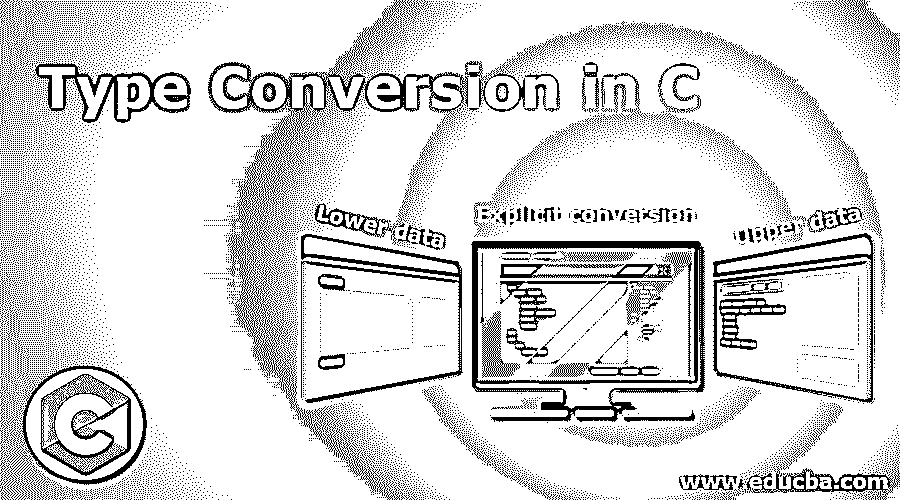
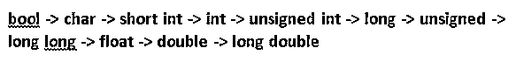
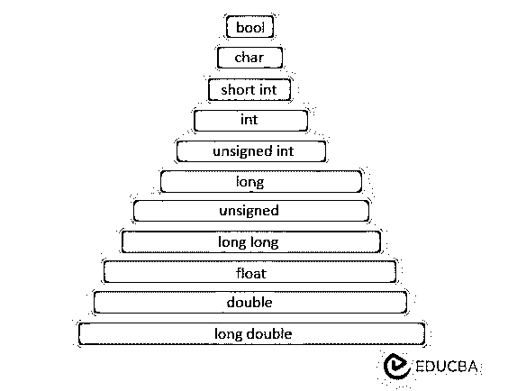
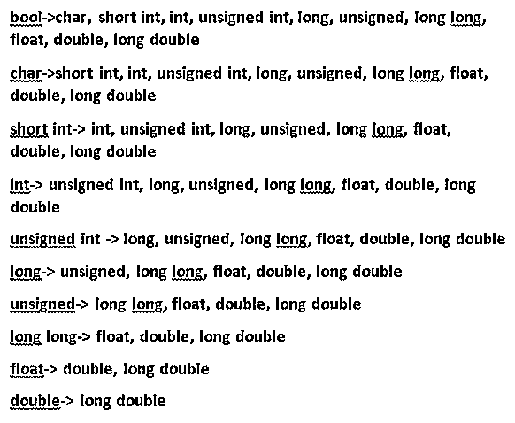
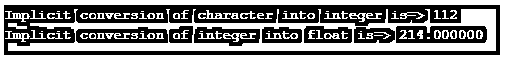
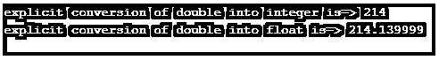

# C 语言中的类型转换

> 原文：<https://www.educba.com/type-conversion-in-c/>




## C 语言中的类型转换介绍

C 中类型转换的定义就好像我们把任何一个数据类型赋给另一个数据类型，然后称之为“类型转换”。任何具有较低数据类型值的编程语言都可以自动转换为较高的数据类型值。在这种情况下，没有数据丢失，而在高数据类型值转换为低数据类型值的情况下，可能会有数据丢失的机会。低级数据类型到高级数据类型的转换可以由 C 编译器自动完成，但是高级数据类型到低级数据类型的转换，我们必须需要显式的类型转换。这被称为“显式转换”。让我们举一个例子，long 值转换为 int 值是一种显式类型转换。

### 为什么显式转换需要将较大的数据类型转换为较小的数据类型？

我们来考虑一个小类比然后你就很明白了，有 2 个水瓶，一个是 1 升，一个是 2 升。我们可以很容易地将 1 升水倒入 2 升的水瓶中，而不会溢出。同样，如果我们试图将 2 升的水瓶倒入 1 升的水，那么如果一个 2 升的水瓶装的水超过 1 升，水就有可能溢出。所以在这种情况下，1 升的水瓶是下层数据类型，2 升的水瓶是上层数据类型。即使有溢出水的可能，我们仍然希望将 2 升水倒入一个 1 升的水瓶中，这样顾客就必须接受这样做。同样，开发人员有一个明确的想法，即使我们试图将上层数据类型转换为下层数据类型也可能会有数据丢失，所以他必须接受这一点。

<small>网页开发、编程语言、软件测试&其他</small>

### C #中的转换类型？

c #中有两种类型的造型。

*   隐式类型转换
*   显式类型转换

#### 1.隐式类型转换

较小数据类型到较大数据类型的转换被称为“隐式类型转换”。这是由 C 编译器自动完成的。没有数据丢失。

**隐式类型转换:**




**隐式类型转换图:**




**语法:**

```
Bigger_dataType  variableName=smaller_dataType_Value;
```

#### 2.显式类型转换

较大数据类型到较小数据类型的转换被称为“显式类型转换”。这不是由 C 编译器自动完成的。可能会丢失数据。这必须由开发人员明确完成。

**显式类型转换:**




**语法:**

```
Smaller_dataType  variableName=(Smaller_dataType)Bigger_dataType_Value;
```

**Note:** Conversion applies to compatible data types only.

### C 语言中的类型转换示例

下面是下面提到的例子

#### 示例# 1–隐式类型转换

**代码:**

```
//include the basic c libraries
#include<stdio.h>
int main() //main method to run the application
{
//declaring and initializing variable
int first = 214; //int variable
char character = 'p'; // character variable
// implicit conversion of character into integer
// ASCII value of 'p' is 112
int second= character;
// implicit conversion of integer into float
float third = first;
//display the implicit type conversion output
printf("Implicit conversion of character into integer is=> %d\n",second);
printf("Implicit conversion of integer into float is=> %f\n",third);
return 0;
}
```

**输出:**




#### 示例# 2–显式类型转换

**代码:**

```
//include the basic c libraries
#include<stdio.h>
int main() //main method to run the application
{
//declaring and initializing variable
double firstDouble = 214.14; //double variable
float secondFloat=222.22; //float variable
// explicit conversion of double into integer
int intValue=(int)firstDouble;
// explicit conversion of double into float
float floatValue = (float)firstDouble;
//display the implicit type conversion output
printf("explicit conversion of double into integer is=> %d\n",intValue);
printf("explicit conversion of double into float is=> %f\n",floatValue);
return 0;
}
```

**输出:**




#### 示例# 3–自动显式转换

**代码:**

```
//include the basic c libraries
#include<stdio.h>
double getSquareArea(int a, int b);
int main() //main method to run the application
{
//declaring and initializing variable
double firstDouble = 214.14; //double variable
double secondDouble=222.22; //float variable
// we are passing arguments as double values
int mul=getSquareArea(firstDouble,secondDouble);
//display the implicit type conversion output
printf("Area of square is=> %d\n",mul);
return 0;
}
// Even we are not converting also compiler automatically convert double to int and take only inter part to multiplication
double getSquareArea(int a, int b)
{
return a*b;
}
```

**输出:**


### 结论

C #中的类型转换，有两种类型的类型转换，第一种是隐式类型转换，第二种是显式类型转换。隐式类型转换由编译器自动完成，但显式类型转换必须由开发人员执行，因为在这种情况下可能会丢失数据。最新的 C 版本显式转换也是由编译器完成的。

### 推荐文章

这是一个 C 语言中类型转换的指南，在这里我们讨论 C 语言中的转换类型和例子，以及代码和输出。你也可以看看下面的文章来了解更多-

1.  [C 语言中的编程错误](https://www.educba.com/programming-errors-in-c/)
2.  [C 编程矩阵乘法](https://www.educba.com/c-programming-matrix-multiplication/)
3.  [c#中的正则表达式](https://www.educba.com/regular-expression-in-c-sharp/)
4.  [c++中的信号](https://www.educba.com/signal-in-c-plus-plus/)


