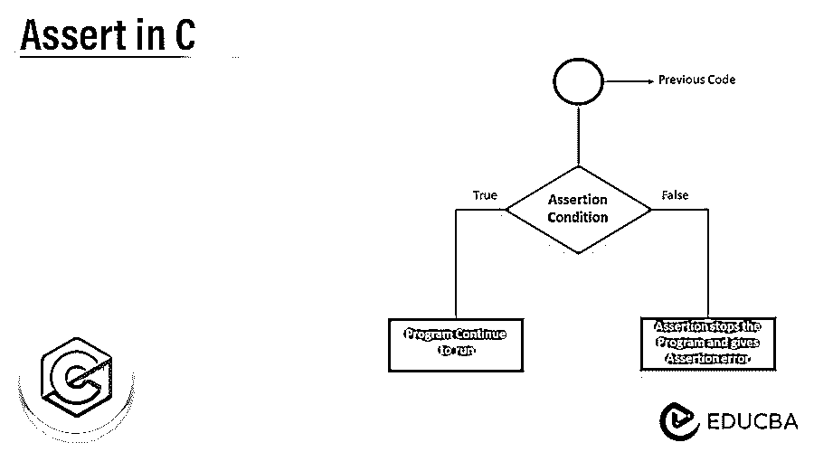
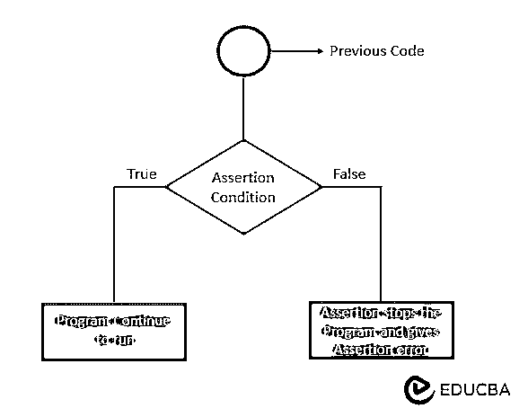
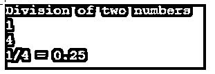
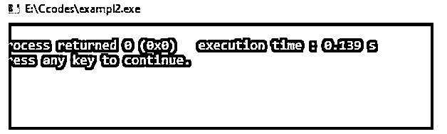
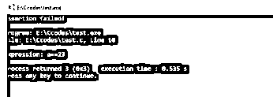

# 在 C 中断言

> 原文：<https://www.educba.com/assert-in-c/>




## C 语言中断言的介绍

以下文章提供了 c 语言中 Assert 的概要。Assert 关键字语句是程序员可以用来确定在正常情况下是否检查和验证表达式值的关键字语句之一。如果表达式被设置为非零值，malloc()方法也会将内存分配为空值。如果表达式设置为非零值，assert 方法将返回 void 并验证布尔条件。

### 关键要点

*   断言的目的是使用和测试程序员的假设和其他操作。
*   举例来说，我们可以使用断言来确定 malloc()返回的指针是否为空。
*   根据断言，程序在执行期间的特定时期满足某些要求。
*   如果表达式为 false，则布尔值返回 0，当执行该表达式时，assert()方法将调用并在写入更多关于对 stderr()的不成功调用的数据后中止。
*   程序员只需重新编译程序，就可以在不修改源代码的情况下删除断言。

### C 编程中什么是 Assert？

assert 关键字用于将表达式作为函数参数来执行，并在内存分配期间对其求值。所以我们可以使用 malloc()方法来编写和计算变量的表达式。如果表达式求值失败或返回布尔值 false，则相同的表达式以及文件名和执行行将作为错误返回。当表达式失败时，整数代码有时会作为 0 返回。如果发生错误，应用程序将在执行 abort()方法时调用该方法。否则，如果表达式成功并返回布尔值 TRUE，assert 函数将自动停用。

<small>网页开发、编程语言、软件测试&其他</small>

### C 编程中如何使用 Assert？

Assert 宏用于在运行时检查和验证条件，对于编程调试尤其有用。在开始之前，我们必须在头文件中包含 assert.h，它将调用并声明 assert(int expression)方法，表达式作为整数数据类型传递给该方法。在此断言操作期间，将多次调用有效的 C 语言表达式。因此，assert 是 C #中的一个伪装函数，它检查表达式值，并在默认情况下保存布尔值 true。它使用 gcc 编译器作为 Windows 10 上的默认编译器来描述和调试程序错误，它还将使用 Ubuntu 上的 bash 脚本来编译代码并找到错误。当使用一个语句断言一个函数时，可以验证参与断言的条件。




上图是用 C 语言执行断言操作的流程图。从上一组代码开始，进入断言条件检查，如果条件为真，程序将继续执行。否则，如果条件为假，则断言将停止程序代码并抛出错误。

### C 语言中 Assert()的语法

该操作也由 assert 函数执行，该函数保存它将影响的当前进程，直到参数过零。它还在函数运行时监视变量值，并测试变量执行、数据操作和数据限制，直到变量值超过数据限制。为了测试这些假设，开发人员使用断言并确保数组索引大于零。如果断言被设置为 true，代码断言将是正常的。否则，它将返回一个假语句，直到满足条件，然后抛出一个错误消息。

```
assert(int expression or variable)
```

上述代码中使用了关键字和默认函数 assert()，它需要一个名为 expression 或 variable 的参数。它应该是整数类型，并且应该返回布尔条件 true 或 false。

### C 程序设计中的断言程序

Assert 是一个宏，在运行时执行期间调试程序或检查特定条件时非常有用。为了使用它，头文件如“assert.h”必须包含在程序代码中，然后才是应用程序。

调试程序时，assert 宏更有用，因为它用于在运行时识别特定的条件。表达式通常对条件有效，可以是任何合法的 C 表达式。

该语句和方法称为 void assert(int expression)；它遵循表达式，在 C 语言表达式中是有效的，最常见的是它遵循某些条件。例如，声明两个整数变量，比如 x 和 y，并对它们进行除法运算。

**示例:** x/y

y 不能假定为 0，所以我们可以像 assert(y！=0)，程序会一直运行到 y！=0，它返回真条件。

**代码:**

```
#include <stdio.h>
#include <assert.h>
int main() {
int x, y;
printf("Division of two numbers\n");
scanf("%d%d", &x, &y);
assert(y != 0);
printf("%d/%d = %.2f\n", x, y, x/(float)y);
return 0;
}
```

**输出:**




### Assert()忽略 C 编程

通过使用 GCC、C 和 C++编译器，将生成代码，并且默认情况下启用断言。

如果我们不能使用 assert()函数，我们必须被禁用，所以应该定义 ndebug。决定使用#define NDEBUG 代码来声明它；否则，代码编译应该通过。

-代码中的 NDEBUG。代码编译会将-DNDEBUG 传递给 GCC 编译器，以禁用 assert()函数。

在编译程序时，assert 语句可能会产生意想不到的后果，从代码中消除所有断言是一项非常耗时且具有挑战性的任务。

在 C 编程语言中，有一种更简单的方法可以在代码执行过程中消除所有 assert 语句。使用了预处理程序 NDEBUG。

利用 NDEBUG 和语法实现 assert 的代码如下:

**代码:**

```
#define assert(ignore) ((void)0)
```

上面的代码是定义 assert()和传递名为 ignore 的参数的基本语法，用于禁用程序中的 assert 操作。

**代码:**

```
#define NDEBUG
# include <assert.h>
int main()
{
int p = 7;
assert (p==1);
return 0;
}
```

**输出:**




### 断言与错误的区别

下面给出了断言和错误之间的区别:

| ****断言**** | ****错误**** |
| 它主要针对程序中的错误。 | 由于各种各样的原因，这种事情一直在发生。 |
| If 语句用于检查和验证条件。 | 它的定义是计算机问题包括硬件和软件。 |
| 断言消息是最常用的错误。 | 错误的路径或文件名不匹配，它显示一个错误。 |
| 它被记录到应用程序中，以获取日志文件来进一步调查。 | 它不同于断言消息。 |
| 当所有断言都被删除时，程序必须工作。 | 这类似于断言所有的错误都被删除，然后程序将执行。 |

### C 语言中断言的示例

下面是提到的例子:

**代码:**

```
#include <stdio.h>
#include <assert.h>
int main()
{
int a = 23;
a = 41;
assert(a==23);
return 0;
}
```

****输出:****

**

** 

### 常见问题解答

下面是提到的常见问题:

#### Q1。定义 assert()。

**答案:**

检查编程代码的逻辑假设是否正确，是关键词之一。

#### Q2。assert()的作用是什么？

**答案:**

assert 命令验证条件是成功还是失败。如果执行失败，特定的方法就会停止。

#### Q3。断言的类型有哪些？

**答案:**

*   简单断言
*   静态断言

是 c #中最常用的断言。

### 结论

断言不应该被用来处理同样的错误。但是运行时错误不能通过使用 assert 方法来捕获。它可能是每个运行时故障所必需的，并且被设计成使用编程语言。典型实例和验证空指针，以检查函数上任何超出范围的索引或大小。

### 推荐文章

这是一个在 C 中使用 assert 的指南，这里我们讨论一下入门，如何在 C 编程中使用 Assert？区别、示例和常见问题。您也可以看看以下文章，了解更多信息–

1.  [AVL 树 C 程序](https://www.educba.com/avl-tree-c-program/)
2.  [C 编程中的数组](https://www.educba.com/arrays-in-c-programming/)
3.  [C 程序中的基数排序](https://www.educba.com/radix-sort-in-c-program/)
4.  [C 编程生涯](https://www.educba.com/career-in-c-programming/)


