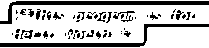
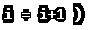
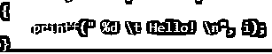

# c 命令

> 原文：<https://www.educba.com/c-command/>

## C 命令简介

c 语言是一种命令式的通用编程语言，是计算机和系统编程的基础。它支持词法变量类型、结构化编程和递归状态。c 语言用于提供有助于有效映射到机器指令的结构，因此今天主要使用的是汇编语言，它包括操作系统和一些 T2 应用软件。范围从[嵌入式系统到超级计算机](https://www.educba.com/what-is-embedded-systems/)不等。C 最初的[目的是用作](https://www.educba.com/introduction-to-c/) [UNIX 操作系统](https://www.educba.com/career-in-unix/)编程语言。今天，它的大部分应用是在编译器设计、操作系统和计算机体系结构中。它用于需要低水平内存访问和最低限度运行时支持的地方。要执行这种语言，你应该知道要使用的命令。在这篇 C 命令的文章中，我们将列出对你很重要的 C 命令。

### 基本 C 命令

下面是一些基本 C 命令:

<small>网页开发、编程语言、软件测试&其他</small>

**1。#include:** 这是主头文件预处理程序命令，包括标准输入和输出头文件，如编译程序前来自 C 库仓库的 stdio.h。

**2。int main():** 在大多数编程语言中，这个 C 命令是 main 函数，通常是程序执行的起点。一旦执行了 primary main()，就会调用所有其他方法和函数。

**3。{:** 这些花括号不仅是 C 语言特有的，而且在任何编程语言中都很常见。这表示方法或函数定义的开始。

**4。/* abc*/:** 写在/*和*/中的文本将被视为注释，不会用于执行或编译。这只是为了让程序员对复杂性有一个清晰的[理解。](https://www.educba.com/concepts-of-programming-languages/)

**5。Printf:** 这个 C 命令用于将输出打印到控制台屏幕上。

**6。Getch():** 该命令用于等待用户的任何输入。

**7。返回 0:** 该 C 命令用于终止 C 程序或主函数，返回 0。

**8。}:** 这些花括号用来关闭函数或者方法块。

**9。//:** 这些被称为单行注释，不仅在 C 语言中使用，在任何其他编程语言中也使用。

10。Return: 该命令用于返回代码执行的输出。

### 中间 C 命令

下面是一些中间 C 命令:

**1。For:** 这是循环 C 命令，当你知道明确的循环时使用。这也称为迭代，它由执行语句所需的一组特定命令组成。

**2。初始化:**这是由初始化变量部分组成的循环的初始部分。
这对于了解循环结构的起点至关重要。

**3。测试:**这是循环的中间部分，用于告诉条件最后一个迭代点，即最后一个满足条件的点，命令将执行。

**4。Increment:** 该值用于告诉循环结构所需的增量级别。代码执行流程将随着增量值的定义而进行。

**5。语句:**这是包含程序实际逻辑的循环体文本。根据需要，这可以是任意数量的行。

**6。Return EXIT_SUCCESS:** 这是用来告诉系统程序正常终止的返回语句。Stdlib.h 头文件是一个强制文件。

7 .**。%d:** 这是表示整数类型字符的格式说明符。它用于格式化输出。

**8。\t:** 这是使用水平空格的制表符或空白制表符的命令。这用于程序的格式化，属于[转义序列](https://www.educba.com/escape-sequence-in-c/)的范畴。

**9。\n:** 这是另一个格式说明符转义序列，用于换行。

10。%lf: 这是双精度类型浮点文字的格式说明符，它比浮点类型具有更宽的范围和更高的值。

### 高级 C 命令

以下是一些高级 C 命令:

**1。Scanf:** 该 C 命令用于从标准[控制台终端窗口](https://www.educba.com/linux-vs-windows/)获取用户输入。

**2。格式字符串:**这是用于定义必须读取的各种类型的字符串。

**3。&变量列表:**包含构成格式字符串一部分的变量。这可能包含前面有&符号的任意数量的变量。

**4。%f:** 用于定义浮点值，即包含小数的值。与 double 类型变量相比，它的范围相对较小。

**5。Double:** 这是用来给后面的变量名分配一个 Double 类型。

**6。Char:** 该命令用于定义任何包含 Char 数据类型的变量。

7 .**。Float:** 用于定义变量的一种浮点值。

**8。Gets():** 这个 C 命令用于从标准输入设备中读取字符串类型语句，并保存它，直到找到一个换行符。它不检查数组边界。

**9。%s:** 这是用于表示字符串类型变量的格式说明符。

10。Fgets(): 这个 C 命令用于读取字符串类型值，直到新的一行或达到最大数组限制。它检查数组界限值。

### 使用 C 命令的提示和技巧

使用 goto(-->)操作符很有用，因为它用于管理程序控制流。利用常用的宏。c 编程语言不同于任何其他编程语言，如 Java 等。因此，必须明智地使用诸如[指针](https://www.educba.com/pointers-in-c/)和地址等细节。

### 结论

如果你选择以 C 语言为职业，这些 C 命令将会是你经常使用的。请随时张贴您的疑问，并继续关注我们，以获得新鲜的新职位。

### 推荐文章

这是 C 命令的指南。这里，我们讨论了带有适当输出的基本、中级以及高级 C 命令。您也可以阅读以下文章，了解更多信息——

1.  [HBase 命令](https://www.educba.com/hbase-commands/)
2.  [猪命令](https://www.educba.com/pig-commands/)
3.  [Sqoop 命令](https://www.educba.com/sqoop-commands/)
4.  [配置单元命令](https://www.educba.com/hive-command/)

