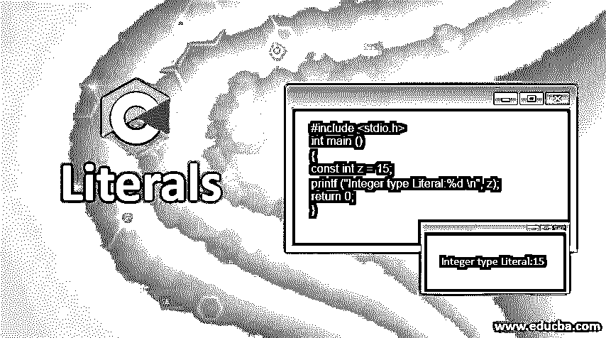
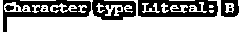

# c 语言文字

> 原文：<https://www.educba.com/c-literals/>




## C 语言文字简介

c 文字被定义为常量，用来表示静态的东西，但永远不能被声明为变量，这些常量值占用内存，但没有任何特定的引用，如变量。c 语言文字基本上用于优化代码，并在没有选择余地来声明变量的情况下运行。

### C 语言中的文字类型

文字主要有四种类型:

<small>网页开发、编程语言、软件测试&其他</small>

*   整数文字
*   字符文字
*   字符串文字
*   浮点或实数

#### 1.整数文字

进一步的整数文字可以用三种方式表示:

*   十进制数字文字
*   八进制数字文字
*   十六进制数字文字

此外，Integer literal 是一种类型的文字，后跟一个整数，可以是 long，表示为 L 或 L，即[l，L]。无符号整数也是类似的情况，它表示为[u，U]并且只存储正整数。

**代码:**

```
#include <stdio.h>
int main ()
{
const int z = 15;
printf ("Integer type Literal:%d \n", z);
return 0;
}
```

**输出:**


##### 形容词（adjective 的缩写）十进制数字文字

十进制常数可以用 0 到 9 之间的数字来表示。

**十进制常数的例子**

1.  Four hundred and fifty-six
2.  Seven hundred and eighty-nine

##### b.八进制数字文字

另一方面，八进制常量是用 0 到 7 之间的数字表示的常量类型，并以数字 0 为前缀。

**举例:**

0678 是 re

**Note:** It is needed to be conscious while defining an octal number because any number starting with 0 must be included between the range of 0 and 7 or compiler will throw compilation error. Also, an octal number should never be confused with a decimal number.

##### 碳（carbon 的缩写）十六进制数字文字

十六进制数字文本包含以 0x 或 0X 为前缀的十六进制字符，简而言之，它应该包含范围从 0 到 9 的值和范围从 A 到 f 的字符

**例如:**

十六进制的 0022 被认为等同于十进制的 34。

**Note:** Order of qualifiers doesn’t matter in case of integer literals they can be represented as either ul or lu it not matters.

**定义整数常量的例子**

| **十进制表示法** | **八进制表示法** | **十六进制表示法** | **描述** |
| 2016U | 03740u | 0x7E0u | **无符号整数** |
| 2147483697l | 02000000061l | 0x80000031l | **长整数** |
| 2147483697ul | 020000000061ul | 0x80000031ul | **无符号长整数** |

**NOTE:** Order of qualifiers doesn’t matter it can be either ul or lu.

#### 2.字符文字

字符类型文本是一种考虑单引号中的单个字符的文本。在 C 程序设计中，占用一个字节内存的字符文字或常数。

表示字符字面量的方法如下:

*   使用字符的 Unicode 值。例如:\u09A9
*   转义序列字符也可以用来表示任何字符文本。
*   用一个 ASCII 整数来表示一个字符称之为字符文字。例如:“B”用于将“066”表示为字符文本。
*   单引号中的字符。比如:' a '，' 1 '，'.', '!'
*   使用整数的八进制或十六进制表示形式作为转义序列字符。

**代码:**

```
#include <stdio.h>
int main ()
{
const char f = 'B';
printf ("Character type Literal: %c\n", f);
return 0;
}
```

**输出:**




此外，字符文字也可以归类为多字符常量。

##### 形容词（adjective 的缩写）多字符文字

在单引号中包含多个字符或在单引号中包含一组字符的字符文字称为多字符文字。如果有人想在单引号内得到一组字符，可以使用多字符文字，但是我们不应该在编程时使用多字符文字，或者编写一个简洁的程序。

**多字符文字的示例:**

1.  ddd
2.  6579300.

#### 3.字符串文字

字符串文字是考虑双引号内的一组字符的文字类型。字符串文字以这样一种方式占用一些字节，首先它在内存中用一个额外的字节空间存储全部字符。添加额外的一个字节是为了保留最后一个空字符。添加 null 是为了解析整个字符串，并以指定字符串结尾的方式放置。使用+运算符连接字符串值或文字也是可能的。

**代码:**

```
#include <stdio.h>
int main ()
{
const char strarr []
= "author\n\tof\t educba";
printf ("%s", strarr);
return 0;
}
```

**输出:**


**一些有效字符串文字的示例:**

*   我会努力写一个好的程序。
*   写一个好的程序很难…
*   我知道编程。\ n“+”我必须执行。
*   这有点令人困惑，因此我们需要记住,“C”和“C”看起来很相似，但实际上它们是非常不同的。c '实际上消耗 1 字节的内存。

#### 4.浮点型还是实型

c 编程是一种[编程语言，其中](https://www.educba.com/what-is-a-programming-language/)float 或 real literal 的使用方式是将其指定为十进制或指数记数法。

**代码:**

```
#include <stdio.h>
int main ()
{
const float g = 4.14;
printf ("Floating type of literal: %d\n", g);
return 0;
}
```

**输出:**


**Float 或 real Literal 的例子:**

*   One hundred and sixty-seven thousand eight hundred and fifty-nine
*   4167859E-6L

### 十进法

可选的小数点或小数部分以一个被视为整数的实数为前缀。此外，前面会有+或–分别代表正数或负数。

**浮点常量的例子如下:**

*   +1
*   Three point two
*   -0.5
*   0.
*   .3
*   -.5

### 指数符号

*   任何大小不等的数字，如果用文字的指数符号来表示，都是有用的。多位数或多记数法的数字就是这样表示的。像 7950000000000 这样的数字可以写成 7.95e12，0.0000000000795 的格式，表示为 7.95e-011。
*   任何指数记数法实数常数都以科学格式表示，它只接受尾数和指数。

有一个特定的科学符号来做那就是:

[-/+] /mantissa/ /e/E/ [+/-] /Exponent/

**指数符号的例子如下:**

*   0.2e2
*   0f-7
*   6e45
*   -8.90

**指数记数法中实数常数表示的规则:**

*   指数只能是十进制值。
*   的大写或小写必须被指定为“E”或“E ”,这取决于我们需要如何使用它的要求。
*   指数 E 或 E 的尾数可以用大写或小写表示。
*   空格也是不允许的。

### 结论

文字行为只像常量，当我们需要修正和使事情像常量一样时，它们是非常需要的。但这取决于规则，以及我们需要如何以及何时使用哪种文字的要求。文字是一种非常有序的常量形式，它应该是通用的和优化的，而不是增加内存和空间。

### 推荐文章

这是 C 语言文字的指南。这里我们讨论了 C 语言文字的基本概念、主要的四种类型，并给出了相应的例子。您也可以浏览我们的其他相关文章，了解更多信息——

1.  [C 语言中的算术运算符](https://www.educba.com/arithmetic-operators-in-c/)
2.  [c#中的静态构造函数](https://www.educba.com/static-constructor-in-c-sharp/)
3.  [C++文字](https://www.educba.com/c-plus-plus-literals/)
4.  [C#文字量](https://www.educba.com/c-sharp-literals/)


