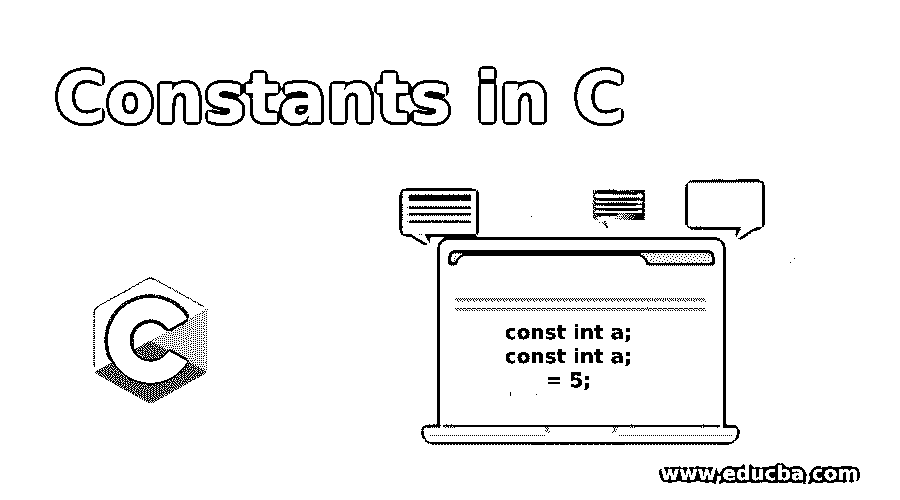
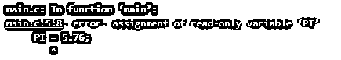
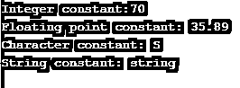

# C 语言中的常数

> 原文：<https://www.educba.com/constants-in-c/>




## C 语言中常数的介绍

在 C 程序设计语言中，一个变量的名字叫做常量，这个变量的值不能改变。在 C 编程语言中，它们也被称为文字，因为它们类似于变量，但有一个条件，即这些变量的值不能改变，或者这些变量的值是固定的。C 语言提供了不同的基本类型的常量，它们又分为两大类，即主常量和次常量。在初级常数中，我们有整数常数、实数常数和字符常数等。在二级常量中，我们有数组、结构、并集、指针等。

### C 语言中常量的函数

如上所述，常数是具有固定值的变量。在 C 编程语言中，常量可以通过两种方式声明或定义，一种是使用关键字“const ”,另一种是使用#define 预处理程序。让我们看看语法及其示例:

<small>网页开发、编程语言、软件测试&其他</small>

#### 1.使用 Const 关键字定义常数

**语法:**

```
const contant_type constant_name = value;
```

或者

```
constant_type const const_name = value;
```

##### 示例#1

**代码:**

```
#include<stdio.h>
int main()
{
const float PI=3.14;
int radius = 2;
float area = PI * radius * radius;
printf("The area  of circle is: %f",area);
return 0;
}
```

**输出:**


在上面的程序中，我们声明了一个“const”关键字来定义圆周率值，这个变量用来计算圆的面积。因此，使用常量“PI ”,我们可以在公式中直接使用它来计算圆的面积，其值使用“const”关键字声明一次，值为 3.142，在代码执行期间不会改变。如果我们试图改变“PI”值，那么它将给出一个错误。让我们试着改变“圆周率”的值。

##### 实施例 2

**代码:**

```
#include<stdio.h>
int main()
{
const float PI=3.14;
PI = 5.76;
int radius = 2;
float area = PI * radius * radius;
printf("The area  of circle is: %f",area);
return 0;
}
```

**输出:**




通常常数可以是任何数据类型。让我们看一个例子:

##### **例 3**

**代码:**

```
#include <stdio.h>
int main()
{
const int var1 = 70;
printf("Integer constant:%d \n", var1 );
const float var2 = 35.89;
printf("Floating point constant: %.2f\n", var2 );
const char var3 = 'S';
printf("Character constant: %c\n", var3 );
const char var4[10] = "string";
printf("String constant: %s\n", var4);
return 0;
}
```

**输出:**




在上面的代码中，我们使用了整数常量“int”，实数常量“float”，字符常量“char”，字符串常量“char”。

#### 2.可以使用#define 定义常量

在此方法中，可以使用#define 预处理程序指令来声明或定义常数。在 C 编程中，这个方法是用 C 中的宏来解释的。让我们看看这个预处理器指令将如何用于定义常量，这些常量用于声明整个代码的常量值。

**语法:**

```
#define constant_name value
```

##### 示例#1

**代码:**

```
#include <stdio.h>
#define LENGTH 20
#define WIDTH  30
int main() {
int area_r, area_s;
area_r = LENGTH * WIDTH;
printf("Area of rectange is l * b =  %d\n", area_r);
area_s = LENGTH * LENGTH;
printf("Area of square is l * b =  %d", area_s);
return 0;
}
```

**输出:**


在上面的代码中，我们可以看到，我们使用#define 预处理器指令将“长度”和“宽度”声明为两个常量。这些常量可以在整个程序中使用。在上面的代码中，我们计算矩形和正方形的面积，这些常量在开始时只声明或定义一次，我们可以在整个程序中多次使用这些常量。

### C 语言中常量的注意事项

一般来说，在 C 编程语言中，常量被赋予一个值，这个值被称为文字。因此，在 C 编程语言中，常量也称为文字。

**举例**:

```
const int max =100;
```

这里的“100”是上述常量表达式中的常量整数。

*   我们在定义常量时应该小心，因为只使用“const”关键字和声明就像在 c 中声明变量一样简单

```
int a = 5;
```

以下两个声明对于定义常量无效:

```
const int a;
const int a;
= 5;
```

*   对于常量的声明，用大写字母或大写字母写常量名称总是最佳实践。这有助于其他人以及我们理解和阅读程序。
*   一旦使用“const”关键字或#define 指令赋值，我们就不能更改常量的值，因为如果试图给声明的常量赋值，就会出错。

### 结论

在本文中，我们讨论了 C 编程语言中的常量。常量分为两类，一级常量和二级常量，其中一级常量由数字常量(如整数、小数、实数等)和字符常量(如字符、字符串、反斜杠等)组成。在辅助常量中，我们有数组、指针、结构、联合等。C 语言中的常量是那些一旦声明其值就不能更改的常量，这些常量也称为文字。

### 推荐文章

这是一个 c 语言中常量的指南。这里我们讨论 c 语言中常量的介绍和使用，以及不同的例子和它的代码实现。您也可以看看以下文章，了解更多信息–

1.  [C 文字量](https://www.educba.com/c-literals/)
2.  [Java 文字](https://www.educba.com/java-literals/)
3.  [C 语言中的错误处理](https://www.educba.com/error-handling-in-c/)
4.  [C 语言中的函数原型](https://www.educba.com/function-prototype-in-c/)


