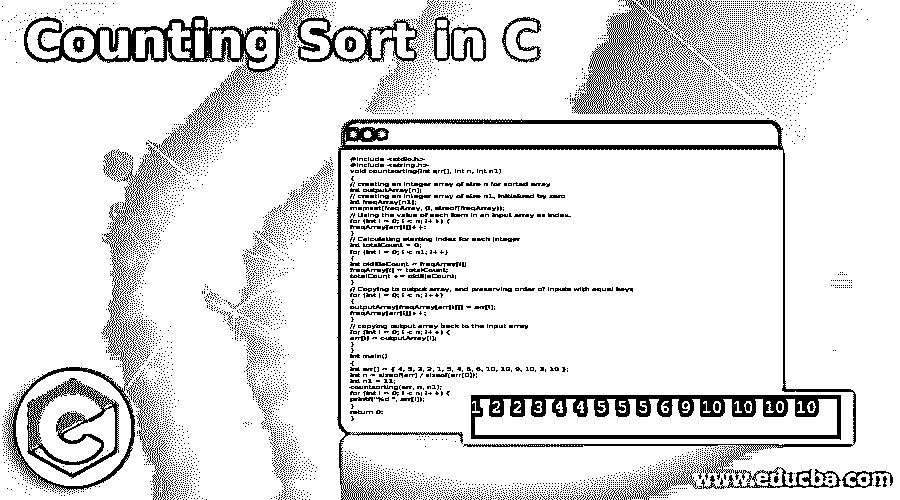
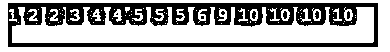
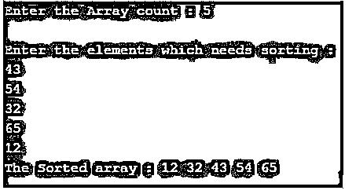

# C 中的计数排序

> 原文：<https://www.educba.com/counting-sort-in-c/>




## C 语言中计数排序的介绍

C 中的计数排序是一种实际上基于输入值范围的排序技术。由于排序用于以线性方式对元素进行排序，用户需要维护一个辅助数组，这增加了排序算法实现的空间需求。但不知何故，这并不是一个非常节省空间的算法。排序算法通过获取数组中每个唯一元素的出现次数来对数组中的元素进行排序。在计算机科学中，除了对数组中的元素集合进行排序之外，它还非常有用，或者被用作基数排序或任何其他排序算法中的子例程，可以更有效地处理大型键。

**语法:**

<small>网页开发、编程语言、软件测试&其他</small>

计数排序没有特定的语法，因为 C 是一种我们将使用一些条件和循环来执行计数排序的语言。

*   基本上，计数排序的工作方式完全类似于 hashtag 用户计算要排序的数组的最大值。
*   然后，数组中每个元素的出现次数从 0 到长度 1，这些元素被分配给一个辅助数组。这用于检索数组的排序版本。
*   该算法具有线性的时间复杂度，但是它也具有非常高的空间复杂度，并且仅在阵列元素范围接近阵列大小的情况下使用。

### C 中计数排序的算法/伪代码

*   首先，我们需要迭代输入数组，并找到数组中的最大值。
*   然后声明一个新数组，大小 max_value + 1，值为 0。
*   对数组中的每个元素进行计数，并将这些值递增相应的索引。
*   通过将当前频率和先前频率相加，找到辅助阵列的累积和。
*   现在，这个累积数组值表示一个元素在排序数组中的位置。
*   我们需要从 0 到最大值迭代辅助数组。
*   如果元素存在于输入数组中，则在相应的索引处设置 0 并将计数减 1 表示该元素的第二个位置。
*   现在这个实际收到的数组到输入数组。

基本上，该算法基于三种类型的数组:

*   **输入数组:**存储输入数据。
*   **输出数组:**存储排序后的数据值。
*   **临时数组:**数据临时存储。

### C 中计数排序的例子

下面提到了不同的例子:

#### 示例#1

c 中的简单计数排序。

**代码:**

```
#include <stdio.h>
#include <string.h>
void countsorting(int arr[], int n, int n1)
{
// creating an integer array of size n for sorted array
int outputArray[n];
// creating an integer array of size n1, initialized by zero
int freqArray[n1];
memset(freqArray, 0, sizeof(freqArray));
// Using the value of each item in an input array as index,
for (int i = 0; i < n; i++) {
freqArray[arr[i]]++;
}
// Calculating starting index for each integer
int totalCount = 0;
for (int i = 0; i < n1; i++)
{
int oldEleCount = freqArray[i];
freqArray[i] = totalCount;
totalCount += oldEleCount;
}
// Copying to output array, and preserving order of inputs with equal keys
for (int i = 0; i < n; i++)
{
outputArray[freqArray[arr[i]]] = arr[i];
freqArray[arr[i]]++;
}
// copying output array back to the input array
for (int i = 0; i < n; i++) {
arr[i] = outputArray[i];
}
}
int main()
{
int arr[] = { 4, 5, 2, 2, 1, 5, 4, 5, 6, 10, 10, 9, 10, 3, 10 };
int n = sizeof(arr) / sizeof(arr[0]);
int n1 = 11;
countsorting(arr, n, n1);
for (int i = 0; i < n; i++) {
printf("%d ", arr[i]);
}
return 0;
}
```

**输出:**




所以在上面的算法中，你可以检查我们是否遵循了上面的某种逻辑来获得所需的输出。

#### 实施例 2

c 中的计数排序。

**代码:**

```
#include <stdio.h>
void countingSort(int Array[], int n1, int n)
{
int i, j;
int X[15], Y[100];
for (i = 0; i <= n1; i++)
Y[i] = 0;
for (j = 1; j <= n; j++)
Y[Array[j]] = Y[Array[j]] + 1;
for (i = 1; i <= n1; i++)
Y[i] = Y[i] + Y[i-1];
for (j = n; j >= 1; j--)
{
X[Y[Array[j]]] = Array[j];
Y[Array[j]] = Y[Array[j]] - 1;
}
printf("The Sorted array : ");
for (i = 1; i <= n; i++)
printf("%d ", X[i]);
}
int main()
{
int n, n1 = 0, Array[15], i;
printf("Enter the Array count : ");
scanf("%d", &n);
printf("\nEnter the elements which needs sorting :\n");
for (i = 1; i <= n; i++)
{
scanf("%d", &Array[i]);
if (Array[i] > n1) {
n1 = Array[i];
}
}
countingSort(Array, n1, n);
printf("\n");
return 0;
}
```

**输出:**




这是一种逻辑，用来在数组中执行计数排序。

### 结论

在这里，我们看到了我们在上面看到的算法步骤，按照这些步骤，我们已经解决了几个例子，这将使我们对计数排序如何工作有一个清晰的想法，你们可以尝试动手操作计数排序理论。

### 推荐文章

这是一个 C 中计数排序的指南，这里我们分别讨论 C 中计数排序的简介、算法/伪代码和例子。您也可以看看以下文章，了解更多信息–

1.  [C 语言中的指针算法](https://www.educba.com/pointer-arithmetic-in-c/)
2.  [空 C 中的指针](https://www.educba.com/void-pointer-in-c/)
3.  [C 语言中的令牌](https://www.educba.com/tokens-in-c/)
4.  [C 语言中的地址运算符](https://www.educba.com/address-operator-in-c/)


