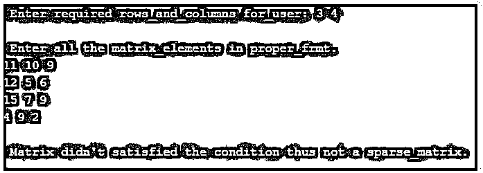

# C 语言中的稀疏矩阵

> 原文：<https://www.educba.com/sparse-matrix-in-c/>


## C 语言中的稀疏矩阵介绍

下面的文章提供了 c 语言中稀疏矩阵的概要。稀疏矩阵是一种几乎在每种编程语言、数值分析和计算问题中都使用的矩阵。稀疏矩阵由一个稀疏数组组成，数组中所有元素的格式都是零。没有严格的规则要求矩阵中的元素为零；相反，稀疏矩阵可以粗略地设计成包含值为零的元素的行和列。在行和列中具有大部分零而不是其他数字的稀疏矩阵被称为密集矩阵。

**C 语言中稀疏矩阵的语法**

<small>网页开发、编程语言、软件测试&其他</small>

没有特定的语法可以遵循，但某些步骤和数据结构将用于操作和工作，其中包括以下算法，表示如下。

```
main()
{
Define a sparse matrix
int sp_mtrx [] [] = {
{} {} {} {}
};
Calculate the size of the matrix defined;
for {
if {
}
else {
}
}
Define and estimate the size of final matrix;
Int mt_[4] [size]
Compute the final matrix that is being sparsed;
for
{
If
{
}
else
{
}
}
Display the final matrix.
```

### 稀疏矩阵在 C 中是如何工作的？

*   稀疏矩阵不仅在 C 编程语言中，而且对任何计算和分析过程都非常有用。从某种意义上说，它有助于使一个矩阵被分割并表示成一个二维数组，其中 a 和 b 两列表示一个*b 矩阵。
*   由于矩阵中所包含的大部分元素都是零，因此也称为密度矩阵。大多数为零的元素清楚地表明矩阵是稀疏的。
*   有时会产生一个问题，当一个简单的矩阵已经存在时，为什么还需要一个稀疏矩阵？
*   答案在于，任何简单的矩阵都只是用来在内存中存储元素，而稀疏矩阵有更多的意义，比如它包含更多的零和更少的非零；因此，消除了存储这种非零元素所需的存储空间，因为主要焦点是处理矩阵的零元素。
*   元素的计算时间，尤其是稀疏矩阵中存在的非零元素，节省了大量的计算时间，因为它具有许多非零元素，这在逻辑上设计了某种数据结构用于遍历非零元素。
*   用 2D 阵列对稀疏矩阵进行二维表示会导致内存浪费。此外，在任意稀疏矩阵中存在的与多个非零值混合的多个零在某种程度上消耗了时间，这在计算、存储空间和遍历时间方面减少了稀疏矩阵的使用。
*   稀疏矩阵的表示基本上以两种方式执行，在行、列中存储三元组或属性，使用数组表示和链表表示。
*   数组表示涉及一个稀疏矩阵，其中包含行、列和值，以及它们各自的位置和用途。
*   在 C 中使用稀疏矩阵时需要记住的一些规范和要点，就像在 C 中使用稀疏矩阵及其实现一样，使用专门的算法和数据结构是非常有益的。
*   许多机器学习算法和系统是使用这种稀疏矩阵设计的，因为它节省了计算时间，使得使用恰当。
*   使用这些稀疏矩阵的操作在内存、空间和处理其中所有类型的存储元素方面有很多优势。
*   所有的偏微分算法和组合算法都被应用到这个稀疏的 C 上，从而使它总体上是密集和有用的。
*   有许多迭代和直接方法存在于稀疏矩阵求解问题之间，有一些预处理子可以迭代更多的方法来使用。
*   这种或那种形式的稀疏矩阵比使用不满足大多数条件并且不检查与分析、计算、处理和存储相关的大多数参数的简单矩阵要有利得多。然而，它可以用于许多其他相关领域，如机器学习和回归活动。

### C 语言中稀疏矩阵的例子

不同的例子如下:

这个程序演示了一个稀疏矩阵的实现，它显示了稀疏矩阵的输入和输出的条件和数量是否满足，并显示在下面的输出中。

**代码:**

```
#include <stdio.h>
int main()
{
int k_0, p_1, row_0, col_0, x[5][6], Total_vl = 0;
printf("\n Enter required rows_and_columns for_user: ");
scanf("%d %d", &k_0, &p_1);
printf("\n Enter all the matrix_elements in proper_frmt. \n");
for(row_0 = 0; row_0 < k_0; row_0++)
{
for(col_0 = 0;col_0 < p_1;col_0++)
{
scanf("%d", &x[row_0][col_0]);
}
}
for(row_0 = 0; row_0 < k_0; row_0++)
{
for(col_0 = 0; col_0 < p_1; col_0++)
{
if(x[row_0][col_0] == 0)
{
Total_vl++;
}
}
}
if(Total_vl > (row_0 * col_0)/2)
{
printf("\n Matrix satisfies_the proper_condition then sparse_matrix ");
}
else
{
printf("\n Matrix didn't satisfied the condition thus not a sparse_matrix. ");
}
return 0;
}
```

**输出:**




**说明:**

*   在上面的程序中，用户可以输入所需的行数和列数，这确实需要以满足稀疏矩阵条件的方式进行操作和计算。
*   如果给定的稀疏矩阵输入和另一种形式的矩阵(即标准矩阵)有一些不匹配，那么这将是计算的问题，并且给出弹出的 else 部分将作为确认给出。
*   输入的所有元素必须采用正确的格式；否则会抛出错误，如上图截图所示。

### 结论

由于稀疏矩阵的特性和它为程序员提供的实现能力，稀疏矩阵在 C 编程语言中非常有用，并且起着举足轻重的作用。当在 c 语言中使用稀疏矩阵时，它使得具有存储和缓慢处理的遗留系统变得有点快。这种或那种形式的稀疏矩阵节省了大量时间。

### 推荐文章

这是一个 C 语言中稀疏矩阵的指南，这里我们讨论一下入门，C 语言中稀疏矩阵是如何工作的？和示例。您也可以看看以下文章，了解更多信息–

1.  [C 语言中的指针算法](https://www.educba.com/pointer-arithmetic-in-c/)
2.  [C 语言中的令牌](https://www.educba.com/tokens-in-c/)
3.  [C 语言中的地址运算符](https://www.educba.com/address-operator-in-c/)
4.  [C 编程矩阵乘法](https://www.educba.com/c-programming-matrix-multiplication/)


