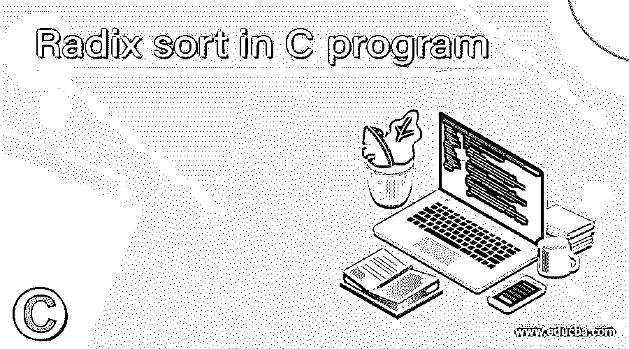
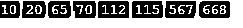

# C 程序中的基数排序

> 原文：<https://www.educba.com/radix-sort-in-c-program/>




## C 程序中基数排序的介绍

下面的文章提供了 C 程序中基数排序的概要。任何编程语言或通用语言中的基数排序都是一种非比较排序算法，用于与数字操作相关的几个过程。基数排序尽量不使用太多分布在桶中的元素，而是根据基数和桶中有效位数的索引对桶中的元素进行排序。C 语言中基数排序的主要目的是保持顺序和个数，因此它也被称为数字排序的桶排序。基数排序适用于已经以词法格式排序的数据。

**语法**

<small>网页开发、编程语言、软件测试&其他</small>

C 中的基数排序没有任何特定的格式，但有一些语法用于根据需求进行表示，如下所示:

*   取一个 c 中未排序的列表。
*   使用最低有效数字在列表中排序，这提供了以下值。
*   然后找到下一个有效位或数字，即在第 10 <sup>个</sup>位，当与前一个列表比较时，它改变了值。
*   然后使用第 100 个<sup>位的下一个最高有效数字开始排序，这给出了列表中的以下值。</sup>

### 基数排序在 C 程序中如何工作？

*   每个排序算法都有一个工作流程，基数排序也是如此。此外，它遵循前面提到的非比较算法范例。
*   基数排序基本上处理数字，并与所有数字的有效位进行比较，是保留有效位还是最高有效位取决于作为链表一部分并期望应用基数排序的数字。
*   它试图不使用更多的元素，通过创建元素并将其分布到桶中，以便它们各自的基数工作。
*   基于比任何有效数字更多的数字来执行索引和对数字的操作，使得整个过程被排序，并且保持进入其中的先前步骤的顺序。
*   由于分桶过程和数字排序，它是预期的，也称为桶排序。
*   基数排序也有一段历史，它早先被用来对穿孔卡片进行排序，并作为基数排序的实现算法。
*   基数排序作为计算机的一部分之前已经被放弃，并且被认为是不切实际的，因为要求在索引中分配变量，其中分配的变量大小是未知的，并且不满足需要。
*   如今，基数排序主要用于二进制字符串和整数，它们已经有了一些基准和标准，并且被认为比任何其他通用算法都要快；这些算法使实现速度比实际速度快 50 倍。
*   根据需要，基数排序可以用于任何形式的实现过程，包括 MSD 或 LSD(最低有效位)。
*   LSD 基数排序使用某种排序模式和顺序，首先是长度较短的键，然后是长度较长的键。
*   一旦遵循了这个顺序，就进行检查以记录所排列的元素是否是按照排列的词汇顺序。
*   这与没有任何特定顺序排列的正常数字的顺序一致；然后，这种类型的排序或安排通常被认为是 LSD 的形式。元素排列的 LSD 格式也称为稳定排序。
*   然后是基数排序的另一种格式，即 MSD，称为平均有效位。MSD 基数排序主要用于对所有固定类型的排序字符串或固定长度的整数表示进行排序，然后，如果订单是词汇格式的，则数字以 1 到 10 的格式输出，其中排序器键是左对齐的，并在右侧填充一些空白，以便用更长的固定值替换排序器值或排序器键。
*   与 LSD 基数排序不同，MSD 基数排序被认为是不稳定的，但是具有排序的原始重复键总是被保持。
*   MSD 或 LSD 排序与变量或字符串的输入长度的处理相关，这不是强制性的；更确切地说，它可以用来对任何一组元素进行长度排序、基数排序，而 group 则按照顺序大小连接各组。因此，所有的键和元素可以被相应地排序，而不使用任何复杂的过程。

### C 程序中基数排序的例子

这个程序演示了 C 语言中基数排序的实现，如输出所示。

**代码:**

```
#include<stdio.h>
int gt_Max_vl(int arr_0[], int n_1) {
int mx_vl = arr_0[0];
int k_2;
for (k_2 = 1; k_2 < n_1; k_2++)
if (arr_0[k_2] > mx_vl)
mx_vl = arr_0[k_2];
return mx_vl;
}
void count_Sort_0(int arr_0[], int n_1, int exp) {
int output[n_1];
int k_2, count_val[8] = { 0 };
for (k_2 = 0; k_2 < n_1; k_2++)
count_val[(arr_0[k_2] / exp) % 8]++;
for (k_2 = 1; k_2 < 8; k_2++)
count_val[k_2] += count_val[k_2 - 1];
for (k_2 = n_1 - 1; k_2 >= 0; k_2--) {
output[count_val[(arr_0[k_2] / exp) % 8] - 1] = arr_0[k_2];
count_val[(arr_0[k_2] / exp) % 8]--;
}
for (k_2 = 0; k_2 < n_1; k_2++)
arr_0[k_2] = output[k_2];
}
void radix_sort_0(int arr_0[], int n_1) {
int m_0 = gt_Max_vl(arr_0, n_1);
int exp;
for (exp = 1; m_0 / exp > 0; exp *= 8)
count_Sort_0(arr_0, n_1, exp);
}
void print(int arr_0[], int n_1) {
int k_2;
for (k_2 = 0; k_2 < n_1; k_2++)
printf("%d ", arr_0[k_2]);
}
int main() {
int arr_0[] = { 10, 115, 65, 70, 567, 112, 20, 668 };
int n_1 = sizeof(arr_0) / sizeof(arr_0[0]);
radix_sort_0(arr_0, n_1);
print(arr_0, n_1);
return 0;
}
```

**输出**




### 结论

基数排序，由于其在数字和顺序方面的高效和更快的计算值，在当今任何涉及排序算法的地方都非常有用。它用于使整个排序范例的实现变得简单和灵活。LSD 和 MSD 排序使得遍历和操作更加平滑和清晰。

### 推荐文章

这是一个 C 程序中基数排序的指南。这里我们讨论基数排序在 C 程序中的工作，并给出一个例子和它的输出。您也可以看看以下文章，了解更多信息–

1.  [JavaScript 列表](https://www.educba.com/javascript-list/)
2.  [C 程序中的回文](https://www.educba.com/palindrome-in-c-program/)
3.  [Java 中的排序字符串](https://www.educba.com/sort-string-in-java/)
4.  [Java 扫描器类](https://www.educba.com/java-scanner-class/)


