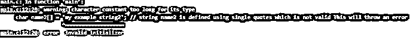
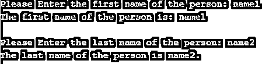
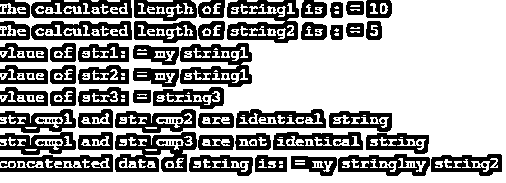

# C 语言中的字符串

> 原文：<https://www.educba.com/string-in-c/>


## C 语言中的字符串介绍

C #中的字符串被定义为以特殊字符(空字符)' \0 '结束的字符数组。因此，未结束的字符串包括由前面带有空值的列表组成的字符。定义字符串类似于定义一维字符数组。

**语法**

<small>网页开发、编程语言、软件测试&其他</small>

声明的基本语法如下所示:

```
// syntax to define a string in C
char string_name[size_str]; // Defining string_name with size of size_str
```

**说明:**“字符串名称”是赋予字符串的名称。“size_str”是命名为 string_name 的字符串的大小。这里请注意，空字符“\0”另外存储在字符串的末尾。这表示每个字符串的结束字符。

### 如何在 C 中初始化字符串？

在 c 中有不同的方法来初始化字符串。请看下面不同的例子，它们展示了在 c 中初始化字符串的不同方法。

**代码:**

```
// Different ways to initialize a string in C
char string_name[] = "mystring"; // string assignment to string_name
char string_name[9] = "mystring";
char string_name[] = {'m','y','s','t','r','i','n','g','\0'};
char string_name[9] = {'m','y','s','t','r','i','n','g','\0'};
```

**说明:**上述所有方法都是将字符串“mystring”赋给一个名为 string_name 的字符串变量。

下面的例子显示了“MYSTRING”是如何存储在 C 语言中的，在字符串的末尾有一个空字符“\0”。" \0 "字符存储在字符串的末尾非常有助于识别字符串的结尾。

| 英语字母表中第十三个字母 | 英语字母表中第二十五个字母 | 英语字母表的第 19 个字母 | 英语字母表中第二十个字母 | 英语字母表中第十八个字母 | 英语字母表中第九个字母 | 英语字母表中第十四个字母 | 英语字母表第七个字母 | \0 |

### 规章制度

它是用双引号定义的，如果我们用单引号定义字符串，它会给出一个错误。例如，看一下示例代码 1 来理解这个概念。

**代码:**

```
char string_name[] = "mystring" // this is allowed because string is defined with double quotes
```

**代码:**

```
char string_name[] = 'mystring' // this is not allowed because string is defined with single quotes
```

要从用户处读取字符串，可以使用 scanf()或 gets()函数；要显示字符串，可以使用 puts()或 printf()。示例代码 2 展示了如何使用这两种方法读取和显示字符串。

以下是常用的字符串函数:

*   **strlen():** 这个函数用来计算给定字符串的长度。
*   **strcpy():** 这个函数用来复制一个字符串。
*   **strcmp:** 这个函数用来比较两个字符串。
*   strcat(): 这个函数用来连接两个字符串。

请参考示例代码 3 来理解字符串函数。

### 用 C 语言实现字符串的例子

下面是要实现的示例:

#### 示例#1

**代码:**

```
// Example code to explain valid string declaration using double quotes
// include all required header file
#include <stdio.h>
// main function
int main()
{
// Body of main function
char name1[] = "my example string1"; // string name1 is defined using double quotes which is valid
char name2[] = 'my example string2'; // string name2 is defined using single quotes which is not valid This will throw an error
return 0;
}
```

**输出:**




#### 实施例 2

**代码:**

```
// Example code to explain valid string declaration using double quotes
// include all required header file
#include <stdio.h>
// main function
int main()
{
// Body of main function
// Example of reading a string using fgets and displaying string using puts
char first_name[30]; // declaration of first_name string
printf("Please Enter the first name of the person: "); // Asking for first name from the user
fgets(first_name, sizeof(first_name), stdin);  // reading input string from the user using fgets function
printf("The first name of the person is: ");
puts(first_name);    // displaying string using puts function
// Example of reading a string using fgets and displaying string using puts
char last_name[30]; // declaration of last_name string
printf("Please Enter the last name of the person: "); // Asking for first name from the user
scanf("%s", last_name); // reading input string from the user using scanf function
printf("The last name of the person is %s.", last_name); // displaying string using printf function
return 0;
}
```

**输出:**




#### 实施例 3

**代码:**

```
// Example code to understand string functions in C
// include all required header files
#include <stdio.h>
#include <string.h> // this header file contains string functions
// main function
int main()
{
// Body of main function
// Example to calculate length of the string
char string1[20]="my string1";
char string2[20]="hello";
printf("The calculated length of string1 is : = %ld \n",strlen(string1));
printf("The calculated length of string2 is : = %ld \n",strlen(string2));
// Example to copy a string
char str1[20]= "my string1"; // declaration of string str1
char str2[20]; // declaration of string str2
char str3[20]; // declaration of string str3
strcpy(str2, str1); // copying str data to str2
strcpy(str3, "string3"); // copying "string3" to str3
printf("vlaue of str1: = %s \n",str1); // displaying the value of str1
printf("vlaue of str2: = %s \n",str2); // displaying the value of str2
printf("vlaue of str3: = %s \n",str3); // displaying the value of str3
// Example to compare strings
char str_cmp1[20]= "my string1"; // declaration of string str_cmp1
char str_cmp2[20]= "my string1"; // declaration of string str_cmp2
char str_cmp3[20]= "my string 3"; // declaration of string str_cmp3
int result_compare = strcmp(str_cmp1, str_cmp2); // if two strings are identical it will return 0
if(result_compare == 0)
{
printf("str_cmp1 and str_cmp2 are identical string \n");
}
else
{
printf("str_cmp1 and str_cmp2 are not identical string \n");
}
int result_compare2 = strcmp(str_cmp1, str_cmp3);
if(result_compare2 == 0)
{
printf("str_cmp1 and str_cmp3 are identical string \n");
}
else
{
printf("str_cmp1 and str_cmp3 are not identical string \n");
}
// Example to concatenate two strings
char str_cat1[20]= "my string1"; // declaration of string str_cat1
char str_cat2[20]= "my string2"; // declaration of string str_cat2
//concatenates str_cat1 and str_cat2 and resultant string is stored in str_cat1.
strcat(str_cat1,str_cat2);
// display the concatenated string
printf("concatenated data of string is: = %s \n",str_cat1); // displaying the value of str_cat1
return 0;
}
```

**输出:**




### 结论

本教程提供了与字符串声明、字符串初始化相关的概念，以及 c 语言中其他与字符串相关的概念。这些概念在使用它们时非常有用。

### 推荐文章

这是一个 C 语言中字符串的指南。这里我们讨论一个介绍，语法，如何在 C 语言中初始化字符串，以及规则和条例和相应的例子。您也可以浏览我们的其他相关文章，了解更多信息——

1.  [C 语言中的算术运算符](https://www.educba.com/arithmetic-operators-in-c/)
2.  [Python 反串](https://www.educba.com/python-reverse-string/)
3.  [Java 中的字符串数组](https://www.educba.com/string-array-in-java/)
4.  [Python 比较字符串](https://www.educba.com/python-compare-strings/)


