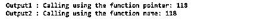
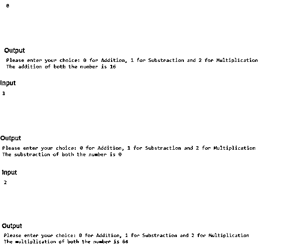
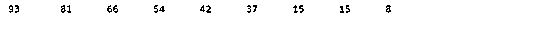

# C 语言中的函数指针

> 原文：<https://www.educba.com/function-pointer-in-c/>


## C 语言中函数指针的介绍

函数指针是 C 语言中最重要的特性，也称为子程序指针。指向任何函数的指针称为函数指针。它在执行时指向代码的特定部分，不同之处在于函数指向代码，而普通指针指向代码中的特定变量。最有价值的是，我们可以将函数参数作为参数传递，并且可以使用它的名称来获取函数的地址。FP 就像一个存储函数地址的变量。

**函数指针的语法**

<small>网页开发、编程语言、软件测试&其他</small>

**语法#1**

```
Function_returntype ( *Pointer_name) ( argument_list)
```

首先，我们必须写出函数的返回类型，可以是 void、double 等。然后我们必须给我们的函数指针一个名字，然后在另一个括号中，我们必须列出参数。

**语法#2**

```
void ( *funct_pointer ) ( int );
```

在上面的语法中，func_pointer 是一个指向函数的指针，该函数采用一个将返回 void 的整数参数。

### C 语言中函数指针的使用

让我们来看看 C 语言中函数指针的工作原理

#### 示例#1

下面是演示函数指针工作的 C 代码:

**代码:**

```
#include <stdio.h>
int sum (int var1, int var2)
{
return var1 + var2 ;
}
int main ()
{
int ( *functiontopointer ) (int, int) ;
functiontopointer = sum ; // This part can also be done using void ( *fun_ptr ) ( int ) = &fun ;
//Here we are calling using the function pointer
int Output1 = functiontopointer (20, 98) ;
// Here we are calling function in normal way
int Output2 = sum (20, 98) ;
printf ( " Calling through function pointer: %d " , Output1 ) ;
printf ( " \n Calling through function name: %d " , Output2 ) ;
return 0 ;
}
```

**输出:**




**解释:**在上面的代码中，你可以看到我们声明了一个名为 Sum 的方法，将两个声明的变量 var1 和 var2 相加，并将加法的输出存储在 Sum 中。在主类中，我们声明了一个函数指针 FTP，它带有一个返回 void 的整数参数。类似地，为了使用函数指针功能，我们从用户那里获取两个输入。一个是用函数指针显示加法，另一个是用普通指针显示结果。

#### 实施例 2

下面是演示函数指针工作的 C 代码:

**代码:**

```
#include <stdio.h>
void addition ( int i , int j )
{
printf ( " The addition of both the input is %d \n " , i+j ) ;
}
void substraction ( int i , int j )
{
printf ( " The substraction of both the input is %d\n " , i-j ) ;
}
void multiplication ( int i , int j )
{
printf ( " The multiplication of both the input is %d\n " , i*j ) ;
}
int main()
{
void ( *funcpointer_arr[] )( int , int ) = { addition, substraction, multiplication} ;
int character, i = 8, j = 8 ;
printf ( " Please enter: 0 for Add , 1 for Substract and 2 "
"for Multiply \n " ) ;
scanf ( " %d ", &character ) ;
if ( character > 2 ) return 0 ;
( *funcpointer_arr [ character ] ) ( i ,  j ) ;
return 0 ;
}
```

**输出:**




**解释:**在上面的代码中，你可以看到我们应用了与前面代码相同的函数指针技术。我们分别创建了加法、乘法和减法的函数。我们已经声明了一个名为 void ( *funcpointer_arr [] )( int，int)的函数指针，分别存储 a 和 b 两种整数数据类型的所有操作的值。因此，基于选项 0、1 和 2，我们可以分别执行首选操作。

#### 实施例 3

下面是演示函数指针工作的另一个 C 代码:

**代码:**

```
#include <stdio.h>
#include <stdlib.h>
int comparison ( const void* lhs , const void* rhs )
{
return ( * ( int * ) rhs - * ( int * ) lhs ) ;
}
main()
{
int ( *cmp ) ( const void* , const void* ) ;
cmp = &comparison ;
int array [] = {15,42,93,54,15,66,37,8,81} ;
qsort ( array, sizeof ( array ) / sizeof ( *array ) , sizeof ( *array ) , cmp ) ;
int x = 0 ;
while ( x < sizeof ( array ) / sizeof ( *array ) )
{
printf ( " %d \t " , array [x] ) ;
x++ ;
}
}
```

**输出:**




**解释:**在上面的代码中，你可以看到我们声明了一个名为 comparison 的函数指针，其中有两个常量类型的参数，分别为 LHS 和 RHS，函数声明为 integer，因此，它将返回这个值(*(int *)RHS-*(int *)LHS)。然后在主类中，我们正在调用我们的函数参数，并声明一个*camp(指针)来存储比较函数指针的地址值。我们已经声明了一个整数数据类型的数组，其中我们已经定义了随机序列中的一些随机值。然后，我们使用一种快速排序方法，在输出中按降序对数组进行排序。最后，在满足 while 条件之前，它会将比较的值打印一个。一旦 while 条件变为 false，它将停止并打印最终的排序结果。

### 结论

C 程序设计语言中的函数指针可以使代码更快、更容易、更简短和更有效，而不会占用代码中的任何大空间，因为函数指针包含可执行代码的开始。我们也可以使用函数名来获取函数指针的地址。

### 推荐文章

这是一个 C 语言中函数指针的指南。这里我们讨论两种语法，用例子说明 C 语言中函数指针的工作。您也可以浏览我们的其他相关文章，了解更多信息——

1.  [C 语言中的空指针](https://www.educba.com/null-pointer-in-c/)
2.  [C 语言中的递归函数](https://www.educba.com/recursive-function-in-c/)
3.  [空 C 中的指针](https://www.educba.com/void-pointer-in-c/)
4.  [C 中的双指针](https://www.educba.com/double-pointer-in-c/)


