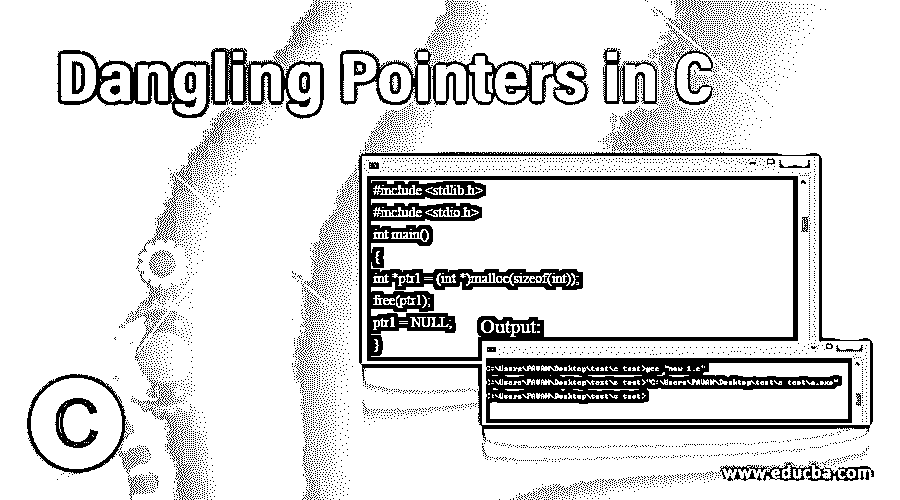
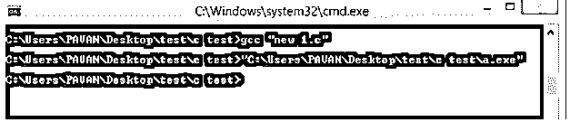
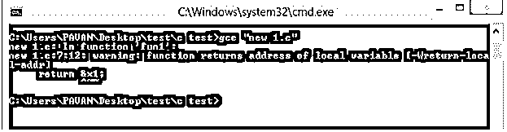
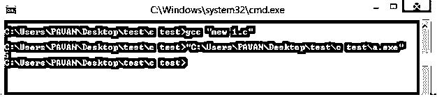

# C 语言中的悬空指针

> 原文：<https://www.educba.com/dangling-pointers-in-c/>




## C 语言中悬空指针的介绍

C 悬空指针是一种指针，它实际上指向一个要被释放或删除的特定内存位置。指针现在有几种不同的方式充当悬空指针。大多数情况下，指针只有 3 种不同的类型/方式来充当悬空指针。它们是内存释放、函数调用和变量超出范围。当内存管理和指针出现大多数常见错误时，会使用这些悬空指针。它通常在对象销毁时出现/发生，只要对象从内存中删除或取消分配，而不修改指针值。在这个主题中，我们将学习 c 语言中的悬空指针。

**语法:**

<small>网页开发、编程语言、软件测试&其他</small>

```
free(a1)
```

### 悬空指针在 C 中是如何工作的？

悬空指针是类似的指针，就像普通指针一样，但它的工作方式是考虑一个取消分配的对象/删除的对象。它只是一个指针，实际上指向一个被删除的特定内存位置，它被称为悬空指针。

悬空指针的错误只能通过将指针初始化为一个空值来避免。如果我们试图将空值赋给一个特定的指针，那么这个指针根本不会指向需要释放的内存。将空值赋给特定指针有助于指针不指向任何特定的内存位置。

为了释放 C 悬空指针概念的内存，free()函数使用了一个参数，只是为了将一个指针变成悬空指针。这就是用 C 语言中的 free()函数创建悬空指针的方法。还有另一种创建悬空指针的方法。它是可变的，超出了创建悬空指针概念的范围。

悬空指针的工作原理是指向特定的内存位置，该位置实际上包含一些编程代码或操作系统的代码。如果我们接受特定指针的值，那么它将覆盖程序代码的值。

### C 语言中悬空指针的例子

下面举几个例子:

#### 示例#1

这是由特定 ptr 原因导致的 C 编程语言内存释放的示例。首先，标准库或 C 语言包含在#include 方法/函数中。然后创建 int main()来写 C 代码。创建*ptr 是为了获得一个指针变量，这是在 malloc()函数的帮助下实现的。malloc()函数通常返回 void 值，所以这里用 int *将 void 指针转换成 int 指针。然后使用带有参数“ptr1”的 free()函数，以便使指针成为悬空指针。因此，当编译器完成执行时，编译器将完美地运行代码，但不会有输出，因为在 print 中没有提到在命令提示符中显示输出。

**代码:**

```
#include <stdlib.h>
#include <stdio.h>
int main()
{
int *ptr1 = (int *)malloc(sizeof(int));
free(ptr1);
ptr1 = NULL;
}
```

**输出:**




#### 实施例 2

这是实现函数调用方式或表示悬空指针的例子。这里，当局部变量根本不是静态的时，指向局部变量的一个指针变成了悬空指针。这里指针没有变成悬空指针，因为 x1 没有被定义为静态项。这里首先用一个值为 5 的普通 int 变量创建一个指针 fun1()。然后创建 main()用于输入 C 代码。然后创建指针 p1 来调用 fun1()。然后在这之后，指针 p 将不再指向一个特定的点，而是指向一个不再有效的点。然后用 printf 打印。但是当 c 代码在 c 编译器中运行时，这里会有一个警告。检查输出，这样您就知道了。在这个例子中，普通指针甚至没有变成悬空指针。

**代码:**

```
#include<stdio.h>
int *fun1()
{
int x1 = 5
return &x1;
}
int main()
{
int *p1 = fun1();
fflush(stdin);
printf("%d", *p1);
return 0;
}
```

**输出:**




#### 实施例 3

这也是一个类似于上面例子的函数调用的例子。起初，通常#include 用于包含标准库。然后创建一个函数 fun11()，并包含一个值为“5”的静态 int 变量“x11”。然后使用 main()函数和指针变量“P11”来包含指针函数 fun11()。然后使用 fflush()函数。fflush 函数主要用于输出流。Fflush(stdin)是一种未定义的行为。然后使用 printf()函数打印指针变量，这个变量就是 x11 变量值。

**代码:**

```
#include<stdio.h>
int *fun11()
{
static int x11 = 5;
return &x11;
}
int main()
{
int *p11 = fun11();
fflush(stdin);
printf("%d", *p11);
return 0;
}
```

**输出:**




#### 实施例 4

这是实现超出范围的变量的示例。在这里，变量将超出范围，然后指向变量的指针变成悬空指针。首先，我们在这里声明指针变量 str1。然后在里面我们声明一个字符变量。现在 str1 变量包含了变量“a1”的地址。那么控制将脱离内部范围。这里 a1 变量将不再可用。所以 str1 将指向一个特定的释放内存。这意味着 str1 指针将变成悬空指针，但 A1 是一个未声明的变量。

**代码:**

```
#include<stdio.h>
int main()
{
char *str1;
{
char a1 = ?A1?;
str1 = &a1;
}
printf("%s", *str1);
}
```

**输出:**


### 结论

我希望您理解 C 悬空/通配符指针的定义及其语法和解释，悬空指针在 C 编程语言中是如何工作的，以及各种更好、更容易实现的例子。

### 推荐文章

这是一个 C 语言中悬空指针的指南，在这里我们讨论悬空指针在 C 语言中是如何工作的，并通过编程例子来更好的理解。您也可以看看以下文章，了解更多信息–

1.  [C 编程中的模式](https://www.educba.com/patterns-in-c-programming/)
2.  [C 文字量](https://www.educba.com/c-literals/)
3.  [C 编程矩阵乘法](https://www.educba.com/c-programming-matrix-multiplication/)
4.  [C 语言中的指针](https://www.educba.com/pointers-in-c/)


