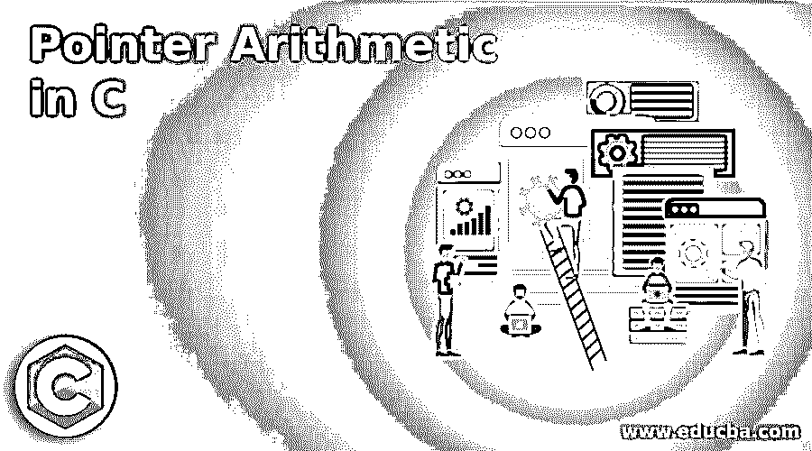
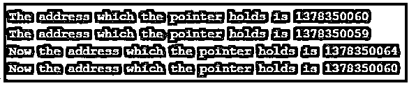
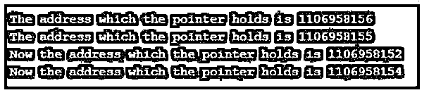
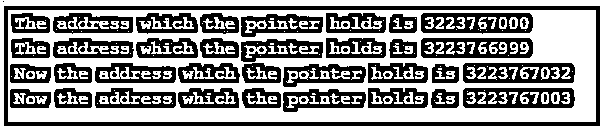
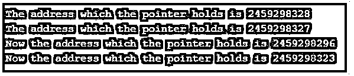
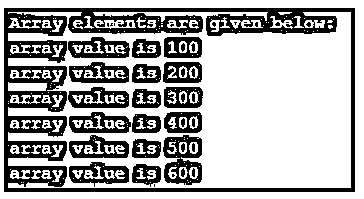

# C 语言中的指针算法

> 原文：<https://www.educba.com/pointer-arithmetic-in-c/>




## C 语言指针算法简介

下面的文章提供了 c 语言中指针算法的概要。众所周知，指针是 c 语言中最有趣的主题之一。指针基本上是保存地址的变量，该地址指向使用' & '运算符访问的特定内存位置。C #中的指针在指针名称前使用星号(*)运算符。指针变量保存的这些地址是整数值，因此可以对这些指针执行基本的算术运算，这将再次产生整数值(存储器位置的地址)。

一元和二元运算都可以在指针上执行，例如:

<small>网页开发、编程语言、软件测试&其他</small>

*   增量
*   减量
*   加法(将任意整数值加到指针上)
*   减法(任何整数值或 2 个指针的减法)
*   比较

上面提到的所有算术运算都可以在指针上执行，因为它们是整数而不是别的。但是有些操作在执行时似乎是无用的，因为不知道它们会产生什么结果。

### C 语言中的指针算术运算及其例子

下面给出了指针算术运算及其在 C 代码中的实现:

#### 1.增量

通过将指针的值递增到 1，它将开始指向下一个地址/存储器位置。在 c 中遍历数组时，增加指针的值非常有用。为了访问数组的下一个元素，我们可以简单地使用 ptr **++** 。值根据指针所指向的值的数据类型递增。例如，如果指针指向任何整数值(具有 64 位整数)，增加其值将使其值增加 4，而在“char”的情况下，值将增加 1。

**代码:**

```
#include<stdio.h>
int main(){
int num =50;
char a = 'x';
// pointer 'ptr' to point the above 'num' and 'ptr1' to point 'a'
int *ptr;
char *ptr1;
// pointer 'ptr' holding the address of 'num' location and 'ptr1' to hold the address of character 'a'
ptr = &num;
ptr1 = &a;
printf("\n The address which the pointer holds is %u",ptr);
printf("\n The address which the pointer holds is %u",ptr1);
// incrementing the value of pointer by 1
ptr++;
ptr1++;
// Pointer address will now gets incremented by 4 bytes as it holds the address of integer value
printf("\n Now the address which the pointer holds is %u",ptr);
// Pointer address will now gets incremented by 1 byte as it holds the address of character value
printf("\n Now the address which the pointer holds is %u",ptr1);
return 0;
}
```

**输出:**




#### 2.减量

在指针的情况下，递减操作的工作方式类似于递增操作。使用“ptr–”减少指针值将使其值减少 1，从而得到内存位置的前一个地址。它将指针的值减少它所指向的数据类型的字节数。

**代码:**

```
#include<stdio.h>
int main(){
float num = 50.3;
char a = 'x';
// pointer 'ptr' to point the above 'num' and 'ptr1' to point 'a'
float *ptr;
char *ptr1;
// pointer 'ptr' holding the address of 'num' location and 'ptr1' to hold the address of character 'a'
ptr = &num;
ptr1 = &a;
printf("\n The address which the pointer holds is %u",ptr);
printf("\n The address which the pointer holds is %u",ptr1);
// decrementing the value of pointer by 1
ptr--;
ptr1--;
// Pointer address will now gets decremented by 4 bytes as it holds the address of float value
printf("\n Now the address which the pointer holds is %u",ptr);
// Pointer address will now gets decremented by 1 byte as it holds the address of character value
printf("\n Now the address which the pointer holds is %u",ptr1);
return 0;
}
```

**输出:**




#### 3.添加

我们不能添加这两个指针，因为这也将导致一个未知的内存位置的地址。所以没有用。但是我们可以在指针上加上任何整数值来指向那个内存位置。使用 ptr+x 根据值指针指向的数据类型添加整数值。例如，如果指针保存任何整数值的地址(64 位整数系统有 4 个字节的整数)，在其中添加+2 时，它将值增加 8 个字节。

**代码:**

```
#include<stdio.h>
int main(){
double num = 50.3;
char a = 'u';
// pointer 'ptr' to point the above 'num' and 'ptr1' to point 'a'
double *ptr;
char *ptr1;
// pointer 'ptr' holding the address of 'num' location and 'ptr1' to hold the address of character 'a'
ptr = &num;
ptr1 = &a;
printf("\n The address which the pointer holds is %u",ptr);
printf("\n The address which the pointer holds is %u",ptr1);
// adding the integer value 4 to the pointer value
ptr = ptr + 4;
ptr1 = ptr1 + 4;
// Pointer address will now gets incremented by 4*8 bytes as it holds the address of double value
printf("\n Now the address which the pointer holds is %u",ptr);
// Pointer address will now gets incremented by 4*1 bytes as it holds the address of character value
printf("\n Now the address which the pointer holds is %u",ptr1);
return 0;
}
```

**输出:**




#### 4.减法

在指针的情况下，可以用两个地址(即两个指针值)进行减法，也可以从指针中减去一个整数值。从指针中减去整数值的工作类似于上面讨论的整数值的相加，即可以使用 ptr-x 从指针中减去任何整数值，并且它将导致指针与指针所保存的值数据类型的 x *字节的差异。

在减去 2 个指针的过程中，两个指针都需要是相同的数据类型，并且它会产生一个整数值，当我们想要使用 2 个地址找到它们之间的元素数量时，该整数值在数组的情况下是有用的。

查找指针的两个地址之间的元素数量的简单语法是:(ptr 2–ptr 1)/指针包含的数据类型的大小。

**代码:**

```
#include<stdio.h>
int main(){
double num = 50.3;
char a = 'u';
// pointer 'ptr' to point the above 'num' and 'ptr1' to point 'a'
double *ptr;
char *ptr1;
// pointer 'ptr' holding the address of 'num' location and 'ptr1' to hold the address of character 'a'
ptr = &num;
ptr1 = &a;
printf("\n The address which the pointer holds is %u",ptr);
printf("\n The address which the pointer holds is %u",ptr1);
// subtracting the integer value 4 to the pointer value
ptr = ptr - 4;
ptr1 = ptr1 - 4;
// Pointer address will now gets decreased by 4*8 bytes as it holds the address of double value
printf("\n Now the address which the pointer holds is %u",ptr);
// Pointer address will now gets decreased by 4*1 bytes as it holds the address of character value
printf("\n Now the address which the pointer holds is %u",ptr1);
return 0;
}
```

**输出:**




#### 5.比较

c 提供了一个很好的比较两个指针的特性，唯一的条件是两个指针都是相同的类型并且指向同一个数组。所有的比较操作比如(>， =，==，！=)可以在它们上面执行。事实上，在比较指向不同数据类型的两个指针时，C 不会在控制台上抛出错误。

**代码:**

```
#include <stdio.h>
int main()
{
int arr1[6] = {100, 200, 300, 400, 500, 600};
// pointer 'ptr1' pointing to the address of 1st array element
int *ptr1 = &arr1[0];
printf("\n Array elements are given below:");
while(ptr1 < &arr1[6])
{
printf("\n array value is %d ", *ptr1);
//Incrementing the pointer to move to the address of next element
ptr1++;
}
return 0;
}
```

**输出:**




### 结论

上面的描述清楚地解释了什么是指针，以及在 c 语言中可以对指针执行的各种算术运算。当在数组或其他数据结构(如链表、堆栈等)中执行运算时，指针非常有用。在代码中实现它们之前，需要彻底理解它们，因为有时它们会返回非常荒谬的结果。像增加两个指针是可能的，但是没有用，因为它会导致一些我们不知道的内存地址。

### 推荐文章

这是一个 C 语言中指针算法的指南。在这里，我们用 5 个算术运算和它们的例子来讨论 C 语言中指针算法的介绍。您也可以看看以下文章，了解更多信息–

1.  [C 语言中的令牌](https://www.educba.com/tokens-in-c/)
2.  [C 语言中的地址运算符](https://www.educba.com/address-operator-in-c/)
3.  [C 语言中的悬空指针](https://www.educba.com/dangling-pointers-in-c/)
4.  [空 C 中的指针](https://www.educba.com/void-pointer-in-c/)


