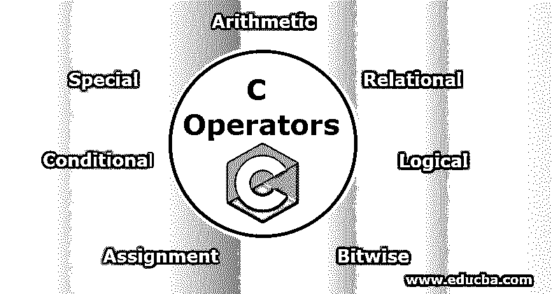
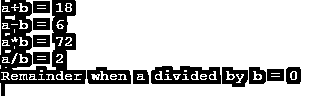
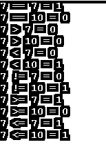
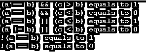

# c 运算符

> 原文：<https://www.educba.com/c-operators/>




## C 中的运算符有哪些？

运算符是帮助执行数学和逻辑运算的符号。C 运算符的分类如下:

*   算术
*   有关系的
*   逻辑学的
*   按位
*   分配
*   有条件的
*   特别的

### C 语言中运算符的解释

下面是 C 语言中运算符的详细解释:

<small>网页开发、编程语言、软件测试&其他</small>

#### 1.算术运算符

这些运算符负责执行算术或数学运算，如加法(+)、减法(-)、乘法(*)、除法(/)、除法的余数(%)、增量(++)、减量(–)。

算术运算符有两种类型:

*   **一元运算符:**这种类型的运算符处理单个值(操作数)，如++和-。
*   **二元运算符:**这种运算符使用两个操作数，如+、-、*、/

下面是 C 中的[算术运算符的数量及其执行的功能的表格。](https://www.educba.com/arithmetic-operators-in-c/)

| **操作员** | **功能** |
| + | 将两个值相加 |
| – | 从第一个值中减去第二个值 |
| * | 将两个值相乘 |
| / | 分子除以分母 |
| % | 除法余数 |
| ++ | 增量运算符–将整数值增加 1。 |
| — | 减量运算符–将整数值减一 |

**示例:** C 程序使用算术运算符

```
#include <stdio.h>
int main()
{
int a = 12, b = 6, c;
c = a + b;
printf("a+b = %d \n", c);
c = a - b;
printf("a-b = %d \n", c);
c = a *b;
printf("a*b = %d \n", c);
c = a / b;
printf("a/b = %d \n", c);
c = a % b;
printf("Remainder when a divided by b = %d \n", c);
return 0;
}
```

**输出:**




#### 2.关系运算符

当我们想比较两个操作数的值时，就要使用关系运算符。如果我们要检查一个操作数是否等于或大于其他操作数，那么我们使用> =运算符。

下表列出了 C 语言中的关系运算符及其功能。

| **操作员** | **功能** | **例子** |
| == | 这将检查两个操作数是否相等 | 6 == 2 返回 0 |
| != | 这将检查两个操作数是否不相等。 | 6 != 2 得出 1 |
| > | 这将检查左边的操作数是否大于右边的操作数 | 6 > 2 返回 1 |
| < | 这将检查左边的操作数是否小于右边的操作数 | 6 < 2 返回 0 |
| >= | 这将检查左操作数是否大于或等于右操作数 | 6 >= 2 返回 1 |
| <= | 这将检查左边的操作数是否小于或等于右边的操作数 | 6 <= 2 返回 0 |

**示例:** C 程序使用关系运算符

```
#include <stdio.h>
int main()
{
int a = 7, b = 7, c = 10;
printf("%d == %d = %d \n", a, b, a == b); // true
printf("%d == %d = %d \n", a, c, a == c); // false
printf("%d > %d = %d \n", a, b, a > b); //false
printf("%d > %d = %d \n", a, c, a > c); //false
printf("%d < %d = %d \n", a, b, a < b); //false
printf("%d < %d = %d \n", a, c, a < c); //true
printf("%d != %d = %d \n", a, b, a != b); //false
printf("%d != %d = %d \n", a, c, a != c); //true
printf("%d >= %d = %d \n", a, b, a >= b); //true
printf("%d >= %d = %d \n", a, c, a >= c); //false
printf("%d <= %d = %d \n", a, b, a <= b); //true
printf("%d <= %d = %d \n", a, c, a <= c); //true
return 0;
}
```

**输出:**




#### 3.逻辑运算符

逻辑运算符用于判断结果的真假。

下表列出了 C 语言中使用的逻辑运算符

| **操作员** | **功能** | **示例(如果 a=1，b=0)** |
| && | 逻辑与 | (a && b)是假的 |
| &#124;&#124; | 逻辑或 | (a &#124;&#124; b)是真的 |
| ! | 逻辑非 | (!a)是假的 |

**例子:** C 程序使用逻辑运算符。

```
#include <stdio.h>
int main()
{
int a = 8, b = 8, c = 12, result;
result = (a == b) && (c > b);
printf("(a == b) && (c > b) equals to %d \n", result);
result = (a == b) && (c < b);
printf("(a == b) && (c < b) equals to %d \n", result);
result = (a == b) || (c < b);
printf("(a == b) || (c < b) equals to %d \n", result);
result = (a != b) || (c < b);
printf("(a != b) || (c < b) equals to %d \n", result);
result = !(a != b);
printf("!(a == b) equals to %d \n", result);
result = !(a == b);
printf("!(a == b) equals to %d \n", result);
return 0;
}
```

**输出:**




#### 4.按位运算符

这些运算符用于操作数的比特级运算。运算符首先转换为位级，然后执行计算。

| **操作员** | **功能** |
| “&”号 | 按位 AND |
| &#124; | 按位或 |
| ^ | 按位异或 |
| ~ | 逐位补码 |
| << | 左移位 |
| >> | 右移 |

**示例:** C 程序进行按位 AND

```
#include <stdio.h>
int main()
{
int a = 10, b = 8;
printf("Output = %d", a&b);
return 0;
}
```

**输出**:


**说明:**

10 = 00001010(二进制)

8 = 00001000(二进制)

10 和 8 的位操作

00001010 & 00001000 = 00001000 = 8(十进制)

#### 5.赋值运算符

这些类型的运算符用于为变量赋值。

| **操作员** | **功能** | **例子** |
| = | 这将把右侧操作数的值赋给左侧操作数 | a=b |
| += | 这会将右操作数与左操作数相加，并将结果赋给左操作数 | a+=b 与 a=a+b 相同 |
| -= | 这将从左操作数中减去右操作数，并将结果赋给左操作数 | a-=b 与 a=a-b 相同 |
| *= | 这会将左操作数与右操作数相乘，并将结果赋给左操作数 | a*=b 与 a=a*b 相同 |
| /= | 这会将左操作数除以右操作数，并将结果赋给左操作数 | a/=b 与 a=a/b 相同 |
| %= | 这将使用两个操作数计算模数，并将结果赋给左边的操作数 | a%=b 和 a=a%b 是一样的 |

#### 6.条件运算符

又称三元运算符或**？:**接线员。这些是用来做决策的。

**语法:**

```
Expression 1? Expression 2: Expression 3
```

这里？表示 IF 条件。

#### 7.特殊操作员

下面是一些在 C 语言中使用的特殊运算符

| **操作员** | **功能** |
| “&”号 | This operator is used to get the address of the variable.**举例:** &甲会给甲一个地址 |
| * | This operator is used as a pointer to a variable.**例子:** * a 其中*是变量 a 的指针。 |
| ()的大小 | This operator gives the size of the variable.**例:**(char)的大小会给我们 1。 |

**示例:** C 程序使用特殊运算符

```
#include <stdio.h>
int main()
{
int *ptr, q;
q = 40;
/* address of q is assigned to ptr */
ptr = &q;
/* display q's value using ptr variable */
printf("%d", *ptr);
return 0;
}
```

**输出:**


### 推荐文章

这是 C 语言操作者的指南。这里我们讨论了 C 语言中使用的运算符及其语法和例子。你也可以看看下面的文章来了解更多。

1.  [c#与 JavaScript 的比较](https://www.educba.com/c-sharp-vs-javascript/)
2.  [C 命令列表](https://www.educba.com/c-command/)
3.  [C 编程生涯](https://www.educba.com/career-in-c-programming/)
4.  [JavaScript 中的按位运算符](https://www.educba.com/bitwise-operators-in-javascript/)


