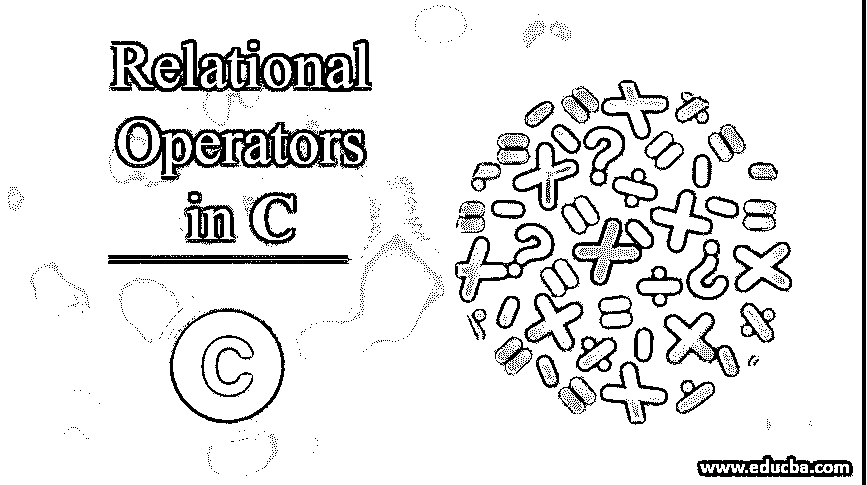
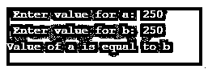
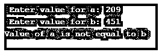
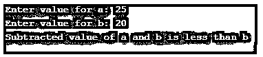

# C 语言中的关系运算符

> 原文：<https://www.educba.com/relational-operators-in-c/>




## C 语言中的关系运算符简介

关系运算符是二元运算符的一部分。这些运算符通常用于比较两个值或条件。这个比较条件驱使我们使用布尔表达式的值，并据此执行所编写的代码。

### C 语言中关系运算符的类型

下面是 C 语言中不同类型的关系运算符:

<small>网页开发、编程语言、软件测试&其他</small>

#### 1.大于(> )

该运算符根据“大于”功能检查并执行代码。它检查左侧操作数或右侧操作数是否更大，并以这种方式执行条件。

**代码:**

```
#include <stdio.h>
int main()
{
int a,b;
printf(" Enter value for a: ");
scanf("%d", &a);
printf(" Enter value for b: ");
scanf("%d", &b);
if(a>b)
{
printf(" a’s value is greater than b’s value");
}
else
{
printf(" b’s value is greater than a’s value");
}
}
```

**输出:**


程序比较“a”的值是否更大，或者“b”的值是否更大，如果满足给我们输出的条件，程序就执行。

#### 2.小于(

该运算符类似于上面讨论的大于运算符。唯一的区别是输出应该给我们一个值小于另一个值的操作数。

**输出:**


与上面相同的示例值用于更好地理解这些大于和小于运算符如何根据条件工作。

#### 3.大于等于(> =)

该运算符不仅满足“大于”条件，还包括左侧操作数是否等于右侧操作数。

**代码:**

```
#include <stdio.h>
int main()
{
int a,b;
printf(" Enter value for a: ");
scanf("%d", &a);
printf(" Enter value for b: ");
scanf("%d", &b);
if(a>b)
{
printf("Value of a is greater than b");
}
else if(a>=b)
{
printf("Value of a is equal to b");
}
else
{
printf("Value of b is greater than a");
}
}
```

**输出:**


这里，我们使用了这两个条件，并给出了一个彼此相等的值的例子。所以，我们执行了相同的条件。

#### 4.小于等于(

这个运算符类似于上面提到的“大于等于”运算符。唯一的区别是运算符“小于”和“大于”。

**代码:**

```
#include <stdio.h>
int main()
{
int a,b;
printf(" Enter value for a: ");
scanf("%d", &a);
printf(" Enter value for b: ");
scanf("%d", &b);
if(a<b)
{
printf("Value of a is less than b");
}
else if(a<=b)
{
printf("Value of a is equal to b");
}
else
{
printf("Value of b is less than a");
}
}
```

**输出:**


因为我们与“小于”操作符在优先级上有相同的条件，所以我们给出了相应的例子。

#### 5.双等于(==)

该运算符仅定义左侧操作数是否等于右侧操作数。这也意味着它不会考虑“大于”或“小于”条件，而只考虑相等条件。

**代码:**

```
#include <stdio.h>
int main()
{
int a,b;
printf(" Enter value for a: ");
scanf("%d", &a);
printf(" Enter value for b: ");
scanf("%d", &b);
if(a==b)
{
printf("Value of a is equal to b");
}
else
{
printf("Value of a is not equal to b");
}
}
```

**输出:**




为了比较左操作数和右操作数之间的相等条件，我们应该使用“双等于”运算符。

#### 6.不等于(！=)

这个操作符的功能与上面提到的相反。这是为了使左右操作数之间的条件不应该彼此相等。

**代码:**

```
#include <stdio.h>
int main()
{
int a,b;
printf(" Enter value for a: ");
scanf("%d", &a);
printf(" Enter value for b: ");
scanf("%d", &b);
if(a!=b)
{
printf("Value of a is not equal to b");
}
else
{
printf("Value of a is equal to b");
}
}
```

**输出:**




下面给出了一个利用所有关系运算符的随机示例:

```
#include <stdio.h>
int main()
{
int a,b;
printf(" Enter value for a: ");
scanf("%d", &a);
printf(" Enter value for b: ");
scanf("%d", &b);
if((a-b) > b)
{
printf(" Subtracted value of a and b is greater than b");
}
else if((a-b) < b)
{
printf(" Subtracted value of a and b is less than b");
}
else if((a==b))
{
printf(" Value of a and b are equal to each other");
}
else if((a+5)!=(b+6))
{
printf(" Value of sum of a and 5 is not equal to sum of b and 6");
}
else if((a*b) >= (b*b))
{
printf(" Multiplied value of a and b is greater than or equal tovalue of square of b");
}
else if((a*b) <= (b*b))
{
printf(" Multiplied value of a and b is less than or equal to value of square of b");
}
else
{
printf(" Tried all the relational operators");
}
}
```

**输出:**




### 结论

这就是我们如何使用不同的关系运算符。这些操作在任何编程语言中都起着非常重要的作用。这里我们用 C 编程语言做了同样的事情。

### 推荐文章

这是 c 语言中关系操作符的指南。这里我们讨论 c 语言中关系操作符的介绍和不同类型。你也可以看看下面的文章来了解更多——

1.  [Python 比较运算符](https://www.educba.com/python-comparison-operators/)
2.  [PHP 中的比较运算符](https://www.educba.com/comparison-operators-in-php/)
3.  [c++中的关系运算符](https://www.educba.com/relational-operators-in-c-plus-plus/)
4.  [C 语言中的左移运算符](https://www.educba.com/left-shift-operator-in-c/)


