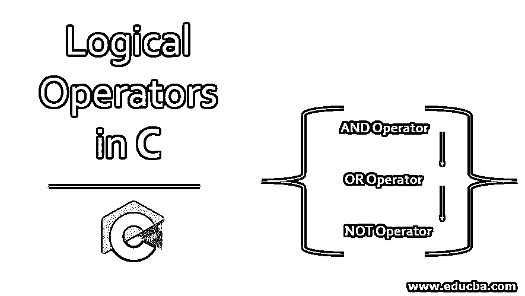
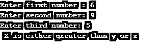

# C 语言中的逻辑运算符

> 原文：<https://www.educba.com/logical-operators-in-c/>




## C 语言中的逻辑运算符简介

逻辑运算符是二元运算符的一部分。当我们将两个或者更多的需求结合在一起时，这些操作符会被特别使用。这些可以用在许多条件和关系表达式中。在评估这些条件时，这些布尔表达式分别给出真/假的 1/0 输出。下面让我们学习一下 C 语言中不同的逻辑运算符。

### C 语言中不同的逻辑运算符

三个主要的逻辑运算符是' && '、' || '和'！'.真值表可以通过以下方式理解:

<small>网页开发、编程语言、软件测试&其他</small>

| **答** | **b** | **a&T3】b** | **a &#124;&#124; b** |
| Zero | Zero | Zero | Zero |
| Zero | One | Zero | One |
| One | One | One | One |
| One | Zero | Zero | One |

对于 NOT 运算符:

| **答** | **！答** |
| One | Zero |
| Zero | One |

输出“1”和“0”分别表示真和假。通过这些，可以很好地理解正在执行的条件操作。

### 用 C 语言实现逻辑运算符的例子

逻辑运算符的类型及其示例和实现解释如下。

#### 1.逻辑积算符

该运算符用“&&”符号表示。如果满足所有条件，该运算符将输出 true。

##### 示例#1

让我们看一个使用下面给出的 AND 运算符的简单例子。

**代码:**

```
#include <stdio.h>
int main()
{
int n;
printf("Enter a digit between 1 to 10: ");
scanf("%d",&n);
if((n>0) && (n<=10))
{
printf(" Given number is in between 0 and 10");
}
else if((n>10) && (n<=20))
{
printf("Given number is in between 10 and 20");
}
else
{
printf("Please enter a number in the given range");
}
return 0;
}
```

上面的例子有我们的 and 条件，它有很多条件，所有的条件都必须满足。

**输出:**


##### 实施例 2

同样，我们可以使用 AND 运算符编写另一个示例。

**代码:**

```
#include <stdio.h>
int main()
{
int a,b;
a=855;
b=1300;
if((a>=500) && (b<1000))
{
printf(" This is the first condition");
}
else
{
printf(" This is the second condition");
}
}
```

**输出:**


这就是我们如何得到 AND 条件。

#### 2.OR 运算符

在这种情况下，任何一个给定的场景都可能是真的。

##### 示例#1

让我们用下面给出的一个小例子来检验这个操作符。

**代码:**

```
#include <stdio.h>
int main()
{
int n;
printf("Enter a digit between 1 to 20: ");
scanf("%d",&n);
if((n%2==0) || (n%5==0))
{
printf(" Number given is divisible by either 2 or 5");
}
else{
printf(" Number is not divisible by 2 or 5");
}
return 0;
}
```

**输出:**


所以，如果给定的数可以被 2 或 5 整除，那么条件就被执行了。

##### 实施例 2

现在让我们看看，如果用“and”条件执行相同的条件会发生什么。

**代码:**

```
#include <stdio.h>
int main()
{
int n;
printf("Enter a digit between 1 to 20: ");
scanf("%d",&n);
if((n%2==0) && (n%5==0))
{
printf(" Number given is divisible by 2 and 5");
}
else{
printf(" Number is not divisible by 2 and 5");
}
return 0;
}
```

**输出:**


比较了这两个例子之后，我们就可以理解“与”和“或”逻辑运算符之间的主要区别了。由于这些[逻辑运算符](https://www.educba.com/logical-operators-in-python/)的输出是一个布尔表达式，True/False 的结果执行这些条件语句中的代码。

#### 3.“非”算符

这个逻辑运算符通常由符号“！”定义.该运算符等于“不等于”。

##### 示例#1

下面我们来看一个小例子。

**代码:**

```
#include <stdio.h>
int main()
{
int n;
printf("Enter a number: ");
scanf("%d",&n);
if(n %2 != 0)
{
printf(" This is an odd number");
}
else
{
printf(" This is an even number");
}
return 0;
}
```

**输出:**


##### 实施例 2

以类似的方式，我们可以编写另一个使用 Not 运算符的示例。

**代码:**

```
#include <stdio.h>
int main()
{
int a,b;
printf("Enter a number : ");
scanf("%d",&a);
printf("Enter b number: ");
scanf("%d",&b);
if(a!=b)
{
printf(" A and B values given are different");
}
else
{
printf(" A and B values given are same");
}
return 0;
}
```

**输出:**


这是通过 C 语言定义的三个逻辑运算符。

##### 实施例 3

这里让我们再看一个例子，这三者可以一起使用。

**代码:**

```
#include <stdio.h>
int main()
{
int x,y,z;
printf("Enter first number : ");
scanf("%d",&x);
printf("Enter second number: ");
scanf("%d",&y);
printf("Enter third number: ");
scanf("%d",&z);
if((x>=y) && (y>=z))
{
printf(" X is the highest number");
}
else if((x>=y) || (x>=z) )
{
printf(" X is either greater than y or z");
}
else if((x>=y) || (x>=z) && (y>=z))
{
printf(" Both 'and' and 'or' are used and X is definitely larger ");
}
else if( x!=y)
{
printf(" Checking for a condition that X is not equal to Y");
}
else
{
printf("Finally");
}
return 0;
}
```

**输出:**




这只是在一个程序中使用所有这些逻辑操作符的一个例子。

### 推荐文章

这是一个关于 C 语言中逻辑操作符的指南。这里我们讨论了基本概念，C 语言中不同的逻辑操作符，以及例子和代码实现。您也可以浏览我们推荐的其他文章，了解更多信息——

1.  [c#中的集合](https://www.educba.com/collections-in-c-sharp/)
2.  [JavaScript 中的逻辑运算符](https://www.educba.com/logical-operators-in-javascript/)
3.  [PHP 中的逻辑运算符](https://www.educba.com/logical-operators-in-php/)
4.  [SQL 逻辑运算符](https://www.educba.com/sql-logical-operators/)


