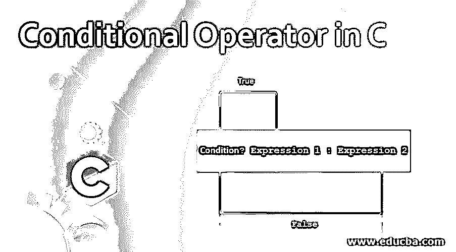
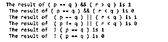

# C 语言中的条件运算符

> 原文：<https://www.educba.com/conditional-operator-in-c/>




## C 语言中条件运算符简介

如果我们把这两个词分开，那么运算符就意味着对某个值进行运算的符号，而条件则是可以应用于运算符来执行某些特定运算的东西。条件运算符有两个值，它显示基于给定条件的输出值。如果一个条件为真，它将显示一个新的，如果另一个条件为真，它将显示一个不同的值，这就是 c 中条件运算符的工作方式，如果条件为真，将返回值，这类似于编程中的 if-else 循环。

条件运算符也称为三元运算符。让我们看看在 C 编程中声明条件运算符的语法:

<small>网页开发、编程语言、软件测试&其他</small>

```
Condition ? True_value : False_value
```

因此，根据语法，我们可以把我们的条件放在它被写入的地方，然后如果条件成立，它将评估为第一个语句，否则它将转到第二个条件。

例如:

```
Expression 1 ? Expression 2 : Expression 3
```

表达式 1 是条件部分，其余两个表达式都是条件所依赖的语句。

### C 中条件运算符是如何工作的？

现在让我们看看条件运算符在 C 编程中是如何工作的，以及如何在 C 代码中实现这些条件。但首先，我们将了解条件运算符的类型及其用途:

| **操作员** | **描述** |
| **&&T1】** | 如果两个给定的条件都为真，该条件运算符将返回真值。 |
| **&#124;&#124;** | 如果任一给定条件为真，该条件运算符将返回真值。 |
| **！** | 如果给定的条件为假，该条件运算符将返回真值。 |
| **&T1】** | 如果给定的两个条件都为真且为布尔型，则该条件运算符将返回真值。 |
| **&#124;** | 如果任一给定条件为 true 和 Boolean，此条件运算符将返回 true 值。 |
| **^** | 如果两个给定的条件不同，该条件运算符将返回 true 值。 |

### C 语言中实现条件运算符的例子

我们将使用这些操作符来理解 C 语言中条件操作符的工作原理。

#### 示例#1

**代码:**

```
#include <stdio.h>
int main()
{
int p = 20 , q = 20 , r = 30 , outcome ;
outcome = ( p == q ) && ( r > q ) ;
printf ( " The result of ( p == q ) && ( r > q ) is %d \n " , outcome ) ;
outcome = ( p == q ) && ( r < q ) ;
printf ( " The result of ( p == q ) && ( r < q ) is %d \n " , outcome ) ;
outcome = ( p == q ) || ( r < q ) ;
printf ( " The result of  ( p == q ) || ( r < q ) is %d \n " , outcome ) ;
outcome = ( p != q ) || ( r < q ) ;
printf ( " The result of  ( p != q ) || ( r < q ) is %d \n " , outcome ) ;
outcome = ! ( p != q ) ;
printf ( " The result of  ! ( p == q ) is %d \n " , outcome ) ;
outcome = ! ( p == q ) ;
printf ( " The result of  ! ( p == q ) is %d \n " , outcome ) ;
return 0 ;
}
```

**输出:**




在上面的代码中，我们声明了 4 个整数 p、q、r 和 outcome，其中 outcome 将存储其余 3 个整数变量上所有应用条件的结果。然后我们一个接一个地应用这些&&，||，和！=对声明变量的操作。因此，这些值将按照提到的代码进行比较，结果将存储在输出整数中。

#### 实施例 2

**代码:**

```
#include <stdio.h>
int main()
{
int marks_obtained ;
printf ( " Please enter the obtained marks : " ) ;
scanf ( " %d " , &marks_obtained ) ;
if ( marks_obtained >= 36 )
printf ( " \n Congratulations!! You Passed " ) ;
else
printf ( " \n You Failed " ) ;
return 0 ;
}
```

**输入:**


**输出:**


#### 实施例 3

**代码:**

```
#include <stdio.h>
int main()
{
int marks_obtained ;
printf ( " Please enter the marks obtained : " ) ;
scanf ( " %d " , &marks_obtained ) ;
puts ( marks_obtained >= 36 ? " Congratulations!! You Passed" : " You Failed " ) ;
return 0 ;
}
```

**输入:**


**输出:**


如果你比较最后两个代码，它们用完全相同的整数和条件执行相同的操作。我们在最后一秒看到的唯一区别是使用 if else 条件来检查标记的条件，然后显示输出，而在最后一段代码中，我们使用条件运算符对完全相同的整数和获得的标记值执行相同的操作。因此，为了展示为什么使用条件操作符，您可以从最后两个代码中看到，使用条件操作符而不是使用 if-else 可以节省几行代码。除此之外，如果一个条件已经为真，那么编译器甚至不会转到该条件的其余部分，这将同时节省编译和执行时间，这样效率会更高。在内存方面，条件操作符也会节省空间。

### 结论

C 语言中的条件运算符起着至关重要的作用，因为它节省了大量时间，因为我们可以使用这些运算符，而不是使用 if-else 循环，因为我们只需在一行中编写两个条件，这既节省了时间，又节省了空间，从而使代码更加高效。

### 推荐文章

这是一个 c 语言中条件操作符的指南，在这里我们也讨论了 c 语言中条件操作符的介绍和工作原理，以及不同的例子和代码实现。您也可以看看以下文章，了解更多信息–

1.  [C 语言中的逻辑运算符](https://www.educba.com/logical-operators-in-c/)
2.  [C 语言中的文件处理](https://www.educba.com/file-handling-in-c/)
3.  [C 语言中嵌套的 if 语句](https://www.educba.com/nested-if-statement-in-c/)
4.  [C 语言中的赋值运算符](https://www.educba.com/assignment-operators-in-c/)


