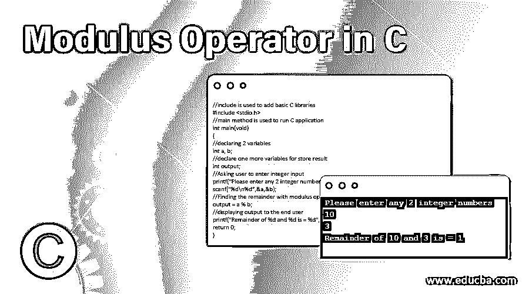
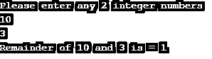
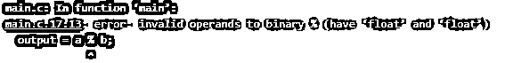
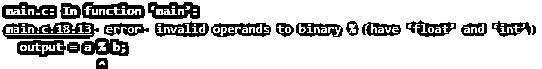
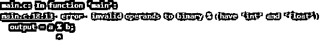
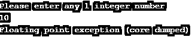

# C 语言中的模数运算符

> 原文：<https://www.educba.com/modulus-operator-in-c/>




## C 语言中模数运算符的介绍

C 中的模数运算符用%(百分位数)运算符表示。这个模算符加到算术运算符上。该模数运算符适用于两个操作数之间。模数运算符用分子除以分母，得到数的余数。余数总是整数。如果没有余数，那么它给你 0(零)作为余数。

**语法:**

<small>网页开发、编程语言、软件测试&其他</small>

让我们考虑 a 和 b 是 2 个整数，然后模数表达式变成

```
a%b
```

**返回值可能性:**

*   如果 a 不能被 b 整除，那么它会产生一些非零的整数值。
*   如果 a 能被 b 整除，那么余数就变成 0。
*   如果 a 是某个数字，b 是 0，那么我们会得到一个编译时错误。

### 模数运算符在 C 中是如何工作的？

模数运算符基于最终用户收到的值工作。它总是找到 2 个数相对于分子的余数。

下面的例子将说明确切的功能。

*   例: 7 % 3 给我们的余数是 1，因为当我们用 7 除以 3 时，我们得到的是 2 的商和 1 的余数。
*   同样的方法:8%3 给我们的余数是 2，因为当我们用 8 除以 3 时，我们得到的是 2 的商和 2 的余数。

### C 语言中“%”运算符的计算

让我们看看 C 语言中“%”运算符的内部计算:

a%b 将被解析为 a-(a/b)*b

**举例:**

设 a=8，b=3，那么

*   a%b >> a-(a/b)*b
*   8%3 >> 8-(8/3)*3
*   8-(2)*3
*   8-6
*   Two

因此 8%3 等于 2。

**Note:** The modulus operator always works with integer numbers only.

### 用 C 语言实现模数运算符的例子

下面是提到的例子:

#### 示例#1

整数的余数

**代码:**

```
//include is used to add basic C libraries
#include <stdio.h>
//main method is used to run C application
int main(void)
{
//declaring 2 variables
int a, b;
//declare one more variables for store result
int output;
//Asking user to enter integer input
printf("Please enter any 2 integer numbers \n");
scanf("%d\n%d",&a,&b);
//Finding the remainder with modulus operator
output = a % b;
//displaying output to the end user
printf("Remainder of %d and %d is = %d", a,b,output);
return 0;
}
```

**输出:**




#### 实施例 2

浮点数余数

**代码:**

```
//include is used to add basic C libraries
#include <stdio.h>
//main method is used to run C application
int main(void)
{
//declaring 2 variables
float a, b;
//declare one more variables for store result
float output;
//Asking user to enter integer input
printf("Please enter any 2 integer numbers \n");
scanf("%f\n%f",&a,&b);
//Finding the remainder with modulus operator
output = a % b;
//displaying output to the end user
printf("Remainder of %f and %f is = %f", a,b,output);
return 0;
}
```

**输出:**




**解释:**正如我们在这个例子中讨论的，我们试图找出导致编译时错误的 2 个浮点数的余数。

#### 实施例 3

分子浮点数和分母整数的余数

**代码:**

```
//include is used to add basic C libraries
#include <stdio.h>
//main method is used to run C application
int main(void)
{
//declaring 2 variables
float a;
int b;
//declare one more variables for store result
int output;
//Asking user to enter integer input
printf("Please enter any 2 integer numbers \n");
scanf("%f\n%d",&a,&b);
//Finding the remainder with modulus operator
output = a % b;
//displaying output to the end user
printf("Remainder of %f and %d is = %d", a,b,output);
return 0;
}
```

**输出:**




**解释:**在这个例子中，带有整数分母的浮点分子也会导致编译时错误。

#### 实施例 4

分子整数和分母浮点的余数

**代码:**

```
//include is used to add basic C libraries
#include <stdio.h>
//main method is used to run C application
int main(void)
{
//declaring 2 variables
int a;
float b;
//declare one more variables for store result
int output;
//Asking user to enter integer input
printf("Please enter any 2 integer numbers \n");
scanf("%d\n%f",&a,&b);
//Finding the remainder with modulus operator
output = a % b;
//displaying output to the end user
printf("Remainder of %d and %f is = %d", a,b,output);
return 0;
}
```

**输出:**




**解释:**在这个例子中，带有浮点分母的 int 分子也会导致编译时错误。这意味着两个值都必须是整数类型。

#### 实施例 5

零分母余数

**代码:**

```
//include is used to add basic C libraries
#include <stdio.h>
//main method is used to run C application
int main(void)
{
//declaring 2 variables
int a;
int b=0;
//declare one more variables for store result
int output;
//Asking user to enter integer input
printf("Please enter any 1 integer number \n");
scanf("%d",&a);
//Finding the remainder with modulus operator
//denominator 0 will result into undefined so we got exception in the output
output = a % b;
//displaying output to the end user
printf("Remainder of %d and %d is = %d", a,b,output);
return 0;
}
```

**输出:**




### 结论

c 模运算符用于计算这两个数的余数。这始终只是整数。从上面的例子中可以得出一个重要的结论:模数运算符只适用于整数。

### 推荐文章

这是一个关于 c 语言中模运算符的指南。这里我们讨论模运算符的介绍，工作，计算以及例子。您也可以浏览我们的其他相关文章，了解更多信息——

1.  [Python 模数运算符](https://www.educba.com/python-modulus-operator/)
2.  [JavaScript 中的布尔运算符](https://www.educba.com/boolean-operators-in-javascript/)
3.  [C 语言中的条件运算符](https://www.educba.com/conditional-operator-in-c/)
4.  [C 语言中的赋值运算符](https://www.educba.com/assignment-operators-in-c/)


