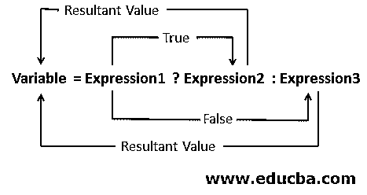
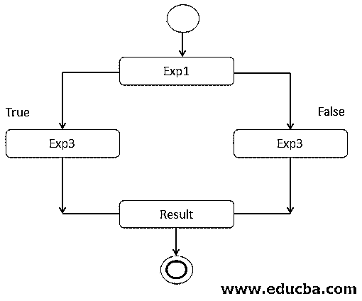
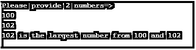
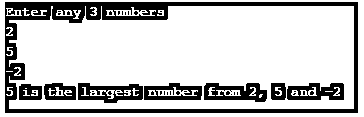
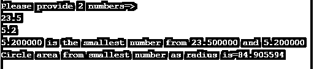
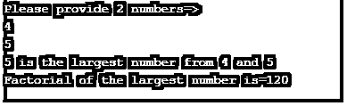

# C 语言中的三元运算符

> 原文：<https://www.educba.com/ternary-operator-in-c/>


## C 语言中的三元运算符简介

在 C 语言中，三元运算符允许根据给定的条件值执行或运行任何代码，并将表达式的条件结果值返回到输出。三元运算符的重要用途是减少代码行数，提高应用程序的性能。大多数研究文章声称表达式结果比语句结果更快(常规 if-else 条件)。三元运算符包含 3 个表达式；表达式 1、表达式 2 和表达式 3。Expression1 保存要检查的条件，Expression2 将保存由 Expression1 条件评估的 true 值，Expression3 将保存由 Expression1 条件评估的 false 值。

**优点:**

<small>网页开发、编程语言、软件测试&其他</small>

*   它减少了代码。
*   提高性能。
*   克服 if 和 else 条件的常规用法。

### C 语言中三元运算符是如何工作的？

c 语言三元运算符的工作原理是基于三元运算符(？)，如果条件被评估为真，则它执行冒号(:)符号左侧的真表达式值，如果条件被评估为假，则它执行冒号(:)符号右侧的假表达式值。

**语法:**

```
Expression1?Expression2:Expression3;
```

**或**

```
Condition?true value:false value;
```

**三元表达式的返回值是什么？**

```
Boolean result= Condition?true value:false value;
```

它返回布尔值(真/假)。

为了更好地理解三元运算符，请参见下图:







### C 语言中三元运算符的例子

下面举几个例子

#### 示例#1

不带三元运算符的较大数

**代码:**

```
#include<stdio.h>//informing to c language include c ibrary files
int main()//main method
{
//declaraing two variables
int first,second;
//printing output
printf("Please provide 2 numbers=>\n");
scanf("%d %d", &first , &second);//%d is integer values
if(first>second)//checking if condition
{
printf("%d",first);//printing the larger output
printf(" is larger number than %d",second);
}
else
{
printf("%d",second);
printf(" is larger number than %d",first);
}
return 0;
}
```

**输出:**


#### 实施例 2

用三元运算符计算两个数中的最大值

**代码:**

```
#include<stdio.h>//line1
main()//line2
{
int first,second,largest;//line3
printf("Please provide 2 numbers=>\n");//lin4
scanf("%d %d", &first , &second);//line5
largest = (first > second) ? first : second;//line6
printf("%d", largest);//line7
printf(" is the largest number from %d and %d",first,second);
}
```

**输出:**




**说明:**

*   **Line1** 包括运行 C 语言应用程序所需的库文件
*   **Line2** 是主方法，应用程序从这个 main()方法开始。
*   **Line3** 是存储整数(非十进制数)的整数变量声明。
*   **Line4** 是要求用户输入 2 个数字的文本。
*   **Line5** 存储在使用%d 运算符的 scanf 方法中输入的 2 个整数中。
*   **Line6** 是三进制运算符比较 2 个数中最大的一个。
*   **Line7** 在控制台上打印输出。

#### 实施例 3

用三元运算符计算 3 个数中的最大数

**代码:**

```
#include<stdio.h>//line1
int main()//line2
{
int firstNumber, secondNumber, thirdNumber, largest;//line3
printf("Enter any 3 numbers\n");//line4
scanf("%d %d %d", &firstNumber, &secondNumber, &thirdNumber);//line5
largest= (firstNumber > secondNumber) ? (firstNumber > secondNumber ? firstNumber : thirdNumber) : (secondNumber > thirdNumber ? secondNumber : thirdNumber);//line5
printf ("%d", largest);//line6
printf (" is the largest number from %d, %d and %d",firstNumber,secondNumber,thirdNumber);//line7
}
```

**输出:**




**说明:**

*   **Line1** 包括运行 C 语言应用程序所需的库文件
*   **Line2** 是主方法，应用程序从这个 main()方法开始。
*   **Line3** 是一个整型变量声明，用于存储 3 个整数(非十进制数)。
*   **Line4** 是要求用户输入 3 个数字的文本。
*   **Line5** 存储在使用%d 运算符的 scanf 方法中输入的 3 个整数中。
*   **第 6 行**是三元运算符比较 3 个数中最大的一个。
*   **Line7** 在控制台上打印输出。

#### 实施例 4

十进制最小数和作为半径的最小数

**代码:**

```
#include<stdio.h>//line1
float getMyCircleArea (float radius);//lin2
int main()//line3
{
float x,y,smallest;//line4
printf("Please provide 2 numbers=>\n");//line5
scanf("%f %f", &x , &y);//line6
smallest = (x < y) ? x : y;//line7
printf("%f", smallest);//line8
printf(" is the smallest number from %f and %f \n",x,y);//line9
float circleArea= getMyCircleArea (smallest);//line10
printf("Circle area from smallest number as radius is=%f", circleArea);//line11
}
float getMyCircleArea (float radius)//lin12
{
float result=3.14*radius*radius;//line13
return (result);//lin14
}
```

**输出:**




**说明:**

*   **Line1** 包括运行 C 语言应用程序所需的库文件。
*   **Line2** 导入自定义方法，这里 getMyCircleArea()是方法。
*   **Line3** 是主方法，应用程序从这个 main()方法开始。
*   **Line4** 是存储 2 个浮点数(非十进制数)的浮点变量声明。
*   **Line5** 是要求用户输入 2 个十进制数字的文本。
*   **第 6 行**存储在使用%f 运算符的 scanf 方法中输入的 2 个十进制数中。
*   **第 7 行**是三进制运算符与两个十进制数相比哪个最小。
*   **行 8** 和**行 9** 用于打印最小的十进制数。
*   **Line10** 正在调用 getMyCircleArea()，将最小的数字作为 radius 传递。
*   **Line11** 正在打印以最小数字为半径的圆面积的结果。
*   **Line12** 是 getMyCicleArea()方法声明。
*   **第 13 行**是圆区域逻辑。
*   **Line14** 从 getMyCirlceArea()方法返回结果值。

#### 实施例 5

带阶乘的最大数

**代码:**

```
#include<stdio.h>//line1
int getMyFactorial(int l);//lin2
int main()//line3
{
int x,y,largest;//line4
printf("Please provide 2 numbers=>\n");//line5
scanf("%d %d", &x , &y);//line6
largest = (x > y) ? x : y;//line7
printf("%d", largest);//line8
printf(" is the largest number from %d and %d \n",x,y);//line9
int factorial=getMyFactorial(largest);//line10
printf("Factorial of the largest number is=%d", factorial);//line11
}
int getMyFactorial(int l)//lin12
{
int f=1;
for (int p = 1; p <= l; p++){
f = f * p;//line13
}
return (f);//lin14
}
```

**输出:**




**说明:**

*   **Line1** 包括运行 C 语言应用程序所需的库文件。
*   **Line2** 导入自定义方法，这里 getMyFactorial()是方法。
*   **Line3** 是主方法，应用程序从这个 main()方法开始。
*   **Line4** 是整数变量声明，用于存储 2 个整数(非十进制数)。
*   **第 5 行**是要求用户输入 2 个整数的文本。
*   **第 6 行**存储在使用%d 运算符的 scanf 方法中输入的 2 个整数中。
*   **第 7 行**是三元运算符比较两个整数中最大的一个。
*   **行 8** 和**行 9** 用于打印最大整数。
*   **Line10** 正在调用 getMyFactorial()，将最大的数字作为参数传递。
*   **Line11** 正在打印作为参数的数字最大的圆面积的结果。
*   **Line12** 是 getMyFactorial()方法声明。
*   **第 13 行**是阶乘逻辑。
*   **Line14** 从 getMyFactorial()方法返回结果值。

### 结论

C 语言中的三元运算符用于减少代码并提高编译器性能。它的条件后跟一个问号，真条件值的表达式后跟颜色(:)，还有一个假条件值的表达式。

### 推荐文章

这是 c 语言中三元运算符的指南。这里我们讨论三元运算符的介绍以及工作原理和示例，以便更好地理解。您也可以阅读以下文章，了解更多信息——

1.  [红宝石运算符](https://www.educba.com/ruby-operators/)
2.  [C 语言中的条件运算符](https://www.educba.com/conditional-operator-in-c/)
3.  [C 文字量](https://www.educba.com/c-literals/)
4.  [c#中的静态关键字](https://www.educba.com/static-keyword-in-c-sharp/)


