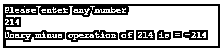
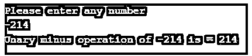
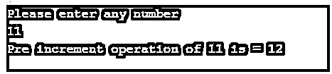
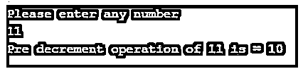
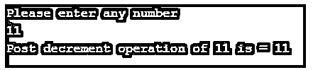
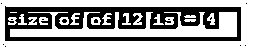

# C 语言中的一元运算符

> 原文：<https://www.educba.com/unary-operator-in-c/>


## C 语言中一元运算符介绍

C 语言中的一元运算符用于通过作用于单个操作数来产生一个新值。所有一元运算符从右侧到左侧的结合性具有相同的优先级。一元减号(-)，一元加号(+)，前缀递增(+a)和递减(–a)，后缀递增(a++)和递减(a-)，逻辑否定(！)、地址运算符(&)、间接运算符(*)、强制转换运算符和 sizeof()运算符属于“一元运算符”。

### 一元运算符的类型

下面给出了一元运算符的类型:

<small>网页开发、编程语言、软件测试&其他</small>

1.一元减号(-)

2.一元加号(+)

3.增量(++)

*   前增量(++变量)
*   后置增量(变量++)

4.减量(–)

*   预减量(–变量)
*   后减量(可变–)

5.逻辑否定(！)

6.地址运算符(&)

7.sizeof()运算符

### 一元运算符在 C 中是如何工作的？

C 中的一元运算符的工作原理是基于我们对一个变量应用了哪种类型的运算符，根据它会执行相应的运算。

#### 1.一元减号(-)

一元减号改变 any 参数的符号。它会把正数变成负数，负数变成正数。

**语法:**

```
int variable1= value;
int variable2= -value //value becomes negative
```

**代码:**

```
//used to include basice c library files
#include <stdio.h>
//main method for run the C application
intmain()
{
//declaring variables
int a, unaryMinus;
//Asking user to enter any number
printf("Please enter any number \n");
//store the enter number in the int variable
scanf("%d",&a);
//unary minus operation performed, negative number becomes positive and positive number becomes negative
unaryMinus=-(a);
//displaying output
printf("Unary minus operation of %d is = %d ",a, unaryMinus);
return 0;
}
```

**输出:**







#### 2.一元加号(+)

一元加号改变任何负参数的符号。它会把负数变成正数，正数变成正数。

**语法:**

```
int variable1= -value;
int variable2= +value //negative value becomes positive
```

**代码:**

```
//used to include basice c library files
#include <stdio.h>
//main method for run the C application
intmain()
{
//declaring variables
int a, unaryPlus;
//Asking user to enter any number
printf("Please enter any number \n");
//store the enter number in the int variable
scanf("%d",&a);
//unary plus operation performed, negative number becomes positive and positive number becomes positive only
unaryPlus=+(a);
//displaying output
printf("Unary plus operation of %d is =%d ",a, unaryPlus);
return 0;
}
```

**输出:**


**Note:** Unary minus and plus is different from subtraction and addition operators, as subtraction and addition requires two operands.

#### 3.增量(++)

##### 形容词（adjective 的缩写）前增量(++变量)

在将变量值赋给变量之前，它会将变量值递增 1。

**语法:**

```
intvar=11;
int out=++var; //out becomes 12
```

**代码:**

```
//used to include basice c library files
#include <stdio.h>
//main method for run the C application
intmain()
{
//declaring variables
int a, pre_increment;
//Asking user to enter any number
printf("Please enter any number \n");
//store the enter number in the int variable
scanf("%d",&a);
//take temp variable for showing actual number in output
int temp=a;
//increment value by 1 before assigning the value
pre_increment=++a;
//displaying output
printf("Pre increment operation of %d is =%d ",temp, pre_increment);
return 0;
}
```

**输出:**




##### b.后置增量(变量++)

将变量值赋给变量后，它会将变量值递增 1。

**语法:**

```
intvar=11;
int out=var++; //out becomes 11
```

**代码:**

```
//used to include basice c library files
#include <stdio.h>
//main method for run the C application
intmain()
{
//declaring variables
int a, post_increment;
//Asking user to enter any number
printf("Please enter any number \n");
//store the enter number in the int variable
scanf("%d",&a);
//take temp variable for showing actual number in output
int temp=a;
//increment value by 1 after assigning the value
post_increment=a++;
//displaying output
printf("Post increment operation of %d is =%d ",temp, post_increment);
return 0;
}
```

**输出:**


#### 4.减量(–)

##### 形容词（adjective 的缩写）预减量(–变量)

在将变量值赋给变量之前，它会将变量值减 1。

**语法:**

```
intvar=11;
int out=--var; //out becomes 10
```

**代码:**

```
//used to include basice c library files
#include <stdio.h>
//main method for run the C application
intmain()
{
//declaring variables
int a, pre_decrement;
//Asking user to enter any number
printf("Please enter any number \n");
//store the enter number in the int variable
scanf("%d",&a);
//take temp variable for showing actual number in output
int temp=a;
//decrement value by 1 before assigning the value
pre_decrement=--a;
//displaying output
printf("Pre decrement operation of %d is =%d ",temp, pre_decrement);
return 0;
}
```

**输出:**




##### b.后减量(可变–)

将变量值赋给变量后，它会将变量值减 1。

**语法:**

```
intvar=11;
int out=var--; //out becomes 11
```

**代码:**

```
//used to include basice c library files
#include <stdio.h>
//main method for run the C application
intmain()
{
//declaring variables
int a, post_decrement;
//Asking user to enter any number
printf("Please enter any number \n");
//store the enter number in the int variable
scanf("%d",&a);
//take temp variable for showing actual number in output
int temp=a;
//decrement value by 1 before assigning the value
post_decrement=a--;
//displaying output
printf("Post decrement operation of %d is =%d ",temp, post_decrement);
return 0;
}
```

**输出:**




#### 5.逻辑否定(！)

它用于反转其操作数的逻辑状态，如 true 变为 false，false 变为 true，反之亦然。

**语法:**

```
bool b=false;
bool out=!b //beocmes out is true
```

**代码:**

```
//used to include basice c library files
#include <stdio.h>
#include <stdbool.h>
//main method for run the C application
intmain()
{
//declaring variables
bool a=false, negation;
//take temp variable for showing actual number in output
bool temp=a;
//negation operator
negation=!a;
//displaying output
//In C o means false and 1 means true
printf("Negation of %d is =%d ",temp, negation);
return 0;
}
```

**输出:**


#### 6.地址运算符(&)

它会给出变量的地址。它用于返回任意变量的内存地址。这在 c 语言中也称为指针。

**语法:**

```
int a=10;
int out=&a // Based on compiler value may varies
```

**代码:**

```
//used to include basice c library files
#include <stdio.h>
//main method for run the C application
intmain()
{
//declaring variables
int a=12, address;
//take temp variable for showing actual number in output
int temp=a;
//address operator assigning to the variable
address=&a;
//displaying output
printf("Address of %d is =%d ",temp, address);
return 0;
}
```

**输出:**


#### 7.sizeof()运算符

它将以字节为单位返回变量的大小。它总是在操作数之前。

**语法:**

```
int a=10;
int out=sizeof(a); //return the int size as 2 or 4 based on platform
```

**代码:**

```
//used to include basice c library files
#include <stdio.h>
//main method for run the C application
intmain()
{
//declaring variables
int a=12, sizeof_value;
//sizeof operator assigning to the variable
sizeof_value=sizeof(a);
//displaying output
//it is inter so size either 2 or 4
printf("size of of %d is =%d ",a, sizeof_value);
return 0;
}
```

**输出:**




### 结论

C 中的一元运算符用于应用于单个变量或操作数。一元减、前增后减、后增后减、求反、地址和 sizeof()运算符是 c 中的一元运算符。

### 推荐文章

这是一个关于 c 语言中一元操作符的指南。在这里我们讨论一元操作符的介绍，类型以及操作符如何与相应的例子一起工作。您也可以看看以下文章，了解更多信息–

1.  [C 中的 f 输出](https://www.educba.com/fputs-in-c/)
2.  [C 文字量](https://www.educba.com/c-literals/)
3.  [C 编程中的数组](https://www.educba.com/arrays-in-c-programming/)
4.  [C 编程矩阵乘法](https://www.educba.com/c-programming-matrix-multiplication/)


